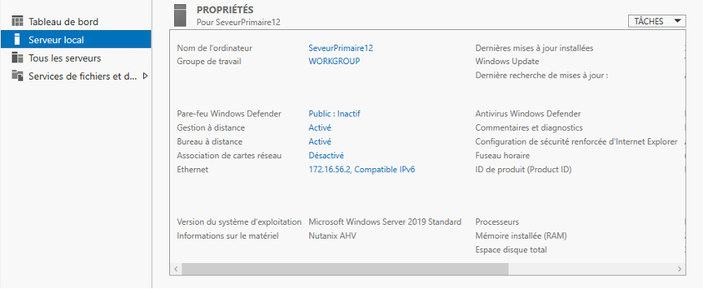
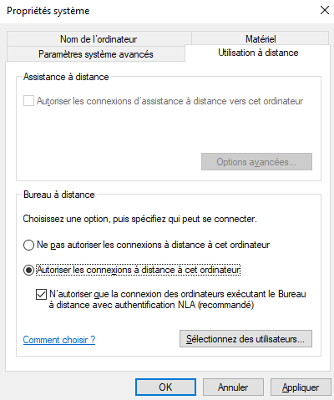
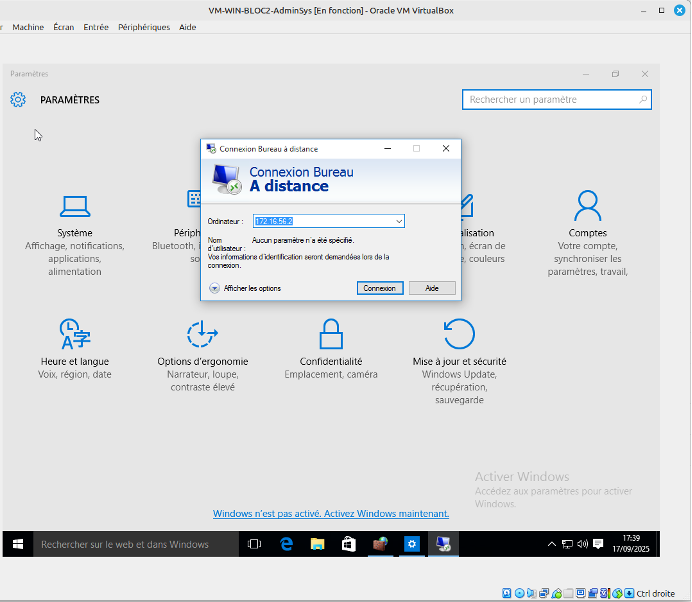

# Fiche procédure protocole RDP

## Installation du bureau à distance – Protocole RDP

### Activer le Bureau à distance sous Windows Server :

Dans le **`Gestionnaire de serveur > Serveur local`**, le paramètre Bureau à distance permet d’activer RDP. Par défaut désactivé, il empêche les connexions entrantes, mais le serveur peut toujours se connecter en RDP à une autre machine.

En cliquant sur *Activé* ou *Désactivé*, on ouvre l’interface de configuration du Bureau à distance. Pour autoriser les connexions, il faut cocher **Autoriser les connexions à distance à cet ordinateur**.

**Activer le Bureau à distance sous Windows Server :**
`Paramètres → Système → Bureau à distance →` **`Activer`**. 

Ouvrir le bureau à distance :

**Test de la connexion RDP pour le compte “adminssh” :**
Le type de compte *adminssh* a été modifié, car par défaut il est en *utilisateur standard*. Pour permettre l’accès en RDP, il doit être configuré en **compte administrateur**.

Entrer votre identifiant et mot de passe : 

