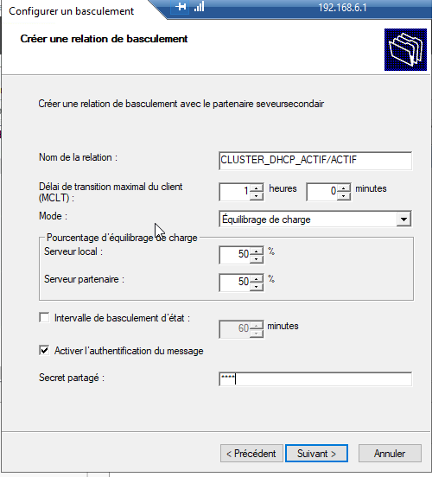
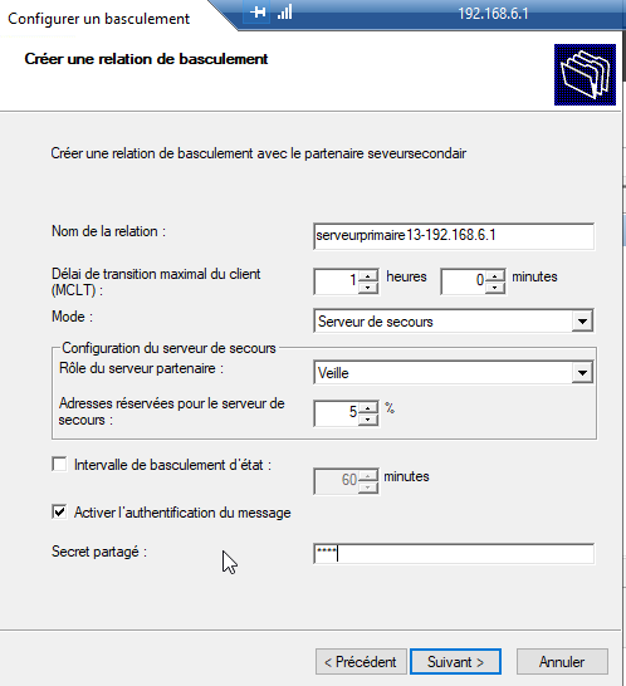

# Redondance DHCP
## Redondance DHCP Actif/Actif
**Mise en place du FailOver Actif/Passif sous WS 2019**

Dans un premier temps rendez-vous dans les paramètres DHCP puis effectuer un clic droit et sélectionner configurer un basculement comme ci-dessous :

La fenêtre suivante devrait s’ouvrir :

Sélectionner les étendues nécessitant d'être concerné par ce basculement. Puis cliquer sur suivant.

Vous devez ensuite ajouter le second serveur DHCP en saisissant l’adresse IP de celui-ci comme ci-dessous :

Renseigner ensuite les informations suivantes afin de configurer le partage selon les paramètres souhaités ici la mise en place d’un serveur en Actif/Actif.
Pensez à configurer un Secret partagé afin d’assurer la sécurité ( 1234 ).

Vous devriez donc avoir un récapitulatif de la configuration qui sera appliquée.

La configuration est appliquée

Cliquer sur « Répliquer les étendues de basculement » pour envoyer les étendus au second serveur :

Il les a bien reçus :

## Redondance DHCP Actif/Passif

La mise en place du FO Actif passif est similaire à la mise en place du Actif/Actif
Le mode doit uniquement passer de veille à Serveur de secours.

