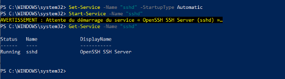

# Fiche procédure protocole SSH

## 1. Installer OpenSSH Server sur Windows 

A partir d'une console PowerShell ouverte en tant qu'administrateur, la commande suivante permet l'installation :

```bash
Add-WindowsCapability -Online -Name OpenSSH.Server~~~~0.0.1.0
```


## 2. Configurer OpenSSH Server sur Windows

### 2.1 Démarrage automatique du serveur OpenSSH

Pour commencer la configuration, nous allons démarrer le serveur OpenSSH d'une part, et d'autre part nous allons le configurer en démarrage automatique.

Plutôt que le faire à partir de la console "**Services**", je vous propose d'exécuter deux commandes PowerShell, ce sera plus efficace. Voici **l'état actuel du service** "**OpenSSH SSH Server**" :


Pour démarrer le service "**sshd**" correspondant à "**OpenSSH SSH Server**", on va utiliser la commande suivante :

```bash
Start-Service -Name "sshd"
```

Ensuite, pour le modifier et définir le mode de démarrage sur "**Automatique**" au lieu de "**Manuel**" :

```bash
Set-Service -Name "sshd" -StartupType Automatic
```
La commande ci-dessous vous permettra de vérifier qu'il est bien en cours d'exécution.

```bash
Get-Service -Name "sshd"
```


### 2.2 Configuration d'OpenSSH Server sur Windows

Sur Windows, la configuration d'OpenSSH est stockée à l'emplacement ci-dessous où l'on va trouver le fichier **sshd_config** :

```bash
%programdata%\ssh\
```

Au sein du fichier **sshd_config**, nous allons retrouver les options classiques d'OpenSSH. Nous pouvons le configurer de la même façon qu'on le ferai la configuration SSH sous Linux.

!!! warning "Attention tout de même"
    À ce jour, il y a des options non supportées comme les options X11. La liste complète des options non supportées est disponible sur le site Microsoft : OpenSSH - Options non supportées


**Modifier le port d'écoute SSH**

Pour modifier le port d'écoute par défaut (recommandé) et utiliser un autre port que le n°22, il faut modifier l'option "Port". **Pour modifier le fichier de configuration, vous devez ouvrir l'éditeur de texte en tant qu'administrateur pour avoir le droit d'enregistrer le fichier**.

Ensuite, il faut *décommenter la ligne* "`#Port 22`" et changer le numéro de port, comme ceci :


**Après chaque modification de la config, il est indispensable de redémarrer le service SSH** pour charger les nouveaux paramètres. PowerShell permet de le faire facilement :

```bash
Restart-Service "sshd"
```

A la suite de la modification du port, si la connexion SSH ne fonctionne pas, regardez du côté du pare-feu Windows. En effet, lors de l'installation d'OpenSSH Server, une règle est créée pour autoriser les connexions sur le port 22.

Voici la commande pour créer une règle de pare-feu qui autorise les connexions entrantes sur le port 222 :

```bash
New-NetFirewallRule -Name sshd -DisplayName 'OpenSSH Server (sshd) - Port 222' -Enabled True -Direction Inbound -Protocol TCP -Action Allow -LocalPort 222
```

!!! info "Information sur le contexte"
    Auparavant, j’ai créé un utilisateur « adminssh » afin d’utiliser celui-ci à la connexion SSH.

Dans le fichier de configuration, il faut **commenter les deux lignes suivantes**, sinon la directive DenyGroups ne fonctionne pas :

```bash
# Match Group administrators

# AuthorizedKeysFile __PROGRAMDATA__/ssh/administrators_authorized_keys
```
A la suite, ajoutez la ligne suivante :

```bash
DenyGroups administrateurs
```

Redémarrez le service SSH et tentez de vous connecter à votre serveur avec un compte administrateur : **l'accès doit être refusé !**

### 2.3 Connexion en ssh :

```bash
ssh adminssh@172.16.56.2 -p -222
```

