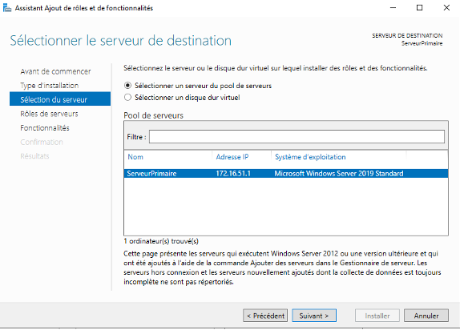
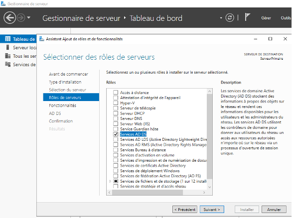
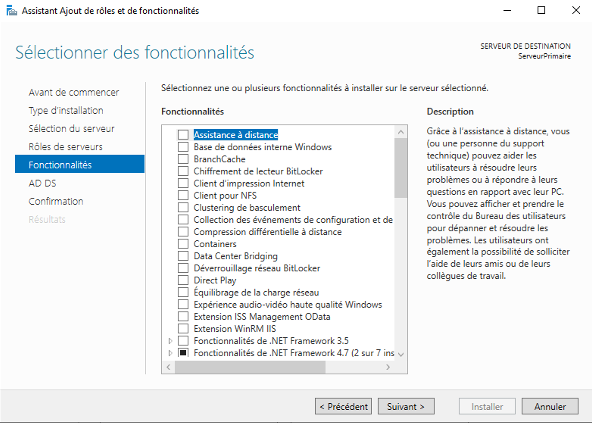
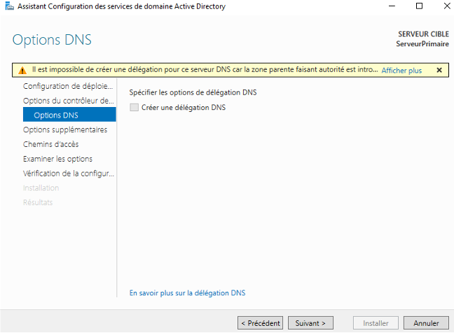
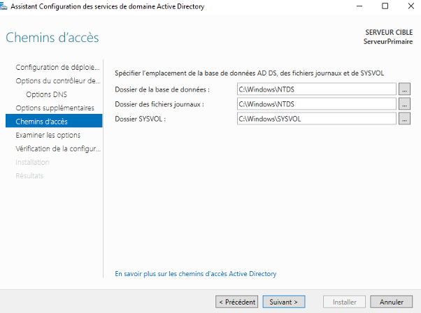
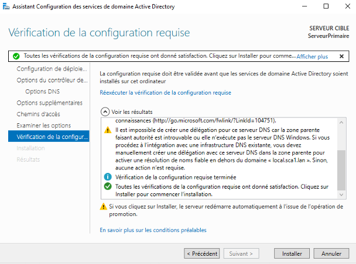

# I - Installation des services ADDS

## Prérequis

*Ducumentation en ligne : [https://cubdocumentation.sioplc.fr](https://cubdocumentation.sioplc.fr)*
 

## Adressage 

| **Service**                           | **Nombre d’hôtes** | **Adresse réseau** | **Masque de sous-réseau** | **Adresse de diffusion** | **Description VLAN** |
|--------------------------------------|--------------------|--------------------|----------------------------|--------------------------|----------------------|
| Production                           | 120                | 192.168.6.0        | 255.255.255.128            | 192.168.6.127            | VLAN 56              |
| Client 1                             | 32                 | 192.168.6.128      | 255.255.255.192            | 192.168.6.191            | VLAN 10              |
| Administration systèmes et réseaux   | 6                  | 192.168.6.192      | 255.255.255.240            | 192.168.6.207            | VLAN 20              |

___

## Schéma logique – Agence Frankfur

___
## Packet tracert - Agence Frankfurt
 

 

  <a href="https://drive.google.com/file/d/1tqY2a5OSuL46RE_DEkwUXmWYONAYMvJb/view?usp=share_link" 
     style="display:inline-block;
            background:#e7e7e9;
            color:#0096FF;
            padding:11px 25px;
            border-radius:10px;
            text-decoration:none;
            font-weight:50;
            box-shadow:0 0 12px rgba(0,0,0,0.5);
            transition:all 0.3s ease;"
     onmouseover="this.style.background='#dcdce0'; this.style.color='#003d80';"
     onmouseout="this.style.background='#e7e7e9'; this.style.color='#0096FF';">
     🔗 Cliquer pour télécherger le paket tracert
  </a>

 

### Étape 1 : Configuration réseau 

### Étape 2 : Ouvrir le gestionnaire de serveur

### Étape 3 : Ouvrir le gestionnaire de serveur

Clic droit sur « Gérer » dans « Gestionnaire de serveur », puis « Ajouter des rôles et des fonctionnalités ». Le « Assistant d'ajout de rôles et de fonctionnalités » s’ouvre pour installer les services de domaine Active Directory. Cliquez sur suivant.

 
### Étape 4 : Type d’installation 

Sur le « Type d'installation », laissez le bouton radio « Installation basée sur les rôles ou les fonctionnalités » sélectionné et cliquez sur suivant.

### Étape 5 : Sélection du serveur

Sur cette étape intitulée « Sélectionner le serveur de destination », sélectionnez le serveur sur lequel vous souhaitez installer AD DS et cliquez sur suivant. Je vais choisir mon serveur local.

### Étape 6 : Rôles de serveur

L'étape précédente vous mènera à la page suivante comme indiqué ci-dessous. Ici, vous verrez de nombreuses options avec une case de liste de contrôle carrée en regard d'elles. Comme vous pouvez le deviner, nous allons choisir « Services de domaine Active Directory ».

 

### Étape 7 : Ajouter des fonctionnalités

En choisissant cette option, une nouvelle partie apparaît. Cliquez sur « Ajouter des fonctionnalités » puis sur « Suivant ».

### Étape 8 : Sélectionner les fonctionnalités

Sur la page suivante après l'étape 6 intitulée « Sélectionner les fonctionnalités », appuyez simplement sur « Suivant » pour vous diriger vers les installations d'AD DS.

### Étape 9 : AD DS
Comme indiqué ci-dessous, la page suivante intitulée « Services de domaine Active Directory » vous sera présentée. Ici, cliquez sur « Suivant »

### Étape 10 : Confirmez vos sélections
La page suivante sert à confirmer l’installation. Si tout est correct, cliquez sur installer. Vous pouvez activer le redémarrage automatique si besoin. Cliquez sur fermer une fois terminer.
 
### Étape 11 : Promouvoir au rang de contrôleur de domaine

Après l’installation des services Active Directory, il faut le promouvoir en contrôleur de domaine. Dans le Gestionnaire de serveur, une notification jaune apparaît à côté de « Gérer ». Cliquez dessus puis sur « Promouvoir ce serveur en contrôleur de domaine ».

### Étape 12 : Ajouter une nouvelle forêt

La fenêtre « Assistant de configuration des services de domaine Active Directory » apparaît. Choisissez « Ajouter une nouvelle forêt » et entrez le nom de domaine racine de votre organisation. Cliquez sur « Suivant ».

  
### Étape 13 : Options du contrôleur de domaine

Dans les options du contrôleur de domaine, laissez les valeurs par défaut cochées et saisissez votre mot de passe. Après cela, cliquez sur « Suivant ».

 
### Étape 14 : Options DNS

Sur la page « Options DNS », une erreur peut s’afficher : « Une délégation pour ce serveur DNS ne peut pas être créée car le serveur de noms de zone parent faisant autorité est introuvable ». Ignorez-la et cliquez sur « Suivant ».

### Étape 15 : Nom de domaine NetBIOS

Sur la page suivante, laissez le nom de domaine NetBIOS par défaut ou vous pouvez le modifier à condition qu'il ne dépasse pas 15 caractères. Cliquez ensuite sur « Suivant ».

### Étape 16 : Chemins

Laissez les chemins par défaut et cliquez sur « Suivant » comme indiqué ci-dessous.

 

### Étape 17 : Examiner les options

Dans cette étape, le serveur vous permet de revoir ce que vous avez fait jusqu'à présent. Si vous êtes bon avec les sélections que vous avez faites. Appuyez sur « Suivant ».

### Étape 18 : Vérification des prérequis

Dans cette étape, les conditions préalables sont vérifiées avant l'installation des services de domaine Active Directory. En cas d'erreurs, corrigez-les. Sinon, cliquez sur « Installer ».

 
Après cela, le serveur redémarrera et vous pourrez ensuite vous connecter au domaine avec les informations d'identification que vous avez définies à l'étape 12, comme indiqué ci-dessous.

