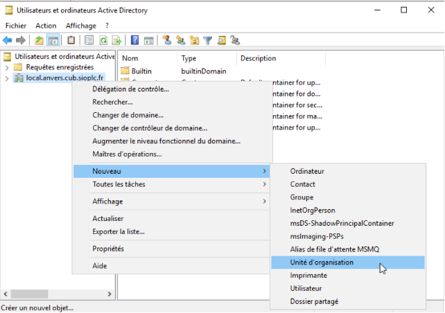
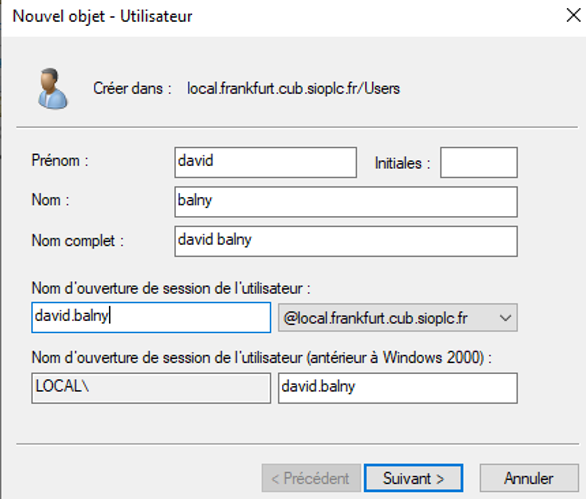

# II - Paramétrage de l’active Directory

## Prérequis

*Ducumentation en ligne : [https://cubdocumentation.sioplc.fr](https://cubdocumentation.sioplc.fr)*
 

## Adressage 

| **Service**                           | **Nombre d’hôtes** | **Adresse réseau** | **Masque de sous-réseau** | **Adresse de diffusion** | **Description VLAN** |
|--------------------------------------|--------------------|--------------------|----------------------------|--------------------------|----------------------|
| Production                           | 120                | 192.168.6.0        | 255.255.255.128            | 192.168.6.127            | VLAN 56              |
| Client 1                             | 32                 | 192.168.6.128      | 255.255.255.192            | 192.168.6.191            | VLAN 10              |
| Administration systèmes et réseaux   | 6                  | 192.168.6.192      | 255.255.255.240            | 192.168.6.207            | VLAN 20              |

___

## Schéma logique – Agence Frankfur

___
## Packet tracert - Agence Frankfurt
 

 

  <a href="https://drive.google.com/file/d/1tqY2a5OSuL46RE_DEkwUXmWYONAYMvJb/view?usp=share_link" 
     style="display:inline-block;
            background:#e7e7e9;
            color:#0096FF;
            padding:11px 25px;
            border-radius:10px;
            text-decoration:none;
            font-weight:50;
            box-shadow:0 0 12px rgba(0,0,0,0.5);
            transition:all 0.3s ease;"
     onmouseover="this.style.background='#dcdce0'; this.style.color='#003d80';"
     onmouseout="this.style.background='#e7e7e9'; this.style.color='#0096FF';">
     🔗 Cliquer pour télécherger le paket tracert
  </a>

 

## Paramétrage de l’active Directory

**Création des unités d’organisation pour chaque salle du site :** 

* Salle001
* Salle002
* Salle003
* Salle004

Pour cela : Faites un clic droit sur le domaine local.frankfurt.cub.sioplc.fr > `Nouveau > Unité d’organisation`

`local.frankfurt.cub.sioplc.fr > Nouveau > Ordinateur` 
Intégrer un ordinateur client Windows au domaine (nom : posteA)

Déplacer l’ordinateur "PosteA" dans l’unité d’organisation "Salle002"
`local.frankfurt.cub.sioplc.fr > posteA > Déplacer…`

**Créer dans le conteneur "Users" les utilisateurs suivant :**

* balny david : mdp ( à changer à la première connexion) : Provisoire_007

* demouliere quentin : mdp ( à changer à la première connexion) : Provisoire_007

* ferreira christèle : mdp ( à changer à la première connexion) : Provisoire_007

* caramigeas béatrice : mdp ( à changer à la première connexion) : Provisoire_007

Exemple pour david balny : 

**Créer les groupes suivants dans le conteneur "Users" (étendue : Globale ; Type : Sécurité) :** 

* Production 
* Clients
* Administration

Exemple avec production :
`local.frankfurt.cub.sioplc.fr > user > nouveau > groupe`

**Ajouter des membres aux groupes créés :** 

* M Balny et M Demoulière : groupe Production
* Mme Ferreira : groupe Administration
* Mme Caramigeas : groupe Clients 

Exemple avec le groupe production : 

