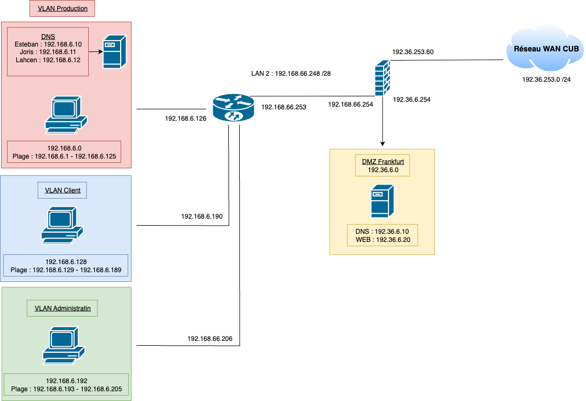

# III - Commandes PowerShell pour l’active Directory


## Prérequis


*Ducumentation en ligne : [https://cubdocumentation.sioplc.fr](https://cubdocumentation.sioplc.fr)*
<br>

## Adressage 

| **Service**                           | **Nombre d’hôtes** | **Adresse réseau** | **Masque de sous-réseau** | **Adresse de diffusion** | **Description VLAN** |
|--------------------------------------|--------------------|--------------------|----------------------------|--------------------------|----------------------|
| Production                           | 120                | 192.168.6.0        | 255.255.255.128            | 192.168.6.127            | VLAN 56              |
| Client 1                             | 32                 | 192.168.6.128      | 255.255.255.192            | 192.168.6.191            | VLAN 10              |
| Administration systèmes et réseaux   | 6                  | 192.168.6.192      | 255.255.255.240            | 192.168.6.207            | VLAN 20              |

___

## Schéma logique – Agence Frankfur



___
## Packet tracert - Agence Frankfurt
<br>


<br>

<div style="text-align:center; margin-top:20px;">
  <a href="https://drive.google.com/file/d/1tqY2a5OSuL46RE_DEkwUXmWYONAYMvJb/view?usp=share_link" 
     style="display:inline-block;
            background:#e7e7e9;
            color:#0096FF;
            padding:11px 25px;
            border-radius:10px;
            text-decoration:none;
            font-weight:50;
            box-shadow:0 0 12px rgba(0,0,0,0.5);
            transition:all 0.3s ease;"
     onmouseover="this.style.background='#dcdce0'; this.style.color='#003d80';"
     onmouseout="this.style.background='#e7e7e9'; this.style.color='#0096FF';">
     🔗 Cliquer pour télécherger le paket tracert
  </a>
</div>
<br>

## Commandes PowerShell pour l’active Directory

### 1. Chargement du module Active Directory
```bash
Import-Module ActiveDirectory
```

### 2. Création d'une unité d'organisation (OU)
```bash
New-ADOrganizationalUnit -Name "Salle005" -Path "DC=local,DC=anvers,DC=cub,DC=sioplc,DC=fr"
```

### 3. Déplacer un ordinateur vers une unité d'organisation
```bash
PS C:\Users\Administrateur> Move-ADObject -Identity "CN=posteA,OU=Salle002,DC=local,DC=anvers,DC=cub,DC=sioplc,DC=fr" -TargetPath "OU=Salle001,DC=local,DC=anvers,DC=cub,DC=sioplc,DC=fr"
```

### 4. Création d'un utilisateur
```bash
New-ADUser -Name "Patricia Delouche" -GivenName "Patricia" -Surname "Delouche" -SamAccountName "pdelouche" -UserPrincipalName "pdelouche@local.anvers.cub.sioplc.fr" -Path "CN=Users,DC=local,DC=anvers,DC=cub,DC=sioplc,DC=fr" -AccountPassword (ConvertTo-SecureString "Provisoire_007" -AsPlainText -Force) -Enabled $true -ChangePasswordAtLogon $true
```

### 5. Création d'un groupe
```bash
New-ADGroup -Name "Développeurs" -GroupScope Global -Path "CN=Users,DC=local,DC=anvers,DC=cub,DC=sioplc,DC=fr"
```

### 6. Ajouter un utilisateur au groupe
```bash
Add-ADGroupMember -Identity "Développeurs" -Members "pdelouche"
```

### 7. Lister tous les comptes avec informations détaillées
```bash
Get-ADUser -Filter * -Property * | Select-Object Name, GivenName, Surname, SamAccountName, Enabled, PasswordLastSet, LastLogonDate
```
