# Situation 1 - Préparation de la maquette et premiers paramétrages du serveur Windows2019


## Prérequis


*Ducumentation en ligne : [https://cubdocumentation.sioplc.fr](https://cubdocumentation.sioplc.fr)*
<br>

## Adressage 

| **Service**                           | **Nombre d’hôtes** | **Adresse réseau** | **Masque de sous-réseau** | **Adresse de diffusion** | **Description VLAN** |
|--------------------------------------|--------------------|--------------------|----------------------------|--------------------------|----------------------|
| Production                           | 120                | 192.168.6.0        | 255.255.255.128            | 192.168.6.127            | VLAN 56              |
| Client 1                             | 32                 | 192.168.6.128      | 255.255.255.192            | 192.168.6.191            | VLAN 10              |
| Administration systèmes et réseaux   | 6                  | 192.168.6.192      | 255.255.255.240            | 192.168.6.207            | VLAN 20              |

___

## Schéma logique – Agence Frankfur


___
## Packet tracert - Agence Frankfurt
<br>


<br>

<div style="text-align:center; margin-top:20px;">
  <a href="https://drive.google.com/file/d/1L7Gp52YpPjjRhFdp9gp4L1sGORqAoCEK/view?usp=share_link" 
     style="display:inline-block;
            background:#e7e7e9;
            color:#0096FF;
            padding:11px 25px;
            border-radius:10px;
            text-decoration:none;
            font-weight:50;
            box-shadow:0 0 12px rgba(0,0,0,0.5);
            transition:all 0.3s ease;"
     onmouseover="this.style.background='#dcdce0'; this.style.color='#003d80';"
     onmouseout="this.style.background='#e7e7e9'; this.style.color='#0096FF';">
     🔗 Cliquer pour télécherger le paket tracert
  </a>
</div>
<br>

___

!!! note "Source"
    https://www.it-connect.fr/installer-et-configurer-openssh-server-sur-windows-server-2019/


## 1. Sysprep : 

Sysprep est l’**outil de préparation système de Windows**. Il permet de préparer une machine qui va servir de « master », en vue d’un futur déploiement.

Cet utilitaire se trouve dans `C:\Windows\System32\Sysprep`.

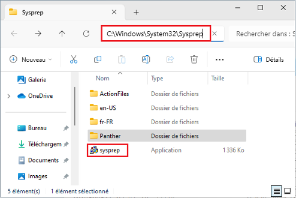

Double cliquez sur « **sysprep** »

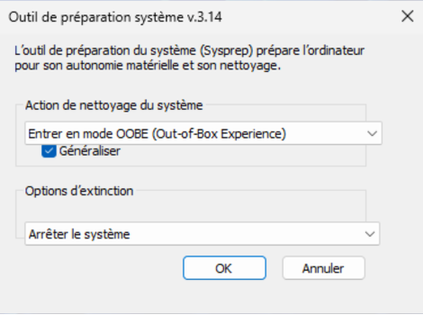

Quand tout ce passe bien, il vous affiche cette petite fenêtre qui reste ouverte plusieurs minutes :

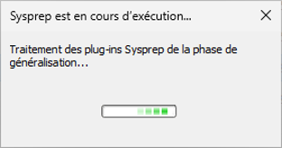


## 2. Comparaison SID

Ouvrez l'invite de commande en tant qu'**administrateur**.
Tapez la commande suivante pour voir votre SID d'utilisateur actuel.

```bash
whoami /user
```


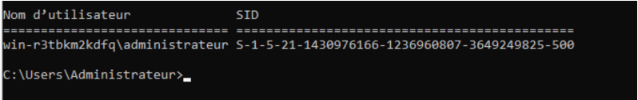

***Mon SID :*** *S-1-5-21-1430976166-1236960807-3649249825-500*
***SID de mon camarade :*** *5-1-5-21-324986168-2068038747-1270508929-500*

## 3. Changement d’adresse

Afin d’être conforme aux règles en vigueur sur les adressages, je change mon adresse IP, mon masque ainsi que ma passerelle.

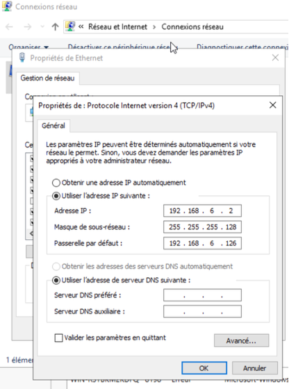

<br>

```bash
ipconfig
```


### 3.1 Accès poste client - Pare-feu

**Autorisation des postes clients : autoriser les requetes icmp** 

1.	Dans le volet gauche, clique sur **Règles de trafic entrant**.
2.	Dans le volet droit, clique sur **Nouvelle règle…**.
3.	Choisis **Personnalisée** puis **Suivant**.
4.	Dans **Programme**, laisse "Tous les programmes" → **Suivant**.
5.	Dans **Protocole et ports** :
<br>
    * Dans **Type de protocole**, sélectionne **ICMPv4**
    * Il est également possible aussi de choisir **ICMPv6** si nécessaire.
<br>
6.	Clique sur **Suivant** jusqu’à **Action** → choisis **Autoriser la connexion**.
7.	Sélectionne les profils (Domaine, Privé, Public) selon le besoin.
Généralement **Privé + Domaine** suffisent.
8.	Donne un nom à la règle (*ex : Autoriser ICMP Ping*) → **Terminer**.


## 4. Installer OpenSSH[^1] Server sur Windows 

A partir d'une console PowerShell ouverte en tant qu'administrateur, la commande suivante permet l'installation :

```bash
Add-WindowsCapability -Online -Name OpenSSH.Server~~~~0.0.1.0
```


## 5. Configurer OpenSSH Server sur Windows

### 5.1 Démarrage automatique du serveur OpenSSH

Pour commencer la configuration, nous allons démarrer le serveur OpenSSH d'une part, et d'autre part nous allons le configurer en démarrage automatique.

Plutôt que le faire à partir de la console "**Services**", je vous propose d'exécuter deux commandes PowerShell, ce sera plus efficace. Voici **l'état actuel du service** "**OpenSSH SSH Server**" :


Pour démarrer le service "**sshd**" correspondant à "**OpenSSH SSH Server**", on va utiliser la commande suivante :

```bash
Start-Service -Name "sshd"
```

Ensuite, pour le modifier et définir le mode de démarrage sur "**Automatique**" au lieu de "**Manuel**" :

```bash
Set-Service -Name "sshd" -StartupType Automatic
```
La commande ci-dessous vous permettra de vérifier qu'il est bien en cours d'exécution.

```bash
Get-Service -Name "sshd"
```


### 5.2 Configuration d'OpenSSH Server sur Windows

Sur Windows, la configuration d'OpenSSH est stockée à l'emplacement ci-dessous où l'on va trouver le fichier **sshd_config** :

```bash
%programdata%\ssh\
```

Au sein du fichier **sshd_config**, nous allons retrouver les options classiques d'OpenSSH. Nous pouvons le configurer de la même façon qu'on le ferai la configuration SSH sous Linux.

!!! warning "Attention tout de même"
    À ce jour, il y a des options non supportées comme les options X11. La liste complète des options non supportées est disponible sur le site Microsoft : OpenSSH - Options non supportées


**Modifier le port d'écoute SSH**

Pour modifier le port d'écoute par défaut (recommandé) et utiliser un autre port que le n°22, il faut modifier l'option "Port". **Pour modifier le fichier de configuration, vous devez ouvrir l'éditeur de texte en tant qu'administrateur pour avoir le droit d'enregistrer le fichier**.

Ensuite, il faut *décommenter la ligne* "`#Port 22`" et changer le numéro de port, comme ceci :


**Après chaque modification de la config, il est indispensable de redémarrer le service SSH** pour charger les nouveaux paramètres. PowerShell permet de le faire facilement :

```bash
Restart-Service "sshd"
```

A la suite de la modification du port, si la connexion SSH ne fonctionne pas, regardez du côté du pare-feu Windows. En effet, lors de l'installation d'OpenSSH Server, une règle est créée pour autoriser les connexions sur le port 22.

Voici la commande pour créer une règle de pare-feu qui autorise les connexions entrantes sur le port 222 :

```bash
New-NetFirewallRule -Name sshd -DisplayName 'OpenSSH Server (sshd) - Port 222' -Enabled True -Direction Inbound -Protocol TCP -Action Allow -LocalPort 222
```

!!! info "Information sur le contexte"
    Auparavant, j’ai créé un utilisateur « adminssh » afin d’utiliser celui-ci à la connexion SSH.

Dans le fichier de configuration, il faut **commenter les deux lignes suivantes**, sinon la directive DenyGroups ne fonctionne pas :

```bash
# Match Group administrators

# AuthorizedKeysFile __PROGRAMDATA__/ssh/administrators_authorized_keys
```
A la suite, ajoutez la ligne suivante :

```bash
DenyGroups administrateurs
```

Redémarrez le service SSH et tentez de vous connecter à votre serveur avec un compte administrateur : **l'accès doit être refusé !**

### 5.3 Connexion en ssh :

```bash
ssh adminssh@172.16.56.2 -p -222
```


## 6. Installation du bureau à distance – Protocole RDP

### 6.1 Activer le Bureau à distance sous Windows Server :

Dans le **`Gestionnaire de serveur > Serveur local`**, le paramètre Bureau à distance permet d’activer RDP. Par défaut désactivé, il empêche les connexions entrantes, mais le serveur peut toujours se connecter en RDP à une autre machine.

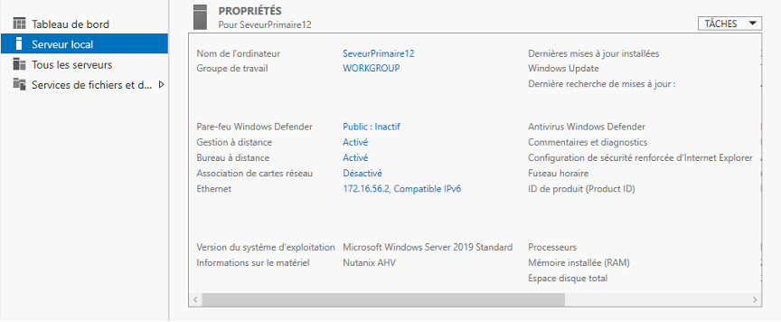

En cliquant sur *Activé* ou *Désactivé*, on ouvre l’interface de configuration du Bureau à distance. Pour autoriser les connexions, il faut cocher **Autoriser les connexions à distance à cet ordinateur**.

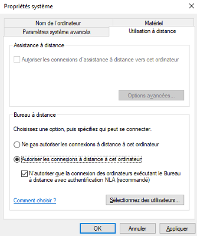

**Activer le Bureau à distance sous Windows Server :**
`Paramètres → Système → Bureau à distance →` **`Activer`**. 

Ouvrir le bureau à distance :

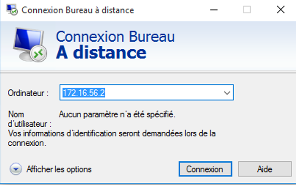

**Test de la connexion RDP pour le compte “adminssh” :**
Le type de compte *adminssh* a été modifié, car par défaut il est en *utilisateur standard*. Pour permettre l’accès en RDP, il doit être configuré en **compte administrateur**.

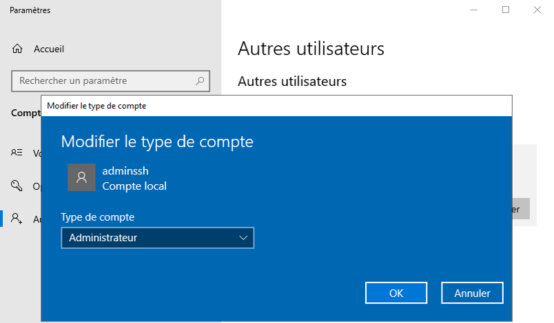

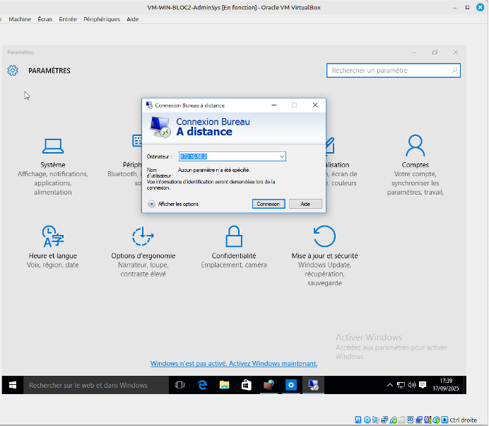

Entrer votre identifiant et mot de passe : 

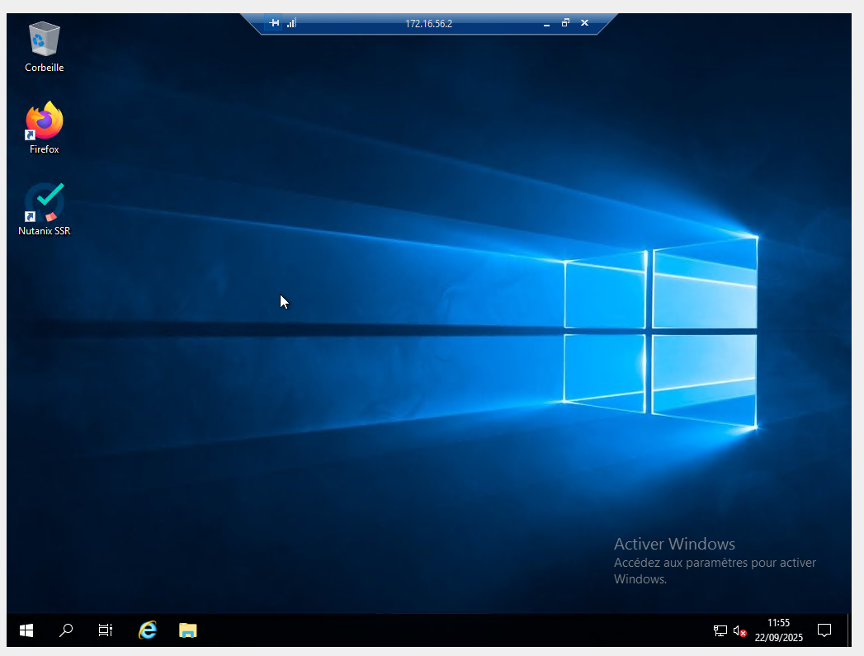

[^1]: **OpenSSH Server** (Open Secure Shell) est un service qui permet d'établir une connexion sécurisée entre un client et un serveur via le protocole SSH (Secure Shell).  
Il offre un canal chiffré pour exécuter des commandes à distance, transférer des fichiers (via `scp` ou `sftp`), et administrer des systèmes sans risquer l’interception des données. <br>  
Sous **Windows**, il peut être installé comme fonctionnalité facultative (« Fonctionnalités Windows ») et fonctionne en tant que service Windows, écoutant par défaut sur le port 22 pour autoriser les connexions SSH entrantes. <br>
Sous **Linux**, il est généralement fourni par le paquet `openssh-server`, qui écoute sur le port 22 par défaut et autorise les connexions SSH entrantes.


