# Situation 2 - Mise en place et découverte d’un environnement de développement GIT


## Prérequis


*Ducumentation en ligne : [https://cubdocumentation.sioplc.fr](https://cubdocumentation.sioplc.fr)*
<br>

## Adressage 

| **Service**                           | **Nombre d’hôtes** | **Adresse réseau** | **Masque de sous-réseau** | **Adresse de diffusion** | **Description VLAN** |
|--------------------------------------|--------------------|--------------------|----------------------------|--------------------------|----------------------|
| Production                           | 120                | 192.168.6.0        | 255.255.255.128            | 192.168.6.127            | VLAN 56              |
| Client 1                             | 32                 | 192.168.6.128      | 255.255.255.192            | 192.168.6.191            | VLAN 10              |
| Administration systèmes et réseaux   | 6                  | 192.168.6.192      | 255.255.255.240            | 192.168.6.207            | VLAN 20              |

___

## Schéma logique – Agence Frankfur


___
## Packet tracert - Agence Frankfurt
<br>


<br>

<div style="text-align:center; margin-top:20px;">
  <a href="https://drive.google.com/file/d/1L7Gp52YpPjjRhFdp9gp4L1sGORqAoCEK/view?usp=share_link" 
     style="display:inline-block;
            background:#e7e7e9;
            color:#0096FF;
            padding:11px 25px;
            border-radius:10px;
            text-decoration:none;
            font-weight:50;
            box-shadow:0 0 12px rgba(0,0,0,0.5);
            transition:all 0.3s ease;"
     onmouseover="this.style.background='#dcdce0'; this.style.color='#003d80';"
     onmouseout="this.style.background='#e7e7e9'; this.style.color='#0096FF';">
     🔗 Cliquer pour télécherger le paket tracert
  </a>
</div>
<br>

___


## Partie 1 – Installation de l’environnement GIT

1.	Installer la version Windows de Git sur votre serveur (Git Bash, Git GUI, Git CMD)
2.	Aller dans Git Bash et tester une première commande « **git version** »
3.	Créer un dossier par le Git Bash sur la racine de votre disque locale que vous nommez « **git_cub** ». Celui-ci contiendra l’ensemble de vos dépôts (ou Repositories en anglais)


## Partie 2 - Initialisation de l’environnement Git[^1] : 

**Question 5 : Préparer la configuration initiale de Git en local qui sera conservée pour tous vos projets :**

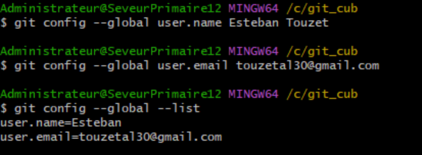

**Question 6 : Initialiser l'environnement Git local pour un dépôt (répositorie) :**


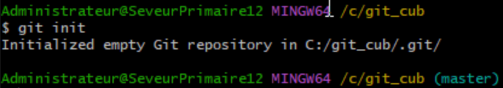

## Partie 3 – Gérer les versions (commits) en local 

**Question 7 : Créer le premier `scripto.bat` en batch à déposer dans le dossier `premierdepot`**

```bash
nano script0
```

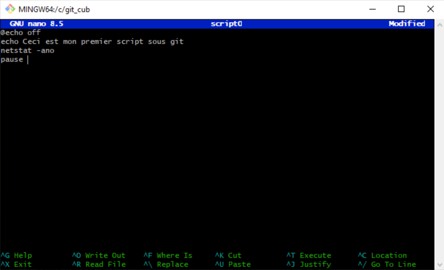

**Question 8 : Valider la première version du script dans une zone tampon (index) : `git add .` ou `git add --patch script0.bat`**

```bash
git add .
```

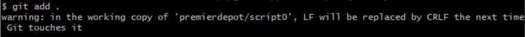

**Question 9 : Vérifier le status de votre dépôt : `git status`**

```bash
git status
```

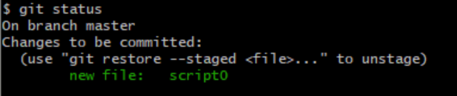

**Question 10 : Réaliser la première version (commit) de votre dépôt : `git commit -m « mon premier commit »`**

```bash
git commit -m « mon premier commit »
```

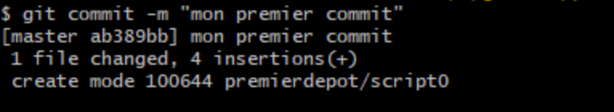

**Question 11 : Vérifier le status à nouveau de votre dépôt : `git status`**

```bash
git status
```

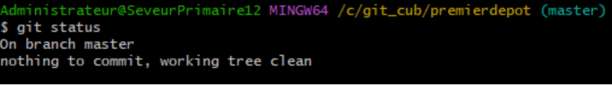

**Question 12 : Lister les versions (commits) de votre dépôt : `git log`**

```bash
git log
```

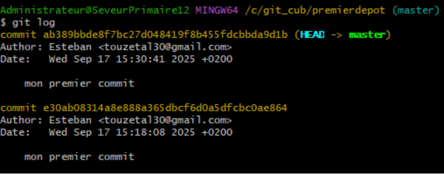

**Question 13 : Réaliser et enregistrer une modification du script :**

```bash
nano script0
```
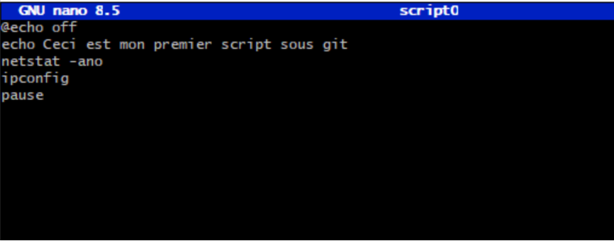

**Question 14 : Valider la deuxième version du script : `git add .`** ou **`git add --patch script0.bat`**

```bash
git add .
```

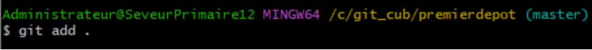

**Question 15 : Vérifier le status de votre dépôt : `git status`**

```bash
git status
```

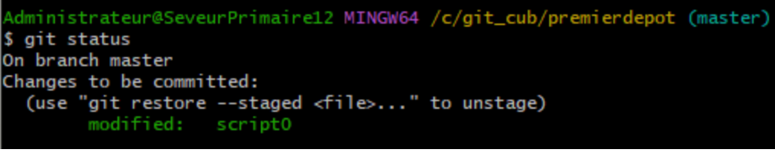

**Question 16 : Réaliser la deuxième version (commit) de votre dépôt : `git commit -m « mon deuxième commit »`**

```bash
git commit -m « mon deuxième commit »
```

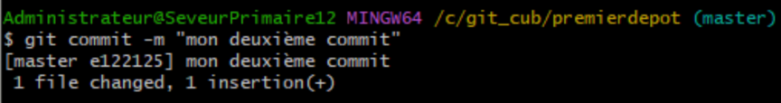

**Question 17 : Vérifier le status à nouveau de votre dépôt : `git status`**

```bash
git status
```

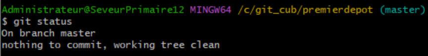

**Question 18 : Lister les versions (commits) de votre dépôt : `git log`**

```bash
git log
```

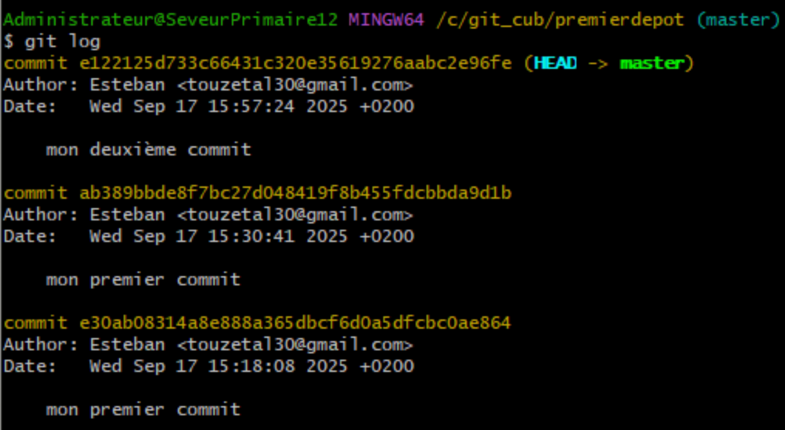

**Question 19 : Revenir à la première version du script : `git log –oneline`, puis `git checkout ab389bb` (à adapter en fonction de vos logs)**

```bash
git log –oneline
```
```bash
git checkout ab389bb
```

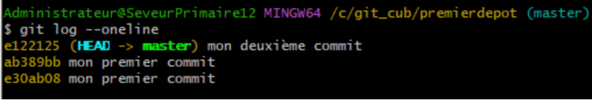
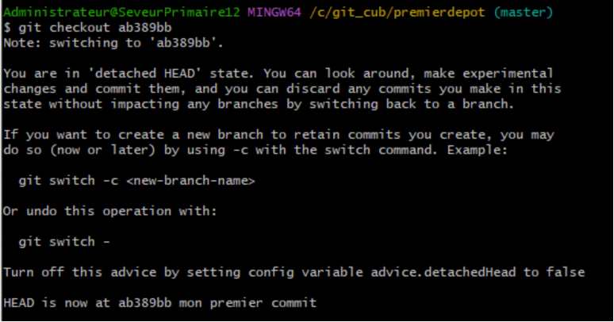

**Question 20 : Vérifier que le contenu du script correspond bien à votre première version**

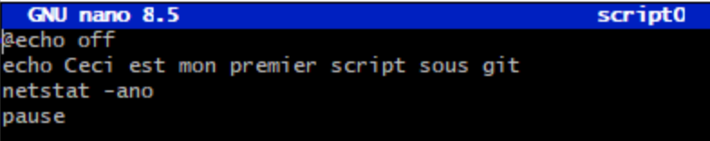

**Question 21 : Revenir à la dernière version du script : `git checkout master`**

```bash
git checkout master
```

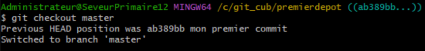

**Question 22 : Lister les versions (commits) de votre dépôt : `git log`**

```bash
git log
```

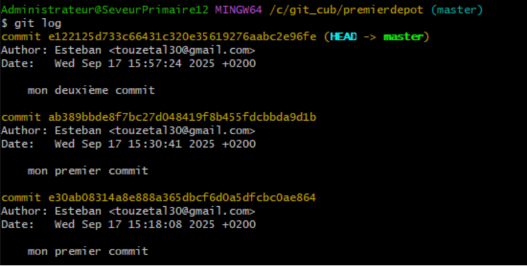

## Partie 4 – Gérer les dépôts GitHub à distance 

**Question 23 : Revenir sur votre compte GitHub et créer un nouveau dépôt `« premierdépotgithub »`**

Sur GitHub, cliquez sur New repository et nomme-le "*premierdepotgithub*"

Url : [https://github.com/estebantouzet/premierdepotgithub.git](https://github.com/estebantouzet/premierdepotgithub.git)

**Question 24 : Cloner ce nouveau dépôt vers votre machine en local dans le dossier « git_cub » : `git clone lien https de github pour le dépôt`**

```bash
git clone https://github.com/estebantouzet/premierdepotgithub.git
```


 
**Question 25 : Vérifier le contenu du nouveau dossier sur votre machine « `premierdépotgithub` »**

```bash
cd premierdepot
ls
```

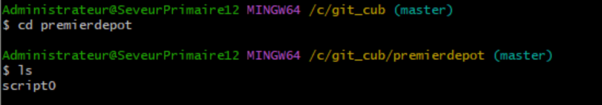

**Question 26 : Copier le `script0.bat` vers ce nouveau dossier**

```bash
git clone https://github.com/EstebanTOUZET/premierdepotgithub.git
```

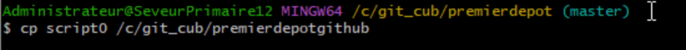

**Question 27 : Vérifier le status à nouveau de votre dépôt : `git status`**

```bash
git status
```

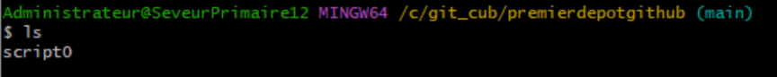

**Question 28 : Réaliser la première version (commit) de votre dépôt : `git commit -m « mon deuxième commit sur github »`**

```bash
git commit -m « mon deuxième commit sur github »
```

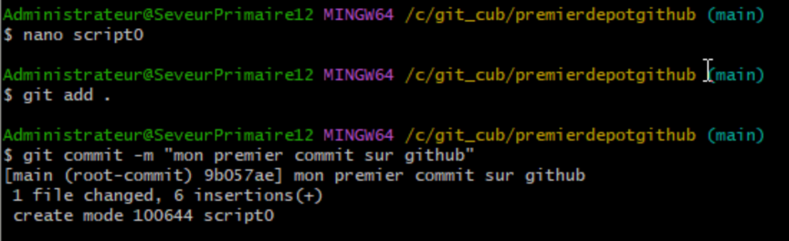

**Question 29 : Vérifier le status à nouveau de votre dépôt : `git status`**

```bash
git status
```

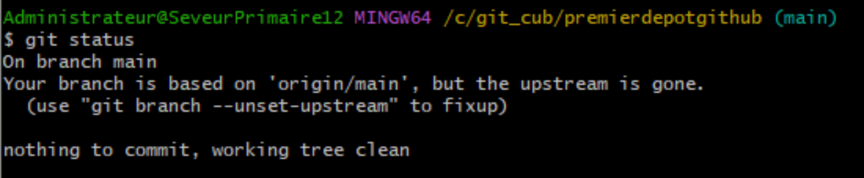

**Question 30 : Pousser et valider le contenu de votre dépôt local vers le dépôt distant : `git push -u origin main`**

```bash
git push -u origin main
```

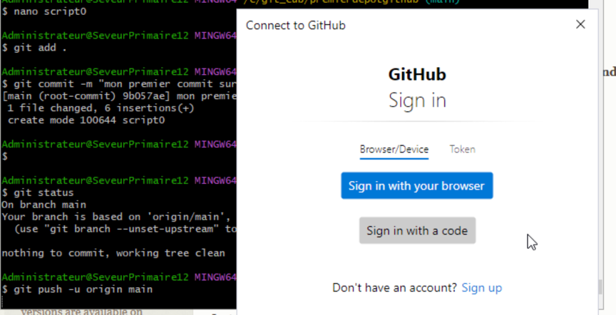
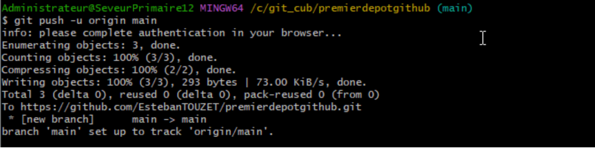

**Question 31 : Réaliser la deuxième version (commit) de votre dépôt : `git commit-m « mon deuxième commit sur github »`**

```bash
git commit-m « mon deuxième commit sur github »
```

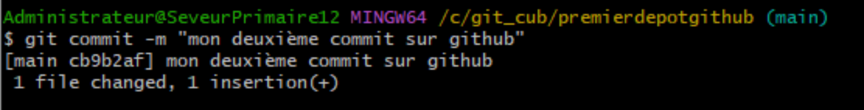

**Question 32 : Vérifier le status à nouveau de votre dépôt : `git status`**

```bash
git status
```

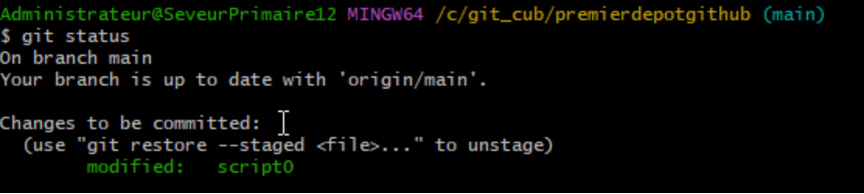

**Question 33 : Pousser et valider le contenu de votre dépôt local vers le dépôt distant : `git push -u origin main`**

```bash
git push -u origin main
```

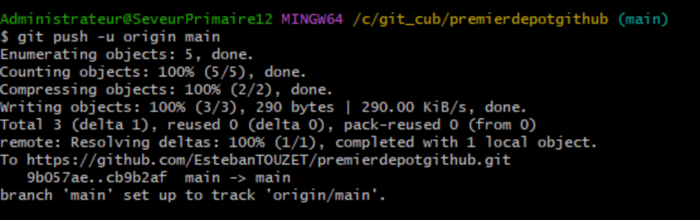

**Question 34 : Vérifier le contenu de votre dépôt distant sur le site de github**

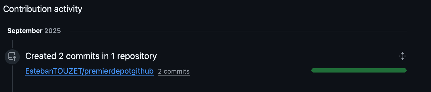

[^1]: Un **environnement Git** désigne l’ensemble des outils, configurations et dépôts permettant de gérer le **versionnement du code ou des fichiers** à l’aide de Git.  Il comprend généralement un **dépôt local** (sur la machine de l’utilisateur) et un **dépôt distant** (hébergé sur une plateforme comme GitHub, GitLab ou Bitbucket).  
Cet environnement permet de suivre l’historique des modifications, de collaborer avec d’autres utilisateurs, de revenir à des versions précédentes et de gérer différentes branches d’un projet.<br>  
Sous Windows, il peut être configuré via **Git Bash** ou un client graphique comme **GitHub Desktop**, tout en s’appuyant sur **OpenSSH** pour les connexions sécurisées.
