# Situation 3 - Introduction au PowerShell


## Prérequis


*Ducumentation en ligne : [https://cubdocumentation.sioplc.fr](https://cubdocumentation.sioplc.fr)*
<br>

## Adressage 

| **Service**                           | **Nombre d’hôtes** | **Adresse réseau** | **Masque de sous-réseau** | **Adresse de diffusion** | **Description VLAN** |
|--------------------------------------|--------------------|--------------------|----------------------------|--------------------------|----------------------|
| Production                           | 120                | 192.168.6.0        | 255.255.255.128            | 192.168.6.127            | VLAN 56              |
| Client 1                             | 32                 | 192.168.6.128      | 255.255.255.192            | 192.168.6.191            | VLAN 10              |
| Administration systèmes et réseaux   | 6                  | 192.168.6.192      | 255.255.255.240            | 192.168.6.207            | VLAN 20              |

___

## Schéma logique – Agence Frankfur


___
## Packet tracert - Agence Frankfurt
<br>


<br>

<div style="text-align:center; margin-top:20px;">
  <a href="https://drive.google.com/file/d/1L7Gp52YpPjjRhFdp9gp4L1sGORqAoCEK/view?usp=share_link" 
     style="display:inline-block;
            background:#e7e7e9;
            color:#0096FF;
            padding:11px 25px;
            border-radius:10px;
            text-decoration:none;
            font-weight:50;
            box-shadow:0 0 12px rgba(0,0,0,0.5);
            transition:all 0.3s ease;"
     onmouseover="this.style.background='#dcdce0'; this.style.color='#003d80';"
     onmouseout="this.style.background='#e7e7e9'; this.style.color='#0096FF';">
     🔗 Cliquer pour télécherger le paket tracert
  </a>
</div>
<br>

___

## 1. Réponse aux questions de la situation - Intoduction au PwerShell[^1] :

??? info "La sensiblité à la casse de PowerShell "
    PowerShell n’est pas sensible à la casse par défaut : variables, cmdlets et paramètres fonctionnent quelle que soit la casse. Pour les comparaisons de chaînes, certains opérateurs sont insensibles (-eq, -like) et d’autres sensibles (-ceq, -clike). <br>
    En clair, les majuscules et/ou minuscule auront aucune incidence sur vos commandes !

### 1.1 Connectez-vous en SSH puis exécuter et vérifier la version de Powershell 

```bash
ssh adminssh@192.168.6.2 -p 222
```

Une fois connecter en ssh, il faut se mettre en Powershell : 

```bash
powershell
```
```bash
$PSVersionTable
```

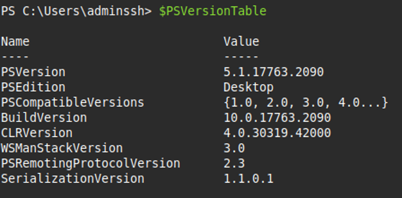

### 1.2 Comment visualiser sur votre terminal que Powershell est bien exécuter

Si vous visualiser "`PS`" comme sur l’image ci-dessous, alors vous êtes en PowerShell :

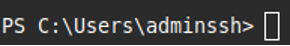


### 1.3 Afficher l’ensemble des alias contenus dans PowerShell

```bash
get-alias
```
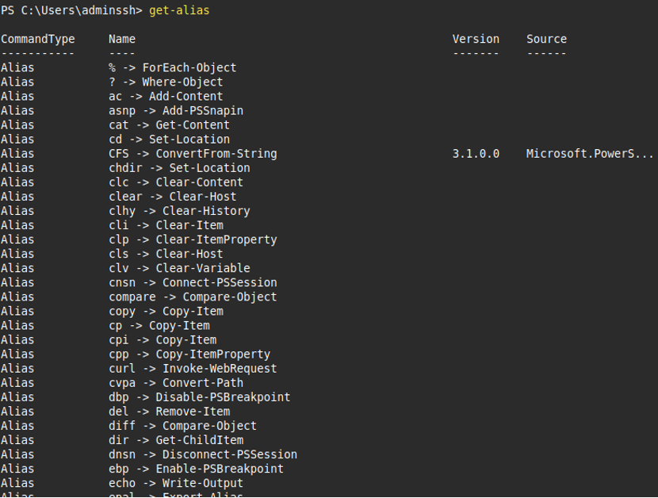
...

### 1.4 Afficher l’aide pour l’utilisation de la commande `clear –host`

```bash
get-help clear
```
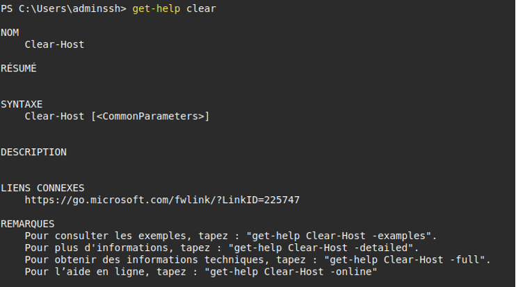

### 1.5 Quels sont les trois types de commande pouvons-nous retrouver dans les commandes disponibles de PowerShell

Commande : *get-command*
1. Alias
2. Function
3. Cmdlet

### 1.6 Tester la commande `Get-History`, quel est l’intérêt d’utiliser cette commande ?

La commande Get-History affiche la liste des commandes exécutées dans la session PowerShell.

Elle permet de retrouver, réutiliser ou analyser les commandes précédentes, ce qui fait gagner du temps et facilite le suivi du travail effectué.

```bash
Get-History
```

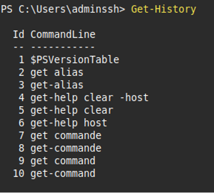

### 1.7 Afficher la liste des processus en cours d’exécution sur le serveur Windows2019.

```bash
get-process
```

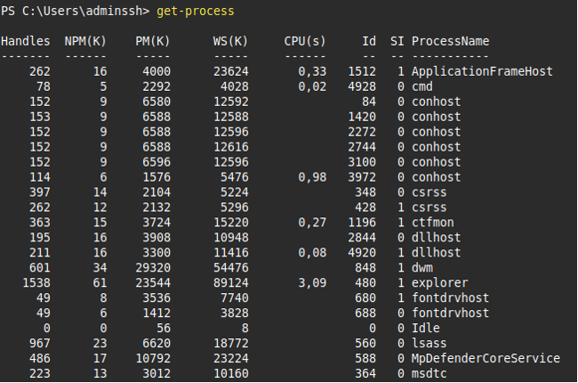

### 1.8 Retrouver les commandes permettant d’afficher page par page la liste des commandes disponible sur PowerShell 

```bash
get-command | out-host -paging
```

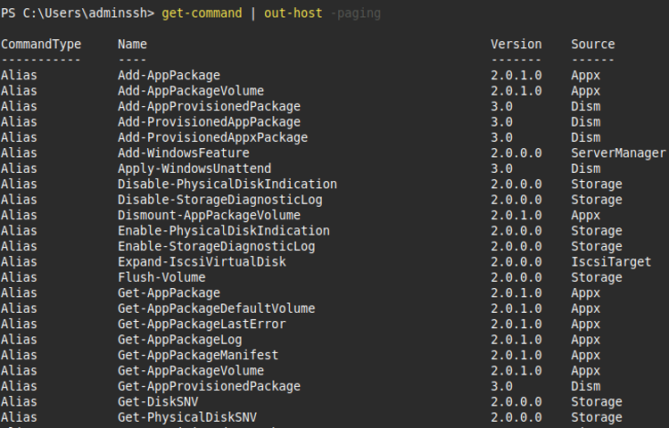

### 1.9 Retrouver et tester les commandes permettant de lister, de démarrer et d’arrêter les services.

Lister le service "`Spooler`" :
```bash
get-service -Name "Spooler"
```
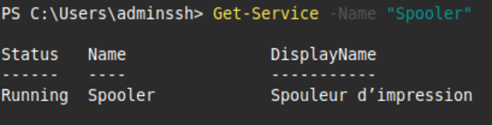

Démarrer le service "`wuauserv`" :
```bash
Start-Service -Name "wuauserv"
```
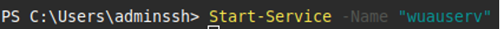

Arrêter le service "wuauserv" :
```bash
stop-service –name "wuauserv"
```

### 1.10 Créer en ligne de commande le dossier « `procédures` »

```bash
new-item -name "procedures" -ItemType directory
```

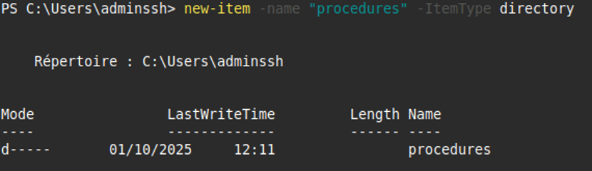

### 1.11 Créer avec une commande PowerShell un fichier nommé « liste des procédures.txt »

```bash
cd procedures
new-item -name "liste des procedures.txt" -ItemType directory
```
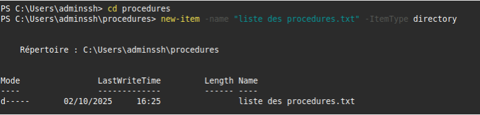

### 1.12 Ajouter les deux lignes suivantes dans le fichier nommé « `ListeProcédures.txt` » 

1.	Administration à distance sécurisée
2.	Commandes Powershell

```bash
Add-Content -Path ".\ListeProcédures.txt" -Value "Administration à distance sécurisée"
Add-Content -Path ".\ListeProcédures.txt" -Value "Commandes Powershell"
```


### 1.13 Réaliser une copie du fichier « `ListeProcédures.txt` » vers un nouveau fichier de sauvegarde nommé « `ListeProcéduresSauvegarde.txt` »

```bash
Copy-Item -Path ".\ListeProcédures.txt" -Destination ".\ListeProcéduresSauvegarde.txt"
```

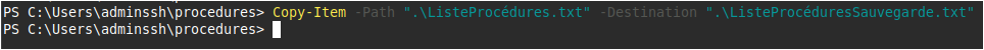


[^1]: Windows PowerShell est un interpréteur de ligne de commande Windows spécialement conçu pour les administrateurs système. Windows PowerShell inclut une invite interactive et un environnement de script utilisables indépendamment ou conjointement. <br>
Windows PowerShell introduit le concept d'applet de commande, outil en ligne de commande simple, à fonction unique, intégré dans l'interpréteur de commandes. Vous pouvez utiliser chaque applet de commande séparément, mais la puissance de ces outils simples s'exprime pleinement quand vous les combinez pour effectuer des tâches complexes. Windows PowerShell inclut plus d'une centaine d'applets de commande de base.