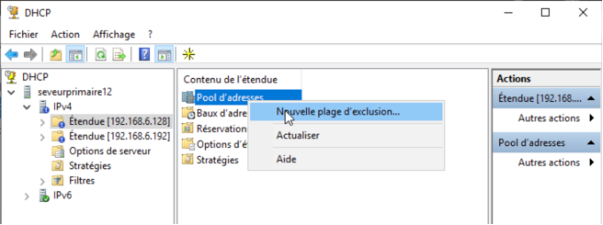
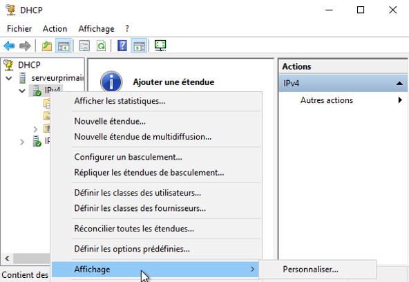
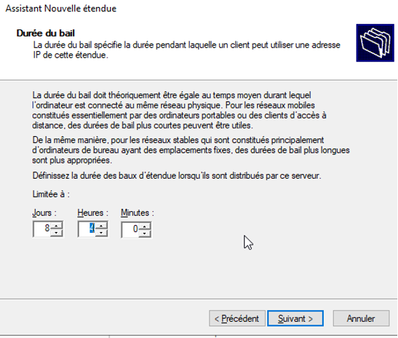
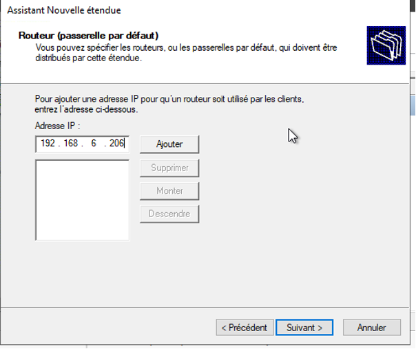

# Situation 4 - Paramétrage et sécurisation du service DHCP


## Prérequis


*Ducumentation en ligne : [https://cubdocumentation.sioplc.fr](https://cubdocumentation.sioplc.fr)*
<br>

## Adressage 

| **Service**                           | **Nombre d’hôtes** | **Adresse réseau** | **Masque de sous-réseau** | **Adresse de diffusion** | **Description VLAN** |
|--------------------------------------|--------------------|--------------------|----------------------------|--------------------------|----------------------|
| Production                           | 120                | 192.168.6.0        | 255.255.255.128            | 192.168.6.127            | VLAN 56              |
| Client 1                             | 32                 | 192.168.6.128      | 255.255.255.192            | 192.168.6.191            | VLAN 10              |
| Administration systèmes et réseaux   | 6                  | 192.168.6.192      | 255.255.255.240            | 192.168.6.207            | VLAN 20              |

___

## Schéma logique – Agence Frankfur


___
## Packet tracert - Agence Frankfurt
<br>


<br>

<div style="text-align:center; margin-top:20px;">
  <a href="https://drive.google.com/file/d/1tqY2a5OSuL46RE_DEkwUXmWYONAYMvJb/view?usp=share_link" 
     style="display:inline-block;
            background:#e7e7e9;
            color:#0096FF;
            padding:11px 25px;
            border-radius:10px;
            text-decoration:none;
            font-weight:50;
            box-shadow:0 0 12px rgba(0,0,0,0.5);
            transition:all 0.3s ease;"
     onmouseover="this.style.background='#dcdce0'; this.style.color='#003d80';"
     onmouseout="this.style.background='#e7e7e9'; this.style.color='#0096FF';">
     🔗 Cliquer pour télécherger le paket tracert
  </a>
</div>
<br>

## Situation : DHCP Windows 

### Télécharger le service DHCP


### Télécharger le service DHCP

*Création de l’étendue vlan 10 :*


```bash
Add-DhcpServerv4Scope -Name "VLAN 10" -StartRange 192.168.6.129 -EndRange 192.168.1.190 -SubnetMask 255.255.255.192
```

*Création de l’étendue vlan 20 :*


```bash
Add-DhcpServerv4Scope -Name "VLAN20" -StartRange 192.168.6.193 -EndRange 192.168.1.206 -SubnetMask 255.255.255.240
```

### Exclusion d’adresse 

Clic droit sur « `pool d’adresses` » > « `nouvelle plage d’exclusion` »




### Réservation d’adresse 

Clic droit sur « `réservation` » > « `nouvelle réservation` »


@IP réservé : 192.168.6.201


En PowerShell


### Toutes les étapes en graphiques  

Création d’une nouvelle étendue DHCP



Nom de l’étendue : 


Plage d’adressage IP : 


Ajout d’exclusion de l’étendue DHCP :  


Durée du bail : 



Routeur (passerelle par défaut) : 



Nom de domaine et serveurs DNS : 


### Redondance DHCP Actif/Actif
**Mise en place du FailOver Actif/Passif sous WS 2019**

Dans un premier temps rendez-vous dans les paramètres DHCP puis effectuer un clic droit et sélectionner configurer un basculement comme ci-dessous :


La fenêtre suivante devrait s’ouvrir :

Sélectionner les étendues nécessitant d'être concerné par ce basculement. Puis cliquer sur suivant.


Vous devez ensuite ajouter le second serveur DHCP en saisissant l’adresse IP de celui-ci comme ci-dessous :


Renseigner ensuite les informations suivantes afin de configurer le partage selon les paramètres souhaités ici la mise en place d’un serveur en Actif/Actif.
Pensez à configurer un Secret partagé afin d’assurer la sécurité ( 1234 ).


Vous devriez donc avoir un récapitulatif de la configuration qui sera appliquée.


La configuration est appliquée


Cliquer sur « Répliquer les étendues de basculement » pour envoyer les étendus au second serveur :


Il les a bien reçus :


### Redondance DHCP Actif/Passif

La mise en place du FO Actif passif est similaire à la mise en place du Actif/Actif
Le mode doit uniquement passer de veille à Serveur de secours.


**Note :**

**<u>Rechercher et rédiger une note sur les vulnérabilités avérées du service DHCP (Starvation et Rogue) et les contre-mesures envisageables :**</u>

Le protocole DHCP (Dynamic Host Configuration Protocol) présente certaines vulnérabilités, car il ne comporte pas de mécanisme d’authentification entre le client et le serveur. Deux attaques principales exploitent cette faiblesse : la DHCP Starvation et le Rogue DHCP.

L’attaque DHCP Starvation consiste à envoyer un grand nombre de requêtes DHCP avec des adresses MAC falsifiées afin d’épuiser le pool d’adresses disponibles sur le serveur. Cela provoque un déni de service pour les clients légitimes, qui ne peuvent plus obtenir d’adresse IP.

L’attaque Rogue DHCP se produit lorsqu’un serveur DHCP non autorisé est introduit sur le réseau. Ce serveur peut répondre plus rapidement que le serveur légitime et fournir de fausses informations (comme une passerelle ou un DNS malveillant), permettant à l’attaquant d’intercepter ou de perturber le trafic réseau.

<u>Pour se protéger contre ces menaces, plusieurs contre-mesures peuvent être mises en place : </u>

Activer le DHCP Snooping sur les commutateurs afin de bloquer les réponses DHCP provenant de ports non autorisés et de n’autoriser que les ports « trusted » reliés aux serveurs légitimes.

Appliquer un rate-limit DHCP sur les ports d’accès pour limiter le nombre de requêtes envoyées par seconde et éviter les attaques de saturation.

Utiliser la Port Security pour restreindre le nombre d’adresses MAC autorisées sur chaque port.

Mettre en œuvre l’Option 82 (Relay Agent Information) afin de relier chaque requête DHCP au port ou au commutateur d’origine.

Autoriser les serveurs DHCP au sein du domaine (par exemple via Active Directory) afin d’empêcher tout serveur non approuvé de distribuer des adresses.

Mettre en place une surveillance réseau pour détecter la présence de plusieurs offres DHCP (OFFER) ou un épuisement anormal du pool d’adresses.

Enfin, il est recommandé de coupler ces mesures avec des fonctions complémentaires telles que Dynamic ARP Inspection (DAI) et IP Source Guard, afin de renforcer la protection contre l’usurpation d’adresses IP ou ARP après l’attribution du bail DHCP.