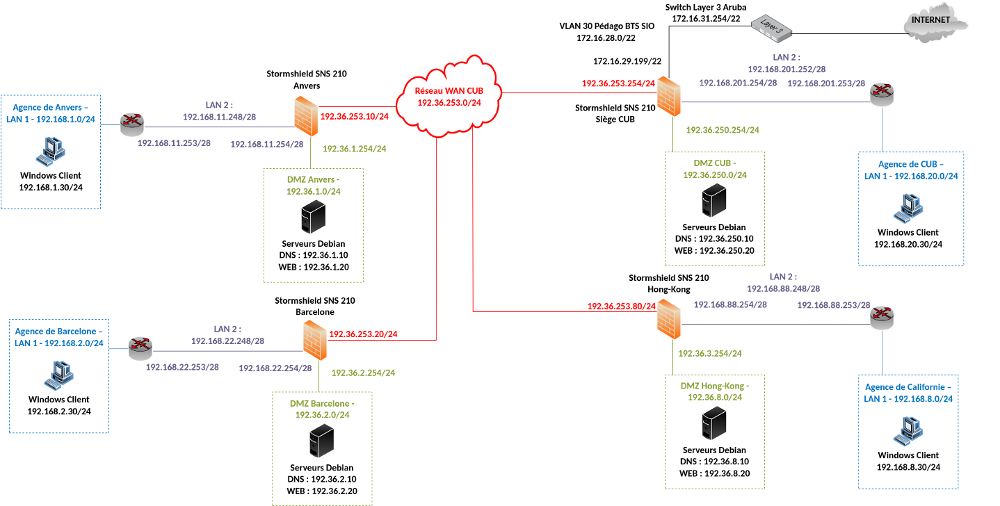
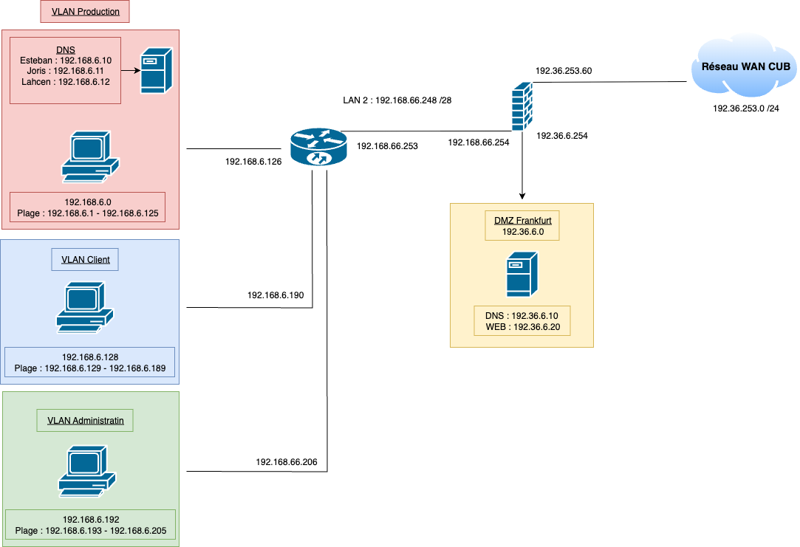
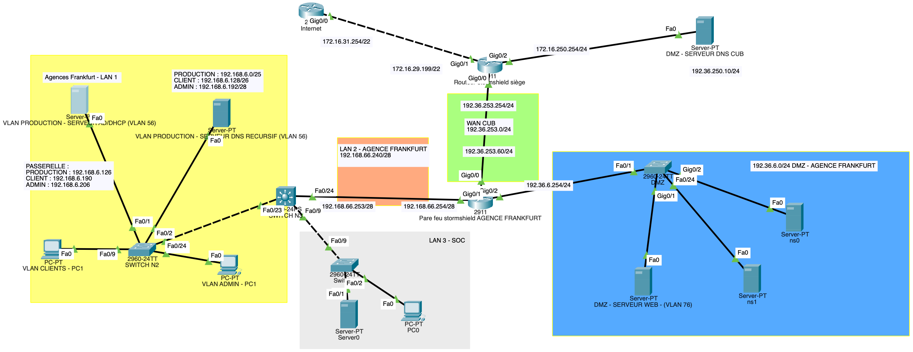
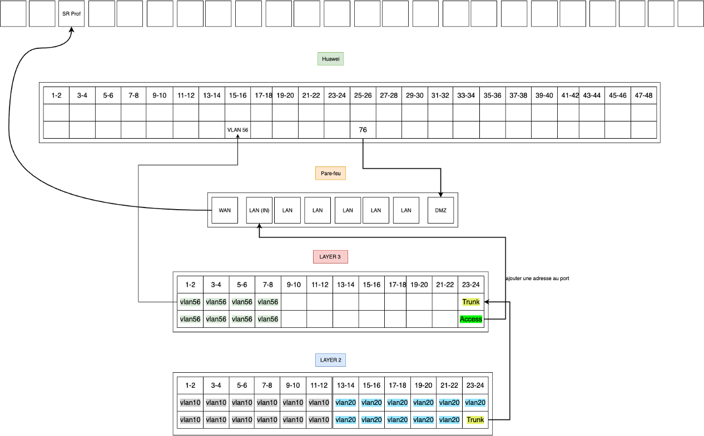

# Scripting PowerShell - Gestion du service DHCP


## Prérequis



*Ducumentation en ligne : [https://cubdocumentation.sioplc.fr](https://cubdocumentation.sioplc.fr)*
<br>

## Adressage 

| Puissance de 2 | Valeur |
|:---------------:|:------:|
| 2⁰ | 1 |
| 2¹ | 2 |
| 2² | 4 |
| 2³ | 8 |
| 2⁴ | 16 |
| 2⁵ | 32 |
| 2⁶ | 64 |
| <span style="background-color:#aee7ff; padding:2px 4px; border-radius:3px;">**2⁷**</span> | <span style="background-color:#aee7ff; padding:2px 4px; border-radius:3px;">**128**</span> |

**Adresse réseau : 192.168.6.0/24**

<br>

| **Service** | **Nombre d’hôtes** | **Adresse réseau** | **Masque de sous-réseau** | **Adresse de diffusion** | **Description VLAN** |
|--------------|--------------------:|--------------------|----------------------------|---------------------------|----------------------|
| Production | 120 | 192.168.6.0 | <span style="background-color:#b7fbb7;">255.255.255.128</span> | 192.168.6.127 | VLAN 56 |
| Client 1 | 32 | 192.168.6.128 | 255.255.255.192 | 192.168.6.191 | VLAN 10 |
| Administration systèmes et réseaux | 6 | 192.168.6.192 | 255.255.255.240 | 192.168.6.207 | VLAN 20 |

<br>

**N°1 sous-réseau Production = 126 hôtes →** <span style="background-color:#aee7ff; padding:2px 4px; border-radius:3px;">**2⁷**</span> **→ <span style="background-color:#b7fbb7;">/25**</span>

**Production = 192.168.6.0/24 → 255.255.255.128 →** <span style="background-color:#aee7ff; padding:2px 4px; border-radius:3px;">**x.x.x.1000 0000**</span>

**Diffusion :** `1100 0000 . 1010 1000 . 0000 0110 . 0111 1111`  
➡️ 192.168.6.**127**

___

## Schéma logique – Agence Frankfur



___
## Packet tracert - Agence Frankfurt
<br>


<br>

<div style="text-align:center; margin-top:20px;">
  <a href="https://drive.google.com/file/d/1L7Gp52YpPjjRhFdp9gp4L1sGORqAoCEK/view?usp=share_link" 
     style="display:inline-block;
            background:#e7e7e9;
            color:#0096FF;
            padding:11px 25px;
            border-radius:10px;
            text-decoration:none;
            font-weight:50;
            box-shadow:0 0 12px rgba(0,0,0,0.5);
            transition:all 0.3s ease;"
     onmouseover="this.style.background='#dcdce0'; this.style.color='#003d80';"
     onmouseout="this.style.background='#e7e7e9'; this.style.color='#0096FF';">
     🔗 Cliquer pour télécherger le paket tracert
  </a>
</div>
<br>

___

## Plan de câblage 



___

## PARTIE 1 — Analyse sans IA

### Indiquer les paramètres d'entrée et les fonctions présentes

**Paramètres d'entrée :**

- `$ScopeID`
- `$DhcpServer`
- `$ExportConfig`

**Fonctions :**

- `Write-Info`
- `Check-DhcpService`
- `Validate-ScopeId`
- `Get-ScopeStatistics`
- `Backup-DhcpConfiguration`

### Schématiser l'ordre d'exécution du script

1. `Check-DhcpService` → vérifie que le service DHCP est actif
2. `Validate-ScopeId` → valide le format et l'existence du scope
3. `Get-ScopeStatistics` → récupère et affiche les statistiques du scope
4. Si `-ExportConfig` → `Backup-DhcpConfiguration`
5. Fin

### Résumer son rôle général

Vérifier le serveur DHCP + afficher les statistiques d'un scope + sauvegarder la configuration (optionnel).

## PARTIE 2 — Utilisation libre de l'IA

### Commenter chaque ligne du script et expliquer son fonctionnement détaillé

Script `DhcpAudit-Esteban.ps1` (voir ci-dessous, commenté intégralement) :

```powershell
<# 
    Script: DhcpAudit.ps1
    Objet pédagogique :
      1) Vérifier que le service DHCP est bien démarré.
      2) Afficher les statistiques d'un scope IPv4.
      3) Exporter la configuration DHCP si l'option est demandée.

    Ce script illustre :
      - l'utilisation de paramètres (param),
      - la structuration en fonctions,
      - l'horodatage des messages,
      - l'usage de cmdlets DHCP.
#>

param (
    # Identifiant du scope IPv4 à auditer (obligatoire)
    # Exemple: "192.168.10.0"
    [Parameter(Mandatory=$true)]
    [string]$ScopeID,

    # Nom du serveur DHCP cible (par défaut: localhost)
    # Peut être un nom DNS ou une adresse IP
    [string]$DhcpServer = "localhost",

    # Si présent, déclenche l'export de configuration DHCP
    # Exemple d'appel: .\DhcpAudit.ps1 -ScopeID "192.168.10.0" -ExportConfig
    [switch]$ExportConfig
)

function Write-Info {
    # Affiche un message horodaté pour le suivi du script
    # Cette fonction centralise la "mise en forme" des messages
    param ([string]$Message)

    # On récupère la date/heure au format lisible
    $timestamp = Get-Date -Format "yyyy-MM-dd HH:mm:ss"

    # Write-Host écrit directement à l'écran (console)
    Write-Host "$timestamp - $Message"
}

function Check-DhcpService {
    # Vérifie l'état du service DHCP et tente de le démarrer si arrêté
    # Objectif: éviter de lancer des commandes DHCP si le service est stoppé
    $service = Get-Service -Name "DHCPServer" -ComputerName $DhcpServer

    # Si le service n'est pas en état "Running", on tente un démarrage
    if ($service.Status -ne "Running") {
        Write-Info "Service DHCP arrêté. Tentative de démarrage."
        Start-Service -Name "DHCPServer" -ComputerName $DhcpServer
    }
    else {
        # Rien à faire si le service tourne déjà
        Write-Info "Service DHCP opérationnel."
    }
}

function Validate-ScopeId {
    # Valide le format du ScopeID et vérifie que le scope existe sur le serveur
    # Objectif: éviter un échec brutal plus loin dans le script
    param ([string]$ScopeID)

    # Vérification simple du format IPv4 (x.x.x.x)
    $ipv4Regex = '^(25[0-5]|2[0-4]\d|1?\d?\d)\.(25[0-5]|2[0-4]\d|1?\d?\d)\.(25[0-5]|2[0-4]\d|1?\d?\d)\.(25[0-5]|2[0-4]\d|1?\d?\d)$'
    if ($ScopeID -notmatch $ipv4Regex) {
        Write-Info "ScopeID invalide (format). Exemple attendu : 192.168.10.0"
        exit 1
    }

    # Vérification de l'existence du scope sur le serveur DHCP
    $scope = Get-DhcpServerv4Scope -ComputerName $DhcpServer -ScopeId $ScopeID -ErrorAction SilentlyContinue
    if (-not $scope) {
        Write-Info "ScopeID invalide (scope introuvable sur $DhcpServer) : $ScopeID"
        exit 1
    }
}

function Get-ScopeStatistics {
    # Récupère et affiche les statistiques du scope ciblé
    Write-Info "Récupération des statistiques du scope $ScopeID"

    # Cmdlet DHCP qui renvoie les statistiques d'utilisation
    $stats = Get-DhcpServerv4ScopeStatistics -ComputerName $DhcpServer -ScopeId $ScopeID

    # Affichage détaillé des infos utiles
    Write-Host "Adresses utilisées : $($stats.InUse)"
    Write-Host "Adresses disponibles : $($stats.Free)"
    Write-Host "Pourcentage utilisé : $($stats.PercentageInUse)%"

    # Alerte proactive si le taux d'occupation dépasse 80 %
    # Objectif: anticiper la saturation et les incidents utilisateurs
    if ($stats.PercentageInUse -ge 80) {
        Write-Warning "ALERTE : taux d'occupation du scope $ScopeID à $($stats.PercentageInUse)% (seuil 80%)."
        Write-Info "Action recommandée : étendre le scope ou réduire la durée des baux."
    }
}

function Backup-DhcpConfiguration {
    # Exporte la configuration DHCP (avec baux) dans C:\DHCP_Backup
    $backupPath = "C:\DHCP_Backup"

    # Si le dossier n'existe pas, on le crée
    if (!(Test-Path $backupPath)) {
        New-Item -ItemType Directory -Path $backupPath | Out-Null
    }

    # Export de la config DHCP dans un fichier XML
    # -Leases inclut les baux en cours
    Export-DhcpServer -ComputerName $DhcpServer -File "$backupPath\dhcp_export.xml" -Leases
    Write-Info "Configuration DHCP exportée."
}

# ------------------------------
# Exécution principale du script
# ------------------------------
# 1) Vérifier le service
Check-DhcpService

# 1b) Valider le ScopeID fourni
Validate-ScopeId -ScopeID $ScopeID

# 2) Afficher les stats du scope demandé
Get-ScopeStatistics

# 3) Sauvegarde optionnelle si le switch -ExportConfig est fourni
if ($ExportConfig) {
    Backup-DhcpConfiguration
}

# Message de fin (utile dans des logs)
Write-Info "Fin du script."
```

### Énumérer au moins une critique du script actuel

**Critique :** pas de validation du format du `ScopeID`. Si l'utilisateur fournit une valeur invalide, la cmdlet échoue ; une validation simple (ex. regex ou `Test-DhcpServerv4Scope`) éviterait ce problème.

Exemples de valeurs invalides :

- `192.168.10` (incomplet)
- `abc` (pas une IP)
- `192.168.300.0` (octet > 255)

Dans ces cas, `Get-DhcpServerv4ScopeStatistics` va échouer et le script s'arrête avec une erreur technique.

### Proposer une réponse à la critique énoncée précédemment

Pour éviter un échec brutal, on peut ajouter une validation simple avant d'appeler la cmdlet, soit par **regex**, soit en testant l'existence du scope sur le serveur. On vérifie que `ScopeID` correspond à un format IP, puis on confirme que le scope existe avec `Get-DhcpServerv4Scope`. Si c'est invalide, on affiche un message clair et on arrête le script.

La fonction `Validate-ScopeId` a été ajoutée dans le script ci-dessus pour répondre à cette critique.
