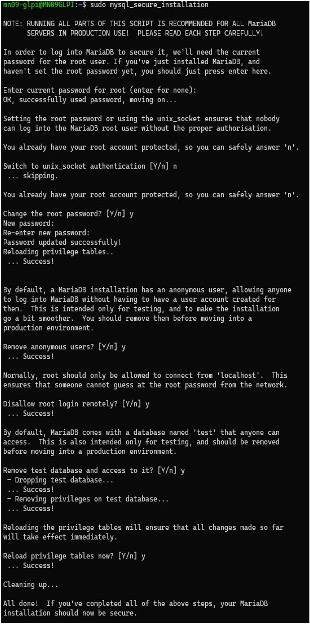

# Installation de GLPI


## Prérequis


*Ducumentation en ligne : [https://cubdocumentation.sioplc.fr](https://cubdocumentation.sioplc.fr)*
<br>

## Adressage 

| Puissance de 2 | Valeur |
|:---------------:|:------:|
| 2⁰ | 1 |
| 2¹ | 2 |
| 2² | 4 |
| 2³ | 8 |
| 2⁴ | 16 |
| 2⁵ | 32 |
| 2⁶ | 64 |
| <span style="background-color:#aee7ff; padding:2px 4px; border-radius:3px;">**2⁷**</span> | <span style="background-color:#aee7ff; padding:2px 4px; border-radius:3px;">**128**</span> |

**Adresse réseau : 192.168.6.0/24**

<br>

| **Service** | **Nombre d’hôtes** | **Adresse réseau** | **Masque de sous-réseau** | **Adresse de diffusion** | **Description VLAN** |
|--------------|--------------------:|--------------------|----------------------------|---------------------------|----------------------|
| Production | 120 | 192.168.6.0 | <span style="background-color:#b7fbb7;">255.255.255.128</span> | 192.168.6.127 | VLAN 56 |
| Client 1 | 32 | 192.168.6.128 | 255.255.255.192 | 192.168.6.191 | VLAN 10 |
| Administration systèmes et réseaux | 6 | 192.168.6.192 | 255.255.255.240 | 192.168.6.207 | VLAN 20 |

<br>

**N°1 sous-réseau Production = 126 hôtes →** <span style="background-color:#aee7ff; padding:2px 4px; border-radius:3px;">**2⁷**</span> **→ <span style="background-color:#b7fbb7;">/25**</span>

**Production = 192.168.6.0/24 → 255.255.255.128 →** <span style="background-color:#aee7ff; padding:2px 4px; border-radius:3px;">**x.x.x.1000 0000**</span>

**Diffusion :** `1100 0000 . 1010 1000 . 0000 0110 . 0111 1111`  
➡️ 192.168.6.**127**

___

## Schéma logique – Agence Frankfur


___
## Packet tracert - Agence Frankfurt
<br>


<br>

<div style="text-align:center; margin-top:20px;">
  <a href="https://drive.google.com/file/d/1L7Gp52YpPjjRhFdp9gp4L1sGORqAoCEK/view?usp=share_link" 
     style="display:inline-block;
            background:#e7e7e9;
            color:#0096FF;
            padding:11px 25px;
            border-radius:10px;
            text-decoration:none;
            font-weight:50;
            box-shadow:0 0 12px rgba(0,0,0,0.5);
            transition:all 0.3s ease;"
     onmouseover="this.style.background='#dcdce0'; this.style.color='#003d80';"
     onmouseout="this.style.background='#e7e7e9'; this.style.color='#0096FF';">
     🔗 Cliquer pour télécherger le paket tracert
  </a>
</div>
<br>

___

## Plan de câblage 


___

## Installation de GLPI en ligne de commande

### A — Installer le socle LAMP

Commençons par installer ces trois paquets :

```bash
sudo apt-get install apache2 php mariadb-server
```

Puis, nous allons installer toutes les extensions nécessaires au bon fonctionnement de GLPI :

```bash
sudo apt-get install php-xml php-common php-json php-mysql php-mbstring php-curl php-gd php-intl php-zip php-bz2 php-imap php-apcu
```

Ces commandes vont permettre de récupérer les versions de ces extensions pour **PHP 8.2**.

!!! info "Extension LDAP"
    Si vous envisagez d'associer GLPI avec un annuaire LDAP comme l'Active Directory, vous devez installer l'extension LDAP de PHP. Sinon, ce n'est pas nécessaire et vous pouvez le faire par la suite si besoin.

```bash
sudo apt-get install php-ldap
```

### B — Préparer une base de données pour GLPI

Nous allons préparer MariaDB pour qu'il puisse héberger la base de données de GLPI. La première action à effectuer est d'exécuter la commande ci-dessous pour effectuer le minimum syndical en matière de sécurisation de MariaDB.

```bash
sudo mysql_secure_installation
```



Connectez-vous à votre instance MariaDB :

```bash
sudo mysql -u root -p
```

Puis, nous allons exécuter les requêtes SQL ci-dessous pour créer la base de données `db23_glpi` ainsi que l'utilisateur `glpi_adm` avec le mot de passe `MotDePasseRobuste` (à changer bien sûr). Cet utilisateur aura tous les droits sur cette base de données (et uniquement sur celle-ci).

```sql
CREATE DATABASE db23_glpi;
GRANT ALL PRIVILEGES ON db23_glpi.* TO glpi_adm@localhost IDENTIFIED BY "MotDePasseRobuste";
FLUSH PRIVILEGES;
EXIT;
```


### C — Télécharger GLPI et préparer son installation

Récupérez le lien vers la dernière version puis entrez la commande suivante :

```bash
wget https://github.com/glpi-project/glpi/releases/download/10.0.10/glpi-10.0.10.tgz
```


Ensuite, décompressez l'archive `.tgz` dans le répertoire `/var/www/`, ce qui donnera le chemin d'accès `/var/www/glpi` pour GLPI :

```bash
sudo tar -xzvf glpi-10.0.10.tgz -C /var/www/
```

Définissez l'utilisateur `www-data` (correspondant à Apache2) en tant que propriétaire sur les fichiers GLPI :

```bash
sudo chown www-data /var/www/glpi/ -R
```

Créez le répertoire `/etc/glpi` qui va recevoir les fichiers de configuration de GLPI, et donnez les autorisations à `www-data` :

```bash
sudo mkdir /etc/glpi
sudo chown www-data /etc/glpi/
```

Puis, déplacez le répertoire `config` de GLPI vers ce nouveau dossier :

```bash
sudo mv /var/www/glpi/config /etc/glpi
```

Répétez la même opération avec la création du répertoire `/var/lib/glpi` :

```bash
sudo mkdir /var/lib/glpi
sudo chown www-data /var/lib/glpi/
```

Déplacez également le dossier `files` (qui contient la majorité des fichiers de GLPI : CSS, plugins, etc.) :

```bash
sudo mv /var/www/glpi/files /var/lib/glpi
```

Terminez par la création du répertoire `/var/log/glpi` destiné à stocker les journaux de GLPI :

```bash
sudo mkdir /var/log/glpi
sudo chown www-data /var/log/glpi
```

#### Créer les fichiers de configuration

Nous devons configurer GLPI pour qu'il sache où aller chercher les données. Autrement dit, nous allons déclarer les nouveaux répertoires fraîchement créés.

Créez ce premier fichier :

```bash
sudo nano /var/www/glpi/inc/downstream.php
```


Ensuite, créez ce second fichier :

```bash
sudo nano /etc/glpi/local_define.php
```


### D — Préparer la configuration Apache2

```bash
sudo nano /etc/apache2/sites-available/support.it-connect.tech.conf
```


Activez ce nouveau site dans Apache2 :

```bash
sudo a2ensite support.it-connect.tech.conf
```


Désactivez le site par défaut car il est inutile :

```bash
sudo a2dissite 000-default.conf
```


Activez le module `rewrite` (pour les règles de réécriture) car il est utilisé dans le fichier de configuration du VirtualHost (`RewriteCond` / `RewriteRule`) :

```bash
sudo a2enmod rewrite
```


Redémarrez le service Apache2 :

```bash
sudo systemctl restart apache2
```

### E — Utilisation de PHP 8.2-FPM avec Apache2

Installez PHP 8.2-FPM :

```bash
sudo apt-get install php8.2-fpm
```

Activez deux modules dans Apache et la configuration de PHP-FPM, puis rechargez Apache2 :

```bash
sudo a2enmod proxy_fcgi setenvif
sudo a2enconf php8.2-fpm
sudo systemctl reload apache2
```


Pour configurer PHP-FPM pour Apache2, éditez ce fichier (et non `/etc/php/8.2/apache2/php.ini`) :

```bash
sudo nano /etc/php/8.2/fpm/php.ini
```


Pour appliquer les modifications, redémarrez PHP-FPM :

```bash
sudo systemctl restart php8.2-fpm.service
```

Pour terminer, modifiez le VirtualHost pour préciser à Apache2 que PHP-FPM doit être utilisé pour les fichiers PHP. Ajoutez ce bloc dans le fichier de configuration du VirtualHost :

```apacheconf
<FilesMatch \.php$>
    SetHandler "proxy:unix:/run/php/php8.2-fpm.sock|fcgi://localhost/"
</FilesMatch>
```


Relancez Apache2 :

```bash
sudo systemctl restart apache2
```

Une fois l'installation terminée, tapez l'adresse IP de votre machine virtuelle dans votre navigateur pour lancer GLPI :

```
http://172.16.56.3
```

Vous devriez atterrir sur cette interface :


## Étape 2 : Accès à l'interface de GLPI

**1.** Une fois sur cette interface, sélectionner la langue puis cliquer sur **OK**.


**2.** Ensuite, cliquer sur **Continuer**.


**3.** Ensuite, sélectionner **Installer**.


**4.** Cliquer sur **Continuer**.


**5.** Entrer le serveur, l'utilisateur et le mot de passe que nous avions créés lors de l'installation de la base de données.


- **Mot de passe :** `MotDePasseRobuste`

**6.** Une fois la connexion à la base de données réussie, sélectionner la base de données `db23_glpi`.


**7.** Cliquer sur **Continuer**.


**8.** Décocher **Envoyer les statistiques d'usage** puis cliquer sur **Continuer**.


**9.** Cliquer sur **Continuer**.


**10.** Sélectionner **Utiliser GLPI**.


**11.** Pour se connecter à votre compte GLPI, utiliser les identifiants par défaut.


- **Identifiant :** `glpi`
- **Mot de passe :** `glpi`

!!! success "Installation terminée !"
    Vous êtes maintenant sur l'interface principale de GLPI. L'installation est complète et vous pouvez commencer à l'utiliser.

**12.** Interface principale de GLPI :


