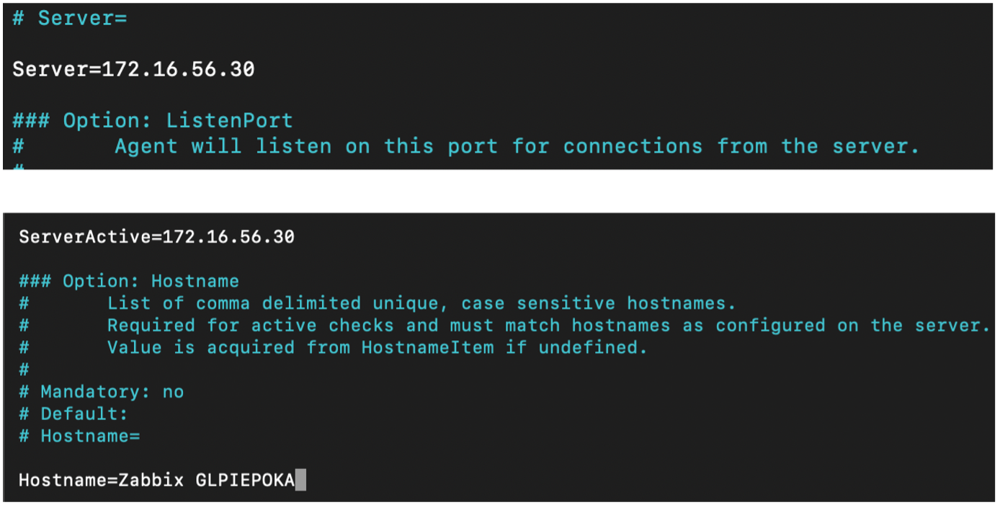
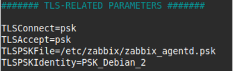
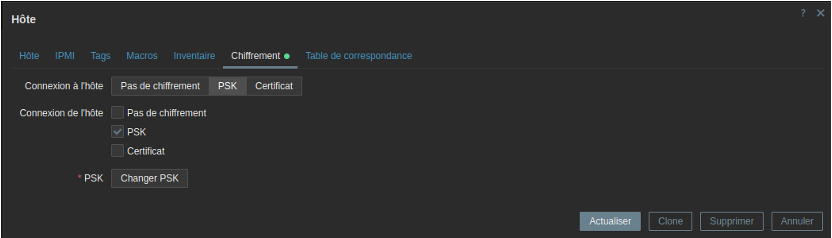
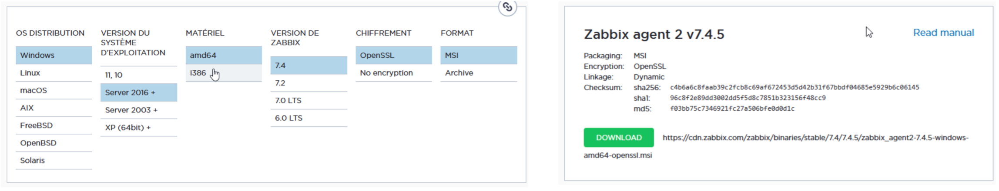
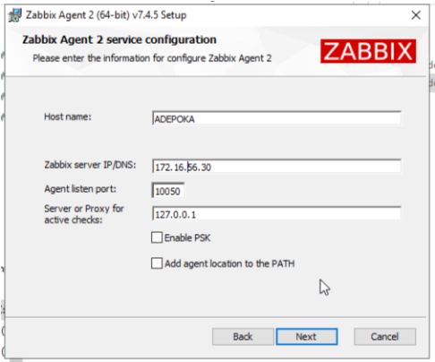
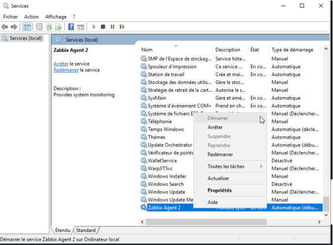

# III - Supervision via Zabbix Agent 


## Prérequis


*Ducumentation en ligne : [https://cubdocumentation.sioplc.fr](https://cubdocumentation.sioplc.fr)*
<br>

## Adressage 

| Puissance de 2 | Valeur |
|:---------------:|:------:|
| 2⁰ | 1 |
| 2¹ | 2 |
| 2² | 4 |
| 2³ | 8 |
| 2⁴ | 16 |
| 2⁵ | 32 |
| 2⁶ | 64 |
| <span style="background-color:#aee7ff; padding:2px 4px; border-radius:3px;">**2⁷**</span> | <span style="background-color:#aee7ff; padding:2px 4px; border-radius:3px;">**128**</span> |

**Adresse réseau : 192.168.6.0/24**

<br>

| **Service** | **Nombre d’hôtes** | **Adresse réseau** | **Masque de sous-réseau** | **Adresse de diffusion** | **Description VLAN** |
|--------------|--------------------:|--------------------|----------------------------|---------------------------|----------------------|
| Production | 120 | 192.168.6.0 | <span style="background-color:#b7fbb7;">255.255.255.128</span> | 192.168.6.127 | VLAN 56 |
| Client 1 | 32 | 192.168.6.128 | 255.255.255.192 | 192.168.6.191 | VLAN 10 |
| Administration systèmes et réseaux | 6 | 192.168.6.192 | 255.255.255.240 | 192.168.6.207 | VLAN 20 |

<br>

**N°1 sous-réseau Production = 126 hôtes →** <span style="background-color:#aee7ff; padding:2px 4px; border-radius:3px;">**2⁷**</span> **→ <span style="background-color:#b7fbb7;">/25**</span>

**Production = 192.168.6.0/24 → 255.255.255.128 →** <span style="background-color:#aee7ff; padding:2px 4px; border-radius:3px;">**x.x.x.1000 0000**</span>

**Diffusion :** `1100 0000 . 1010 1000 . 0000 0110 . 0111 1111`  
➡️ 192.168.6.**127**

___

## Schéma logique – Agence Frankfur


___
## Packet tracert - Agence Frankfurt
<br>


<br>

<div style="text-align:center; margin-top:20px;">
  <a href="https://drive.google.com/file/d/1L7Gp52YpPjjRhFdp9gp4L1sGORqAoCEK/view?usp=share_link" 
     style="display:inline-block;
            background:#e7e7e9;
            color:#0096FF;
            padding:11px 25px;
            border-radius:10px;
            text-decoration:none;
            font-weight:50;
            box-shadow:0 0 12px rgba(0,0,0,0.5);
            transition:all 0.3s ease;"
     onmouseover="this.style.background='#dcdce0'; this.style.color='#003d80';"
     onmouseout="this.style.background='#e7e7e9'; this.style.color='#0096FF';">
     🔗 Cliquer pour télécherger le paket tracert
  </a>
</div>
<br>

___

## Plan de câblage 


___

## Installation de Zabbix Agent
 
### 1) Sur DEBIAN
 
#### Installer l'agent Zabbix
 
```bash
sudo apt update
sudo apt install zabbix-agent2 -y
```
 
**Chiffrement TLS :**
 
```bash
openssl rand -hex 32
echo 392eeeab63b56a23cb17d1c4dd3bc23aa9d132a47c734ab7a48375baa2e81011 > zabbix_agentd.psk
sudo mv zabbix_agentd.psk /etc/zabbix/
sudo chown zabbix:zabbix /etc/zabbix/zabbix_agentd.psk
```
 
#### Modifier la configuration
 
```bash
sudo nano /etc/zabbix/zabbix_agent2.conf
```
 
```ini
Server=IP_SUPEPOKA
ServerActive=IP_SUPEPOKA
Hostname=Zabbix GLPIEPOKA
ListenPort=10050
```
 

 
**Chiffrement TLS :**
 


 
**Redémarrer :**
 
```bash
sudo systemctl restart zabbix-agent2
sudo systemctl enable zabbix-agent2
```
 
!!! info "Autres serveurs Debian"
    La démarche est la même pour les autres serveurs sous DEBIAN !
 
### 2) Sur Windows
 
**Télécharger l'agent Zabbix :**
 
Depuis le serveur Windows : [https://www.zabbix.com/download_agents](https://www.zabbix.com/download_agents)
 
Choisir :
 
- **Windows**
- **Zabbix Agent 2**
- **MSI**
 

 
**Installer (double clic)**
 
Au moment de l'installation, renseigner les informations suivantes :
 
- **Zabbix Server :** IP de SUPEPOKA
- **Listen IP :** IP d'ADEPOKA
- **Listen port :** `10050`
 

 
**Démarrer le service :**
 
Dans PowerShell :
 
```powershell
services.msc
```
 
Puis : `Zabbix Agent 2 → Start`
 

 
!!! success "Zabbix Agent opérationnel"
    Dans mon cas, Zabbix est déjà démarré !