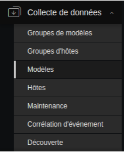
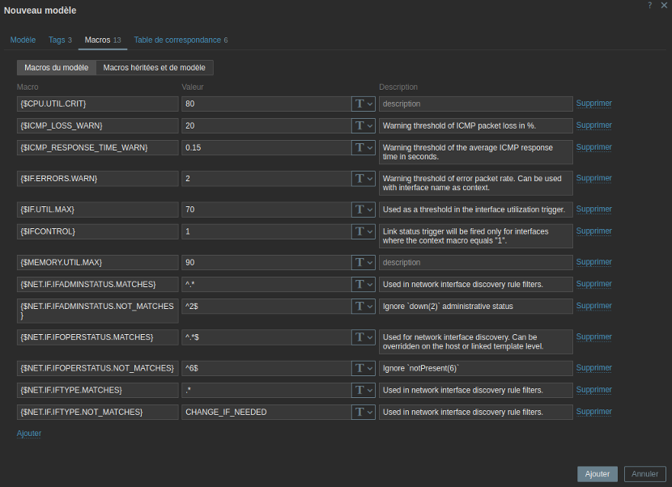
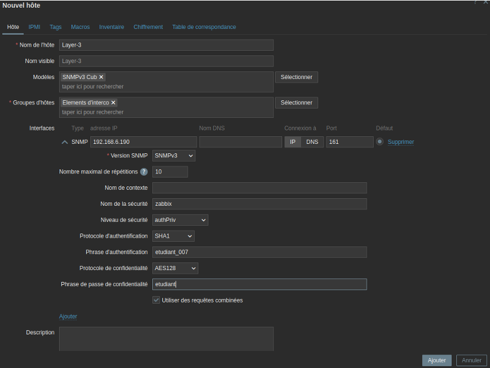

# III - Supervision via le protocole SNMPv3


## Prérequis


*Ducumentation en ligne : [https://cubdocumentation.sioplc.fr](https://cubdocumentation.sioplc.fr)*
<br>

## Adressage 

| Puissance de 2 | Valeur |
|:---------------:|:------:|
| 2⁰ | 1 |
| 2¹ | 2 |
| 2² | 4 |
| 2³ | 8 |
| 2⁴ | 16 |
| 2⁵ | 32 |
| 2⁶ | 64 |
| <span style="background-color:#aee7ff; padding:2px 4px; border-radius:3px;">**2⁷**</span> | <span style="background-color:#aee7ff; padding:2px 4px; border-radius:3px;">**128**</span> |

**Adresse réseau : 192.168.6.0/24**

<br>

| **Service** | **Nombre d’hôtes** | **Adresse réseau** | **Masque de sous-réseau** | **Adresse de diffusion** | **Description VLAN** |
|--------------|--------------------:|--------------------|----------------------------|---------------------------|----------------------|
| Production | 120 | 192.168.6.0 | <span style="background-color:#b7fbb7;">255.255.255.128</span> | 192.168.6.127 | VLAN 56 |
| Client 1 | 32 | 192.168.6.128 | 255.255.255.192 | 192.168.6.191 | VLAN 10 |
| Administration systèmes et réseaux | 6 | 192.168.6.192 | 255.255.255.240 | 192.168.6.207 | VLAN 20 |

<br>

**N°1 sous-réseau Production = 126 hôtes →** <span style="background-color:#aee7ff; padding:2px 4px; border-radius:3px;">**2⁷**</span> **→ <span style="background-color:#b7fbb7;">/25**</span>

**Production = 192.168.6.0/24 → 255.255.255.128 →** <span style="background-color:#aee7ff; padding:2px 4px; border-radius:3px;">**x.x.x.1000 0000**</span>

**Diffusion :** `1100 0000 . 1010 1000 . 0000 0110 . 0111 1111`  
➡️ 192.168.6.**127**

___

## Schéma logique – Agence Frankfur


___
## Packet tracert - Agence Frankfurt
<br>


<br>

<div style="text-align:center; margin-top:20px;">
  <a href="https://drive.google.com/file/d/1L7Gp52YpPjjRhFdp9gp4L1sGORqAoCEK/view?usp=share_link" 
     style="display:inline-block;
            background:#e7e7e9;
            color:#0096FF;
            padding:11px 25px;
            border-radius:10px;
            text-decoration:none;
            font-weight:50;
            box-shadow:0 0 12px rgba(0,0,0,0.5);
            transition:all 0.3s ease;"
     onmouseover="this.style.background='#dcdce0'; this.style.color='#003d80';"
     onmouseout="this.style.background='#e7e7e9'; this.style.color='#0096FF';">
     🔗 Cliquer pour télécherger le paket tracert
  </a>
</div>
<br>

___

## Plan de câblage 


___

## Supervision active avec SNMP v3 sur un équipement Cisco

!!! info "Sur le switch de niveau 3"
    Les instructions suivantes doivent être exécutées sur le switch de niveau 3.
 
 
**Définition de la location de l'équipement et d'une adresse mail de contact :**
 
```cisco
snmp-server location Agence Frankfurt CUB
snmp-server contact touzetal30@gmail.com
```
 
**Définir les droits en lecture-écriture et l'accès à la MIB (vue) de l'équipement :**
 
```cisco
snmp-server view ReadOnly-View iso included
```
 
**Création d'un groupe spécifique avec l'application des droits établis lors de la commande précédente :**
 
```cisco
snmp-server group ReadOnly v3 priv read ReadOnly-View
```
 
**Création d'un utilisateur avec authentification HMAC-SHA1 et chiffrement AES :**
 
```cisco
snmp-server user zabbix ReadOnly v3 auth sha etudiant_007 priv aes 128 etudiant access snmp-service
```
 
## Configuration d'un hôte sur Zabbix à l'aide du protocole SNMPv3
 
*(Sur le serveur Zabbix)*

!!! info "Sur le serveur de supervision Zabbix"
    Les instructions suivantes doivent être exécutées sur le serveur Zabbix.
 
**Valider la connexion SNMP depuis le serveur Zabbix vers l'équipement en ligne de commande.**
 
Installation des outils SNMP :
 
```bash
apt install snmp
```
 
## Configuration de l'hôte sur le tableau de bord Zabbix
 
`Collecte de données > Modèles`


 
**Cloner** le modèle « **Cisco IOS by SNMP** » puis le **renommer**. Une fois cela fait, **supprimer les macros non utiles** et ajuster les valeurs dans le cadre du TP comme ci-dessous.
 

 
Créer un hôte :
 

