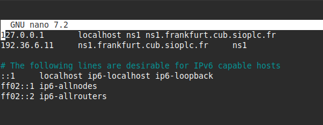
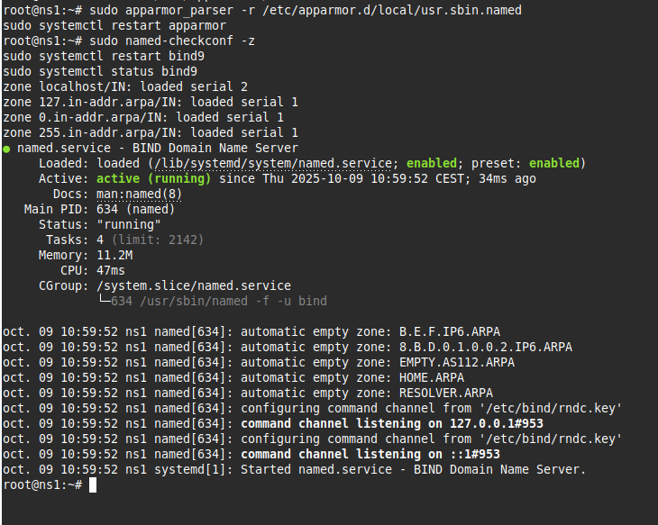
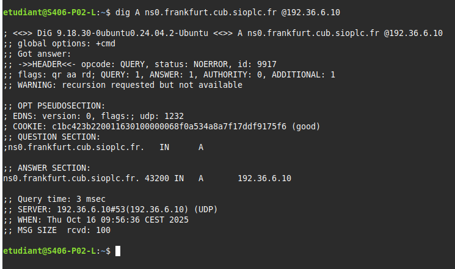

# III - Serveur DNS esclave faisant autorité


## Prérequis


*Ducumentation en ligne : [https://cubdocumentation.sioplc.fr](https://cubdocumentation.sioplc.fr)*
<br>

## Adressage 

| Puissance de 2 | Valeur |
|:---------------:|:------:|
| 2⁰ | 1 |
| 2¹ | 2 |
| 2² | 4 |
| 2³ | 8 |
| 2⁴ | 16 |
| 2⁵ | 32 |
| 2⁶ | 64 |
| <span style="background-color:#aee7ff; padding:2px 4px; border-radius:3px;">**2⁷**</span> | <span style="background-color:#aee7ff; padding:2px 4px; border-radius:3px;">**128**</span> |

**Adresse réseau : 192.168.6.0/24**

<br>

| **Service** | **Nombre d’hôtes** | **Adresse réseau** | **Masque de sous-réseau** | **Adresse de diffusion** | **Description VLAN** |
|--------------|--------------------:|--------------------|----------------------------|---------------------------|----------------------|
| Production | 120 | 192.168.6.0 | <span style="background-color:#b7fbb7;">255.255.255.128</span> | 192.168.6.127 | VLAN 56 |
| Client 1 | 32 | 192.168.6.128 | 255.255.255.192 | 192.168.6.191 | VLAN 10 |
| Administration systèmes et réseaux | 6 | 192.168.6.192 | 255.255.255.240 | 192.168.6.207 | VLAN 20 |

<br>

**N°1 sous-réseau Production = 126 hôtes →** <span style="background-color:#aee7ff; padding:2px 4px; border-radius:3px;">**2⁷**</span> **→ <span style="background-color:#b7fbb7;">/25**</span>

**Production = 192.168.6.0/24 → 255.255.255.128 →** <span style="background-color:#aee7ff; padding:2px 4px; border-radius:3px;">**x.x.x.1000 0000**</span>

**Diffusion :** `1100 0000 . 1010 1000 . 0000 0110 . 0111 1111`  
➡️ 192.168.6.**127**

___

## Schéma logique – Agence Frankfur


___
## Packet tracert - Agence Frankfurt
<br>


<br>

<div style="text-align:center; margin-top:20px;">
  <a href="https://drive.google.com/file/d/1L7Gp52YpPjjRhFdp9gp4L1sGORqAoCEK/view?usp=share_link" 
     style="display:inline-block;
            background:#e7e7e9;
            color:#0096FF;
            padding:11px 25px;
            border-radius:10px;
            text-decoration:none;
            font-weight:50;
            box-shadow:0 0 12px rgba(0,0,0,0.5);
            transition:all 0.3s ease;"
     onmouseover="this.style.background='#dcdce0'; this.style.color='#003d80';"
     onmouseout="this.style.background='#e7e7e9'; this.style.color='#0096FF';">
     🔗 Cliquer pour télécherger le paket tracert
  </a>
</div>
<br>

___

## Plan de câblage 


___

!!! note "Information sur le contexte"
    Manipulation et documentation réaliser par mon Binôme **Joris TEXIER**

**Vérification préalable**

```bash
sudo apt update && sudo apt upgrade
sudo apt install rsyslog bind9 dnsutils
```

**Paramètres réseaux**

```bash
sudoedit /etc/network/interfaces
sudoedit /etc/resolv.conf
nameserver 9.9.9.9
sudo systemctl restart networking
```


**Configuration des fichiers d'identité**

```bash
sudoedit /etc/hostname
ns1
sudoedit /etc/hosts
sudo shutdown -r now
```


**Exemple de configuration Bind9 (esclave)**
```bash
sudoedit /etc/bind/named.conf.local
sudo touch /var/cache/bind/db.frankfurt.cub.sioplc.fr
sudo chown bind:bind /var/cache/bind/db.frankfurt.cub.sioplc.fr
```


**Mise en place de la journalisation**
```bash
sudoedit /etc/bind/named.conf.log
sudo touch /var/log/bind.log
sudo chown bind:bind /var/log/bind.log
sudoedit /etc/bind/named.conf
```


Configuration AppArmor :

```bash
sudoedit /etc/apparmor.d/usr.sbin.named
# Autoriser le daemon Bind 9 à lire et écrire dans /var/log/bind.log
/var/log/bind.log rw,
sudo apparmor_parser -r /etc/apparmor.d/local/usr.sbin.named
sudo systemctl restart apparmor
sudo named-checkconf -z
sudo systemctl restart bind9
sudo systemctl status bind9
```



**TEST**

Cette commande permet de tester la résolution DNS d’un domaine précis :

```bash
nslookup ns0.frankfurt.cub.sioplc.fr 192.36.6.10
```
Résultat attendu : - `ns0.frankfurt.cub.sioplc.fr` → `192.36.6.11` (esclave) - `ns1.frankfurt.cub.sioplc.fr` → `192.36.6.10` (maître)



