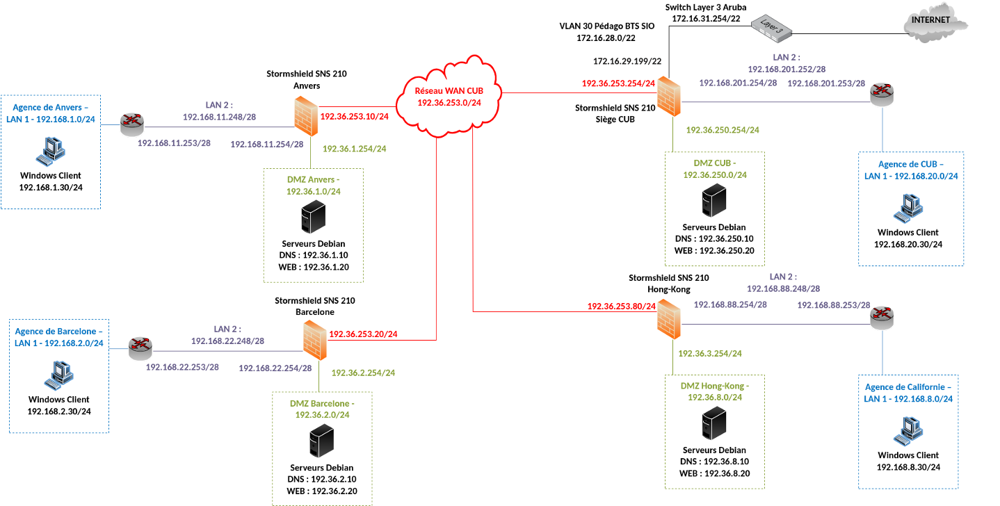
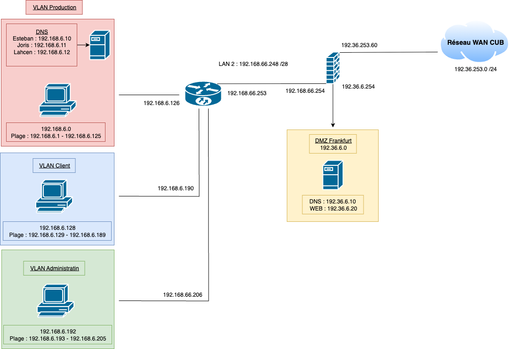
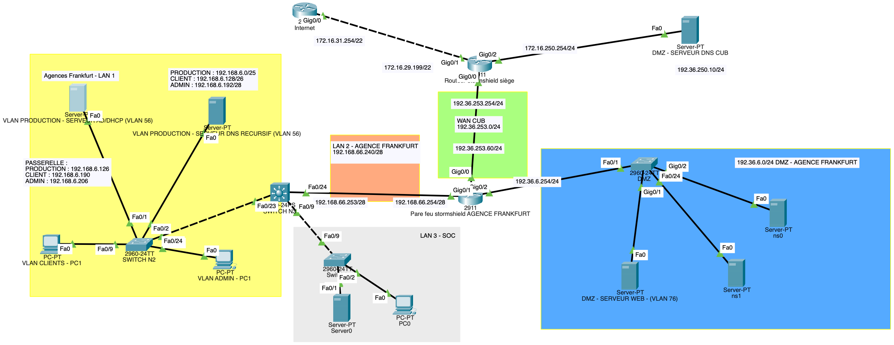
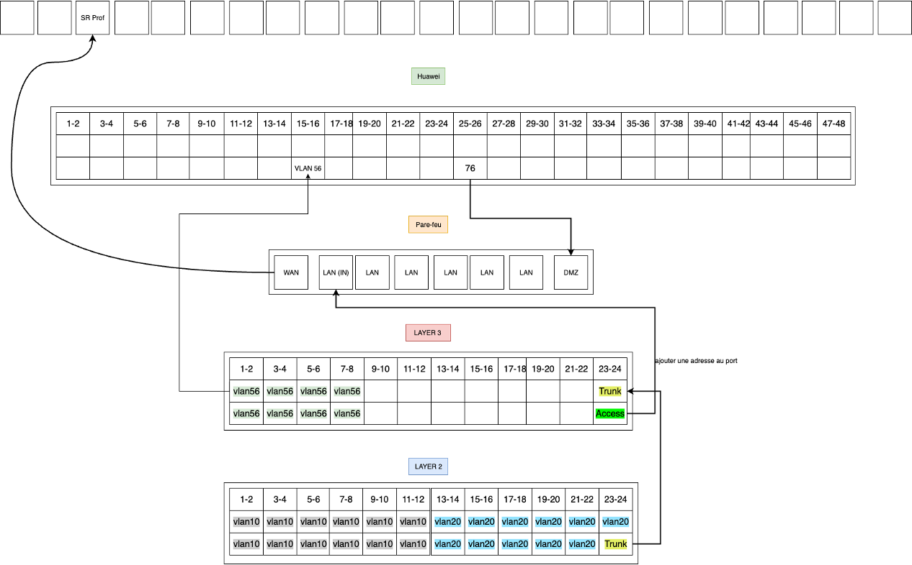

# II - Mise en place des hôtes virtuels Apache (VirtualHost)


## Prérequis



*Ducumentation en ligne : [https://cubdocumentation.sioplc.fr](https://cubdocumentation.sioplc.fr)*
<br>

## Adressage 

| Puissance de 2 | Valeur |
|:---------------:|:------:|
| 2⁰ | 1 |
| 2¹ | 2 |
| 2² | 4 |
| 2³ | 8 |
| 2⁴ | 16 |
| 2⁵ | 32 |
| 2⁶ | 64 |
| <span style="background-color:#aee7ff; padding:2px 4px; border-radius:3px;">**2⁷**</span> | <span style="background-color:#aee7ff; padding:2px 4px; border-radius:3px;">**128**</span> |

**Adresse réseau : 192.168.6.0/24**

<br>

| **Service** | **Nombre d’hôtes** | **Adresse réseau** | **Masque de sous-réseau** | **Adresse de diffusion** | **Description VLAN** |
|--------------|--------------------:|--------------------|----------------------------|---------------------------|----------------------|
| Production | 120 | 192.168.6.0 | <span style="background-color:#b7fbb7;">255.255.255.128</span> | 192.168.6.127 | VLAN 56 |
| Client 1 | 32 | 192.168.6.128 | 255.255.255.192 | 192.168.6.191 | VLAN 10 |
| Administration systèmes et réseaux | 6 | 192.168.6.192 | 255.255.255.240 | 192.168.6.207 | VLAN 20 |

<br>

**N°1 sous-réseau Production = 126 hôtes →** <span style="background-color:#aee7ff; padding:2px 4px; border-radius:3px;">**2⁷**</span> **→ <span style="background-color:#b7fbb7;">/25**</span>

**Production = 192.168.6.0/24 → 255.255.255.128 →** <span style="background-color:#aee7ff; padding:2px 4px; border-radius:3px;">**x.x.x.1000 0000**</span>

**Diffusion :** `1100 0000 . 1010 1000 . 0000 0110 . 0111 1111`  
➡️ 192.168.6.**127**

___

## Schéma logique – Agence Frankfur



___
## Packet tracert - Agence Frankfurt
<br>


<br>

<div style="text-align:center; margin-top:20px;">
  <a href="https://drive.google.com/file/d/1L7Gp52YpPjjRhFdp9gp4L1sGORqAoCEK/view?usp=share_link" 
     style="display:inline-block;
            background:#e7e7e9;
            color:#0096FF;
            padding:11px 25px;
            border-radius:10px;
            text-decoration:none;
            font-weight:50;
            box-shadow:0 0 12px rgba(0,0,0,0.5);
            transition:all 0.3s ease;"
     onmouseover="this.style.background='#dcdce0'; this.style.color='#003d80';"
     onmouseout="this.style.background='#e7e7e9'; this.style.color='#0096FF';">
     🔗 Cliquer pour télécherger le paket tracert
  </a>
</div>
<br>

___

## Plan de câblage 



___

## 1. Objectif

Héberger deux sites différents sur le même serveur web :

Un site vitrine WordPress :
www0.frankfurt.cub.sioplc.fr

Un site “scanner réseau” protégé :
scanner0.frankfurt.cub.sioplc.fr

## 2. Création des dossiers des sites

```bash
sudo mkdir -p /var/www/www0
sudo mkdir -p /var/www/html/scanner0
```

On donne les droits à Apache :

```bash
sudo chown -R www-data:www-data /var/www/www0
sudo chown -R www-data:www-data /var/www/html/scanner0
```


## 3. Création du VirtualHost pour « www0 »

Créer le fichier de configuration :

```bash
sudo nano /etc/apache2/sites-available/www0.conf
```

Contenu du fichier :
```bash
<VirtualHost *:80>
    ServerName www0.frankfurt.cub.sioplc.fr

    DocumentRoot /var/www/www0/wordpress

    <Directory /var/www/www0/wordpress>
        Options FollowSymLinks
        AllowOverride All
        Require all granted
    </Directory>

    ErrorLog ${APACHE_LOG_DIR}/www0-error.log
    CustomLog ${APACHE_LOG_DIR}/www0-access.log combined
</VirtualHost>
```

## 4. Création du VirtualHost pour « scanner0 »

Créer le fichier de configuration :

```bash
sudo nano /etc/apache2/sites-available/scanner0.conf
```

Contenu du fichier :
```bash
<VirtualHost *:80>
    ServerName scanner0.frankfurt.cub.sioplc.fr

    DocumentRoot /var/www/html/scanner0

    <Directory /var/www/html/scanner0>
        Options FollowSymLinks
        AllowOverride All
        Require all granted
    </Directory>

    ErrorLog ${APACHE_LOG_DIR}/scanner0-error.log
    CustomLog ${APACHE_LOG_DIR}/scanner0-access.log combined
</VirtualHost>

```

**Activer le site :**

```bash
sudo a2ensite www0.conf
sudo a2ensite scanner0.conf
``` 