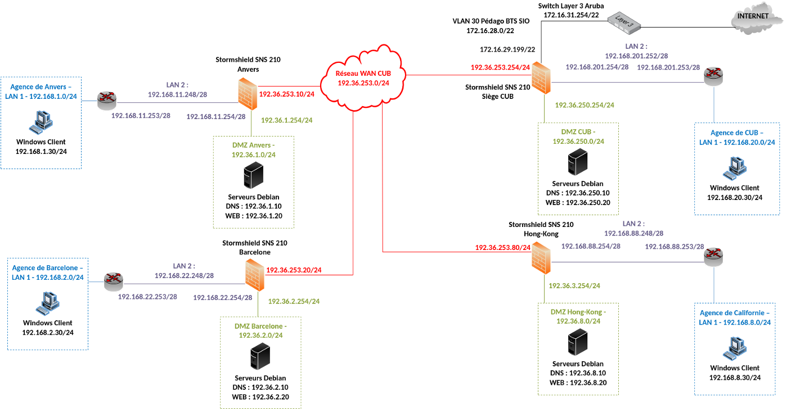

# III - Installation et configuration de WordPress pour www0


## Prérequis



*Ducumentation en ligne : [https://cubdocumentation.sioplc.fr](https://cubdocumentation.sioplc.fr)*
<br>

## Adressage 

| Puissance de 2 | Valeur |
|:---------------:|:------:|
| 2⁰ | 1 |
| 2¹ | 2 |
| 2² | 4 |
| 2³ | 8 |
| 2⁴ | 16 |
| 2⁵ | 32 |
| 2⁶ | 64 |
| <span style="background-color:#aee7ff; padding:2px 4px; border-radius:3px;">**2⁷**</span> | <span style="background-color:#aee7ff; padding:2px 4px; border-radius:3px;">**128**</span> |

**Adresse réseau : 192.168.6.0/24**

<br>

| **Service** | **Nombre d’hôtes** | **Adresse réseau** | **Masque de sous-réseau** | **Adresse de diffusion** | **Description VLAN** |
|--------------|--------------------:|--------------------|----------------------------|---------------------------|----------------------|
| Production | 120 | 192.168.6.0 | <span style="background-color:#b7fbb7;">255.255.255.128</span> | 192.168.6.127 | VLAN 56 |
| Client 1 | 32 | 192.168.6.128 | 255.255.255.192 | 192.168.6.191 | VLAN 10 |
| Administration systèmes et réseaux | 6 | 192.168.6.192 | 255.255.255.240 | 192.168.6.207 | VLAN 20 |

<br>

**N°1 sous-réseau Production = 126 hôtes →** <span style="background-color:#aee7ff; padding:2px 4px; border-radius:3px;">**2⁷**</span> **→ <span style="background-color:#b7fbb7;">/25**</span>

**Production = 192.168.6.0/24 → 255.255.255.128 →** <span style="background-color:#aee7ff; padding:2px 4px; border-radius:3px;">**x.x.x.1000 0000**</span>

**Diffusion :** `1100 0000 . 1010 1000 . 0000 0110 . 0111 1111`  
➡️ 192.168.6.**127**

___

## Schéma logique – Agence Frankfur


___
## Packet tracert - Agence Frankfurt
<br>


<br>

<div style="text-align:center; margin-top:20px;">
  <a href="https://drive.google.com/file/d/1L7Gp52YpPjjRhFdp9gp4L1sGORqAoCEK/view?usp=share_link" 
     style="display:inline-block;
            background:#e7e7e9;
            color:#0096FF;
            padding:11px 25px;
            border-radius:10px;
            text-decoration:none;
            font-weight:50;
            box-shadow:0 0 12px rgba(0,0,0,0.5);
            transition:all 0.3s ease;"
     onmouseover="this.style.background='#dcdce0'; this.style.color='#003d80';"
     onmouseout="this.style.background='#e7e7e9'; this.style.color='#0096FF';">
     🔗 Cliquer pour télécherger le paket tracert
  </a>
</div>
<br>

___

## Plan de câblage 


___


## 1. Création de la base de données WordPress

Se connecter à MariaDB :
```bash
sudo mysql -u root -p
```

Dans MariaDB :

```bash
CREATE DATABASE wordpress0 DEFAULT CHARACTER SET utf8mb4 COLLATE utf8mb4_unicode_ci;

CREATE USER 'wpuser0'@'localhost' IDENTIFIED BY 'Etudiant_007';
GRANT ALL PRIVILEGES ON wordpress0.* TO 'wpuser0'@'localhost';

FLUSH PRIVILEGES;
EXIT;
```


## 2. Téléchargement et installation de WordPress

```bash
cd /tmp
```

```bash
wget https://fr.wordpress.org/latest-fr_FR.tar.gz
```

```bash
tar xvf latest-fr_FR.tar.gz
```

```bash
sudo mv wordpress /var/www/www0 
sudo chown -R www-data:www-data /var/www/www0
sudo find /var/www/www0 -type d -exec chmod 750 {} \;
sudo find /var/www/www0 -type f -exec chmod 640 {} \;
```

## 3. Configuration de WordPress

Copier le fichier de configuration :

```bash
cd /var/www/www0/wordpress
```

```bash
sudo cp wp-config-sample.php wp-config.php
```

```bash
sudo nano wp-config.php
```

Ajouter/compléter les lignes suivantes :

```bash
define( 'DB_NAME', 'wordpress0' );
define( 'DB_USER', 'wpuser0' );
define( 'DB_PASSWORD', 'Etudiant_007' );
define( 'DB_HOST', 'localhost' );
define( 'DB_CHARSET', 'utf8mb4' );
```

Enregistrer, puis redémarrer Apache : 

```bash
sudo systemctl restart apache2
```

Désactiver le site par défaut 

```bash
cd /etc/apache2/sites-available/
```

```bash
a2dissite 000-default.conf
```

```bash
sudo systemctl reload apache2
```
Ensuite, dans un navigateur : [http://192.36.6.20](http://192.36.6.20)

Suivre l’assistant d’installation de WordPress (titre du site, compte admin, etc.) ensuite dans les paramètres du wordpress :  [http://www0.frankfurt.cub.sioplc.fr](http://www0.frankfurt.cub.sioplc.fr)


