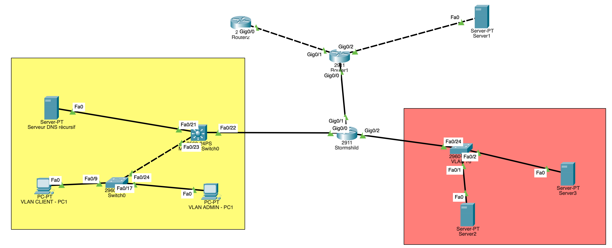

# Activité 3 : Mise en place d’une politique de filtrage interne pour chaque agence


## Prérequis


*Ducumentation en ligne : [https://cubdocumentation.sioplc.fr](https://cubdocumentation.sioplc.fr)*
<br>

## Adressage 

| Puissance de 2 | Valeur |
|:---------------:|:------:|
| 2⁰ | 1 |
| 2¹ | 2 |
| 2² | 4 |
| 2³ | 8 |
| 2⁴ | 16 |
| 2⁵ | 32 |
| 2⁶ | 64 |
| <span style="background-color:#aee7ff; padding:2px 4px; border-radius:3px;">**2⁷**</span> | <span style="background-color:#aee7ff; padding:2px 4px; border-radius:3px;">**128**</span> |

**Adresse réseau : 192.168.6.0/24**

<br>

| **Service** | **Nombre d’hôtes** | **Adresse réseau** | **Masque de sous-réseau** | **Adresse de diffusion** | **Description VLAN** |
|--------------|--------------------:|--------------------|----------------------------|---------------------------|----------------------|
| Production | 120 | 192.168.6.0 | <span style="background-color:#b7fbb7;">255.255.255.128</span> | 192.168.6.127 | VLAN 56 |
| Client 1 | 32 | 192.168.6.128 | 255.255.255.192 | 192.168.6.191 | VLAN 10 |
| Administration systèmes et réseaux | 6 | 192.168.6.192 | 255.255.255.240 | 192.168.6.207 | VLAN 20 |

<br>

**N°1 sous-réseau Production = 126 hôtes →** <span style="background-color:#aee7ff; padding:2px 4px; border-radius:3px;">**2⁷**</span> **→ <span style="background-color:#b7fbb7;">/25**</span>

**Production = 192.168.6.0/24 → 255.255.255.128 →** <span style="background-color:#aee7ff; padding:2px 4px; border-radius:3px;">**x.x.x.1000 0000**</span>

**Diffusion :** `1100 0000 . 1010 1000 . 0000 0110 . 0111 1111`  
➡️ 192.168.6.**127**

___

## Schéma logique – Agence Frankfur


___
## Packet tracert - Agence Frankfurt
<br>


<br>

<div style="text-align:center; margin-top:20px;">
  <a href="https://drive.google.com/file/d/1L7Gp52YpPjjRhFdp9gp4L1sGORqAoCEK/view?usp=share_link" 
     style="display:inline-block;
            background:#e7e7e9;
            color:#0096FF;
            padding:11px 25px;
            border-radius:10px;
            text-decoration:none;
            font-weight:50;
            box-shadow:0 0 12px rgba(0,0,0,0.5);
            transition:all 0.3s ease;"
     onmouseover="this.style.background='#dcdce0'; this.style.color='#003d80';"
     onmouseout="this.style.background='#e7e7e9'; this.style.color='#0096FF';">
     🔗 Cliquer pour télécherger le paket tracert
  </a>
</div>
<br>

___

## Plan de câblage 


___

## Filtrage ACL Cisco

### Étape 1 :

#### Matrice de filtrage avec les connexions à autoriser et celle à bloquer (sur routeur)


| Src \ Dst | Client | Production | Admin | Interface et DMZ |
|-----------|--------|------------|-------|------------------|
| **Client** |  | + DNS<br>+ DHCP<br>+ LOG<br>+ WAZUH<br>+ AD<br>+ Bloquer tout le reste | Bloquer tout | Autoriser (géré par le pare-feu SN 210) |
| **Production** | Bloquer tout |  | Bloquer tout | Autoriser, géré pour le firewall |
| **Admin** | + ICMP<br>+ Bloquer tout | + AD<br>+ DNS<br>+ LOG<br>+ WAZUH<br>+ ZABBIX<br>+ BASTION HTTPS |  | DMZ autorisé Internet<br><br>Interdit par le pare-feu |


### Étape 2 :
#### Table de filtrage internet (sur routeur / Layer 3)

Table de filtrage pour le **<span style="color: red;">VLAN Client</span>**


| N° | Interface     | Sens   | IP Source        | Port Src | IP Destination                 | Port Dest | Protocole | Statut   | Action    |
| -- | ------------- | ------ | ---------------- | -------- | ------------------------------ | --------- | --------- | -------- | --------- |
| 1  | 192.168.6.190 | Sortie | *                | *        | *                              | *         | *         | *        | Autoriser |
| 2  | 192.168.6.190 | Entrée | *                | *        | *                              | *         | *         | Établie  | Autoriser |
| 3  | 192.168.6.190 | Entrée | *                | 68       | 255.255.255.255                | 67        | UDP       | Nouvelle | Autoriser |
| 4  | 192.168.6.190 | Entrée | 192.168.6.128/26 | *        | 192.168.6.10 / 192.168.6.11    | 53        | UDP       | Nouvelle | Autoriser |
| 5  | 192.168.6.190 | Entrée | 192.168.6.128/26 | *        | 192.168.6.0/25                 | 22 / 3389 | TCP       | Nouvelle | Bloquer   |
| 6  | 192.168.6.190 | Entrée | 192.168.6.128/26 | *        | 192.168.6.1 / .2 / .110 / .111 | *         | *         | Nouvelle | Autoriser |
| 7  | 192.168.6.190 | Entrée | 192.168.6.128/26 | *        | 192.168.6.192/28               | *         | *         | Nouvelle | Bloquer   |
| 8  | 192.168.6.190 | Entrée | 192.168.6.128/26 | *        | 192.168.6.0/25                 | *         | *         | Nouvelle | Bloquer   |
| 9  | 192.168.6.190 | Entrée | 192.168.6.128/26 | *        | *                              | *         | *         | Nouvelle | Autoriser |


Table de filtrage pour le **<span style="color: red;">VLAN Production</span>**


| N° | Interface     | Sens   | IP Source      | IP Destination   | Protocole | Statut   | Action    |
| -- | ------------- | ------ | -------------- | ---------------- | --------- | -------- | --------- |
| 1  | 192.168.6.126 | Sortie | *              | *                | *         | *        | Autoriser |
| 2  | 192.168.6.126 | Entrée | *              | *                | *         | Établie  | Autoriser |
| 3  | 192.168.6.126 | Entrée | 192.168.6.0/25 | 192.168.6.192/28 | *         | Nouvelle | Bloquer   |
| 4  | 192.168.6.126 | Entrée | 192.168.6.0/25 | 192.168.6.128/26 | *         | Nouvelle | Bloquer   |
| 5  | 192.168.6.126 | Entrée | 192.168.6.0/25 | *                | *         | Nouvelle | Autoriser |


Table de filtrage pour le **<span style="color: red;">VLAN Administration</span>**


| N° | Interface     | Sens   | IP Source        | IP Destination                    | Port      | Protocole | Statut   | Action    |
| -- | ------------- | ------ | ---------------- | --------------------------------- | --------- | --------- | -------- | --------- |
| 1  | 192.168.6.206 | Sortie | *                | *                                 | *         | *         | *        | Autoriser |
| 2  | 192.168.6.206 | Entrée | *                | *                                 | *         | *         | Établie  | Autoriser |
| 3  | 192.168.6.206 | Entrée | 192.168.6.192/28 | 192.168.6.0/25 & 192.168.6.128/26 | -         | ICMP      | Nouvelle | Autoriser |
| 4  | 192.168.6.206 | Entrée | 192.168.6.192/28 | 192.168.6.128/26                  | *         | *         | Nouvelle | Autoriser |
| 5  | 192.168.6.206 | Entrée | 192.168.6.192/28 | 192.168.6.0                       | 22 / 3389 | TCP       | Nouvelle | Bloquer   |
| 6  | 192.168.6.206 | Entrée | 192.168.6.192/28 | 192.168.6.1 / .2 / .110 / .111    | *         | *         | Nouvelle | Autoriser |
| 7  | 192.168.6.206 | Entrée | 192.168.6.192/28 | 192.168.6.10 / .11                | 53        | UDP       | Nouvelle | Bloquer   |
| 8  | 192.168.6.206 | Entrée | 192.168.6.192/28 | 192.168.6.125                     | 443       | TCP       | Nouvelle | Bloquer   |
| 9  | 192.168.6.206 | Entrée | 192.168.6.192/28 | 192.168.6.0/25                    | *         | *         | Nouvelle | Autoriser |
| 10 | 192.168.6.206 | Entrée | 192.168.6.192/28 | *                                 | *         | *         | Nouvelle | Autoriser |


### Étape 3 :
#### Écriture des ACL Cisco 

Pour les commandes ACL : [https://cubdocumentation.sioplc.fr/documentation/Cisco/0x--ACL/](https://cubdocumentation.sioplc.fr/documentation/Cisco/0x--ACL/)

#### --- VLAN Client ---
```bash
ip access-list extended ACL_VLAN_CLIENT
```

```bash
permit tcp any any established

permit udp any eq 68 any eq 67

permit udp 192.168.6.128 0.0.0.63 host 192.168.6.10 eq 53
permit udp 192.168.6.128 0.0.0.63 host 192.168.6.11 eq 53

deny tcp 192.168.6.128 0.0.0.63 192.168.6.0 0.0.0.127 eq 22
deny tcp 192.168.6.128 0.0.0.63 192.168.6.0 0.0.0.127 eq 3389

permit ip 192.168.6.128 0.0.0.63 host 192.168.6.1
permit ip 192.168.6.128 0.0.0.63 host 192.168.6.2
permit ip 192.168.6.128 0.0.0.63 host 192.168.6.110
permit ip 192.168.6.128 0.0.0.63 host 192.168.6.111

deny ip 192.168.6.128 0.0.0.63 192.168.6.192 0.0.0.15

deny ip 192.168.6.128 0.0.0.63 192.168.6.0 0.0.0.127

permit ip 192.168.6.128 0.0.0.63 any
```


```bash
int vlan 10
ip access-group ACL_VLAN_CLIENT in
```


#### --- VLAN Production ---

```bash
ip access-list extended ACL_VLAN_PRODUCTION
```

```bash
permit tcp any any established

deny ip 192.168.6.0 0.0.0.127 192.168.6.192 0.0.0.15
deny ip 192.168.6.0 0.0.0.127 192.168.6.128 0.0.0.63

permit ip 192.168.6.0 0.0.0.127 any
```

```bash
int vlan 56
ip access-group ACL_VLAN_PRODUCTION in
```


#### --- VLAN Administration ---

```bash
ip access-list extended ACL_VLAN_ADMINISTRATION
```

```bash
permit tcp any any established

permit icmp 192.168.6.192 0.0.0.15 192.168.6.0 0.0.0.127
permit icmp 192.168.6.192 0.0.0.15 192.168.6.128 0.0.0.63

permit ip 192.168.6.192 0.0.0.15 192.168.6.128 0.0.0.63

deny udp 192.168.6.192 0.0.0.15 host 192.168.6.10 eq 53
deny udp 192.168.6.192 0.0.0.15 host 192.168.6.11 eq 53

deny tcp 192.168.6.192 0.0.0.15 host 192.168.6.125 eq 443

permit ip 192.168.6.192 0.0.0.15 192.168.6.0 0.0.0.127

permit ip 192.168.6.192 0.0.0.15 any
```

```bash
int vlan 20
ip access-group ACL_VLAN_ADMINISTRATION in 
```


<span style="color: green;">
Règle 1 : Les sous-réseaux Production et Clients n'ont pas à utiliser le protocole SSH.  
Règle 2 : Le VLAN d'Administration a accès à n'importe quelle adresse IP avec tout type de protocole. Bien que ce VLAN dispose d'autorisations plus amples, cela n'est pas pertinent. Les bonnes pratiques recommandent fortement d'interdire l'accès à Internet au poste d'administration.  
Règle 3 : OK  
Règle 4 : Il manque une règle de protection de la passerelle (ensemble des interfaces du pare-feu).  
Seul le sous-réseau Administration peut interroger sa passerelle et donc aller sur la page Web du pare-feu Stormshield.  
Règle 5 : OK  
Règle 6 : OK</span>