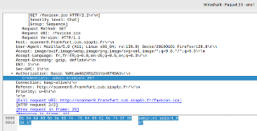

# Activité 3 : Constatation des limites du protocole HTTP et migration vers le protocole HTTPS


## Prérequis


*Ducumentation en ligne : [https://cubdocumentation.sioplc.fr](https://cubdocumentation.sioplc.fr)*
<br>

## Adressage 

| Puissance de 2 | Valeur |
|:---------------:|:------:|
| 2⁰ | 1 |
| 2¹ | 2 |
| 2² | 4 |
| 2³ | 8 |
| 2⁴ | 16 |
| 2⁵ | 32 |
| 2⁶ | 64 |
| <span style="background-color:#aee7ff; padding:2px 4px; border-radius:3px;">**2⁷**</span> | <span style="background-color:#aee7ff; padding:2px 4px; border-radius:3px;">**128**</span> |

**Adresse réseau : 192.168.6.0/24**

<br>

| **Service** | **Nombre d’hôtes** | **Adresse réseau** | **Masque de sous-réseau** | **Adresse de diffusion** | **Description VLAN** |
|--------------|--------------------:|--------------------|----------------------------|---------------------------|----------------------|
| Production | 120 | 192.168.6.0 | <span style="background-color:#b7fbb7;">255.255.255.128</span> | 192.168.6.127 | VLAN 56 |
| Client 1 | 32 | 192.168.6.128 | 255.255.255.192 | 192.168.6.191 | VLAN 10 |
| Administration systèmes et réseaux | 6 | 192.168.6.192 | 255.255.255.240 | 192.168.6.207 | VLAN 20 |

<br>

**N°1 sous-réseau Production = 126 hôtes →** <span style="background-color:#aee7ff; padding:2px 4px; border-radius:3px;">**2⁷**</span> **→ <span style="background-color:#b7fbb7;">/25**</span>

**Production = 192.168.6.0/24 → 255.255.255.128 →** <span style="background-color:#aee7ff; padding:2px 4px; border-radius:3px;">**x.x.x.1000 0000**</span>

**Diffusion :** `1100 0000 . 1010 1000 . 0000 0110 . 0111 1111`  
➡️ 192.168.6.**127**

___

## Schéma logique – Agence Frankfur


___
## Packet tracert - Agence Frankfurt
<br>


<br>

<div style="text-align:center; margin-top:20px;">
  <a href="https://drive.google.com/file/d/1L7Gp52YpPjjRhFdp9gp4L1sGORqAoCEK/view?usp=share_link" 
     style="display:inline-block;
            background:#e7e7e9;
            color:#0096FF;
            padding:11px 25px;
            border-radius:10px;
            text-decoration:none;
            font-weight:50;
            box-shadow:0 0 12px rgba(0,0,0,0.5);
            transition:all 0.3s ease;"
     onmouseover="this.style.background='#dcdce0'; this.style.color='#003d80';"
     onmouseout="this.style.background='#e7e7e9'; this.style.color='#0096FF';">
     🔗 Cliquer pour télécherger le paket tracert
  </a>
</div>
<br>

___

## Plan de câblage 


___

## Constatation des limites du protocole HTTP et migration vers le protocole HTTPS

## Étape 1 : 

Afin de constater les limites du protocole HTTP. Je vais sniffer le réseau afin de récupérer les échanges **entre un client web et mon site scanner0.agence.cub.sioplc.fr.** Pour mettre en place le sniffing, il faut configurer le port miroring sur notre commutateur Cisco. Le port miroring consiste à dupliquer le trafic entrant et sortant d'un port du commutateur vers un autre. L'idée est donc de dupliquer le trafic du port sur lequel est connecté le client web sur mon poste administrateur puis de l'analyser à l'aide de Wireshark.

### A) Configurer le port miroring à l'aide de la documentation suivante : https://www.it-connect.fr/configurer-le-port-mirroring-sous-cisco/. Réaliser les tests nécessaires permettant de valider que la solution est bien effective.

Switch# :
```bash
configure terminal
monitor session 1 source interface fa 0/1 both
monitor session 1 destination interface fa0/2
show monitor session 1
```


### B) À l'aide de Wireshark, récupérer les login et mot de passe permettant d'accéder au à l'interface d'administration Wordpress www0.agence.cub.sioplc.fr puis ceux pour accéder à
scanner0.agence.cub.sioplc.fr.





### C) Sauvegarder la capture de trames et désactiver ensuite le port miroring.

Switch(config)#
```bash
no monitor session 1
```

## Étape 2

A l'aide de votre guide de configuration Apache et d'Internet, mettre en place le protocole HTTPS pour vos deux sites en testant les 3 solutions qui vous ont été demandées dans l'expression des besoins.

Une fois le protocole HTTPS opérationnel, réaliser une capture de trame d'une connexion HTTPS depuis un client et l'interpréter.

## Mise en place de HTTPS

### A) Création et utilisation d’un certificat X509 auto-signé et d'une clé privée sur un serveur Web Apache 2

**Pour www0 :**

```bash
etudiant@web0:/etc/apache2$ sudo mkdir certs
etudiant@web0:/etc/apache2$ cd certs/
etudiant@web0:/etc/apache2/certs$ sudo openssl req -newkey rsa:4096 -keyout www0.key -x509 -days 365 -out www0.crt
Generating a RSA private key
..........................................................++++
.++++
writing new private key to 'docs.key'
Enter PEM pass phrase:
Verifying - Enter PEM pass phrase:
-----
You are about to be asked to enter information that will be incorporated
into your certificate request.
What you are about to enter is what is called a Distinguished Name or a DN.
There are quite a few fields but you can leave some blank
For some fields there will be a default value,
If you enter '.', the field will be left blank.
-----
Country Name (2 letter code) [AU]:FR
State or Province Name (full name) [Some-State]:Indre et Loire
Locality Name (eg, city) []:Tours
Organization Name (eg, company) [Internet Widgits Pty Ltd]:Cub
Organizational Unit Name (eg, section) []:Frankfurt
Common Name (e.g. server FQDN or YOUR name) []: www0.frankfurt.cub.sioplc.fr
Email Address []:touzetal30@gmail.com
```


**Pour scanner0 :** 

```bash
etudiant@web0:/etc/apache2$ cd certs/
etudiant@web0:/etc/apache2/certs$ sudo openssl req -newkey rsa:4096 -keyout scanner0.key -x509 -days 365 -out scanner0.crt
Generating a RSA private key
..........................................................++++
.++++
writing new private key to 'docs.key'
Enter PEM pass phrase:
Verifying - Enter PEM pass phrase:
-----
You are about to be asked to enter information that will be incorporated
into your certificate request.
What you are about to enter is what is called a Distinguished Name or a DN.
There are quite a few fields but you can leave some blank
For some fields there will be a default value,
If you enter '.', the field will be left blank.
-----
Country Name (2 letter code) [AU]:FR
State or Province Name (full name) [Some-State]:Indre et Loire
Locality Name (eg, city) []:Tours
Organization Name (eg, company) [Internet Widgits Pty Ltd]:Cub
Organizational Unit Name (eg, section) []:Frankfurt
Common Name (e.g. server FQDN or YOUR name) []: scanner0.frankfurt.cub.sioplc.fr
Email Address []:touzetal30@gmail.com
```


**`PassPhrase : etudiant_007`**


### B) Configuration du serveur Apache2

```bash
sudo nano /etc/apache2/sites-available/www0.conf
```


```bash
<VirtualHost *:443>
    ServerName www0.frankfurt.cub.sioplc.fr

    DocumentRoot/var/www/www/wordpress

SSLEngine on
    #Pour le https
    SSLCertificateFile /etc/apache2/certs/www0.crt
    SSLCertificateKeyFile /etc/apache2/certs/www.key

    <Directory /var/www/www0/wordpress>
        Options FollowSymLinks
        AllowOverride All
        Require all granted
    </Directory>

    ErrorLog ${APACHE_LOG_DIR}/www0-error.log
    CustomLog ${APACHE_LOG_DIR}/www0-access.log combined
</VirtualHost>
```

---

```bash
sudo nano /etc/apache2/sites-available/scanner0.conf
```


```bash
<VirtualHost *:443>
    ServerName scanner0.frankfurt.cub.sioplc.fr

    DocumentRoot /var/www/html/scanner0

SSLEngine on
#pour le https
    SSLCertificateFile /etc/apache2/certs/scanner0.crt
    SSLCertificateKeyFile /etc/apache2/certs/scanner0.key

    <Directory /var/www/html/scanner0>
        Options FollowSymLinks
        AllowOverride All

#cela vas une authentification
        AuthType Basic
        AuthName "Accès restreint - Scanner Réseau"
        AuthUserFile /etc/apache2/.htpasswd
        Require valid-user

#Filtrage IP VLAN 20 (Administration)
        Require ip 192.168.6.192/28

    </Directory>

    ErrorLog ${APACHE_LOG_DIR}/scanner0-error.log
    CustomLog ${APACHE_LOG_DIR}/scanner0-access.log combined
</VirtualHost>
```

---

```bash
sudo a2enmod ssl
sudo service apache2 reload
```