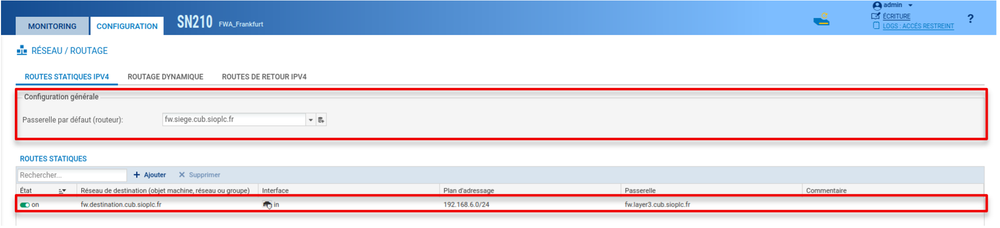

# Activité 0 : Mise en place de l’infrastructure réseau des agences de l’entreprise CUB


## Prérequis


*Ducumentation en ligne : [https://cubdocumentation.sioplc.fr](https://cubdocumentation.sioplc.fr)*
<br>

## Adressage 

| Puissance de 2 | Valeur |
|:---------------:|:------:|
| 2⁰ | 1 |
| 2¹ | 2 |
| 2² | 4 |
| 2³ | 8 |
| 2⁴ | 16 |
| 2⁵ | 32 |
| 2⁶ | 64 |
| <span style="background-color:#aee7ff; padding:2px 4px; border-radius:3px;">**2⁷**</span> | <span style="background-color:#aee7ff; padding:2px 4px; border-radius:3px;">**128**</span> |

**Adresse réseau : 192.168.6.0/24**

<br>

| **Service** | **Nombre d’hôtes** | **Adresse réseau** | **Masque de sous-réseau** | **Adresse de diffusion** | **Description VLAN** |
|--------------|--------------------:|--------------------|----------------------------|---------------------------|----------------------|
| Production | 120 | 192.168.6.0 | <span style="background-color:#b7fbb7;">255.255.255.128</span> | 192.168.6.127 | VLAN 56 |
| Client 1 | 32 | 192.168.6.128 | 255.255.255.192 | 192.168.6.191 | VLAN 10 |
| Administration systèmes et réseaux | 6 | 192.168.6.192 | 255.255.255.240 | 192.168.6.207 | VLAN 20 |

<br>

**N°1 sous-réseau Production = 126 hôtes →** <span style="background-color:#aee7ff; padding:2px 4px; border-radius:3px;">**2⁷**</span> **→ <span style="background-color:#b7fbb7;">/25**</span>

**Production = 192.168.6.0/24 → 255.255.255.128 →** <span style="background-color:#aee7ff; padding:2px 4px; border-radius:3px;">**x.x.x.1000 0000**</span>

**Diffusion :** `1100 0000 . 1010 1000 . 0000 0110 . 0111 1111`  
➡️ 192.168.6.**127**

___

## Schéma logique – Agence Frankfur


___
## Packet tracert - Agence Frankfurt
<br>


<br>

<div style="text-align:center; margin-top:20px;">
  <a href="https://drive.google.com/file/d/1L7Gp52YpPjjRhFdp9gp4L1sGORqAoCEK/view?usp=share_link" 
     style="display:inline-block;
            background:#e7e7e9;
            color:#0096FF;
            padding:11px 25px;
            border-radius:10px;
            text-decoration:none;
            font-weight:50;
            box-shadow:0 0 12px rgba(0,0,0,0.5);
            transition:all 0.3s ease;"
     onmouseover="this.style.background='#dcdce0'; this.style.color='#003d80';"
     onmouseout="this.style.background='#e7e7e9'; this.style.color='#0096FF';">
     🔗 Cliquer pour télécherger le paket tracert
  </a>
</div>
<br>

___

## Plan de câblage 


___

**FW**

| Destination      | Masque | Passerelle       | Interface       | Type |
|-----------------|--------|-----------------|----------------|------|
| 192.36.253.0    | /24    | 192.36.253.60   | 192.36.253.60  | C    |
| 192.36.6.0      | /24    | 192.36.6.254    | 192.36.6.254   | C    |
| 192.168.66.248  | /28    | 192.168.66.254  | 192.168.66.254 | C    |
| 192.168.6.0     | /24    | 192.168.66.253  | 192.168.66.254 | S    |
| 0.0.0.0         | /0     | 192.36.253.254  | 192.36.253.60  | S    |

**LAYER 3**

| Destination      | Masque | Passerelle       | Interface       | Type |
|-----------------|--------|-----------------|----------------|------|
| 192.168.6.0     | /25    | 192.168.6.126   | 192.168.6.126  | C    |
| 192.168.66.248  | /28    | 192.168.66.253  | 192.168.66.253 | C    |
| 192.168.6.128   | /26    | 192.168.6.190   | 192.168.6.190  | C    |
| 192.168.6.192   | /28    | 192.168.66.206  | 192.168.66.206 | S    |
| 0.0.0.0         | /0     | 192.168.66.254  | 192.168.66.253 | S    |

**Routage NAT**

<table>
  <tr>
    <th colspan="4">Avant translation</th>
    <th colspan="4">Après translation</th>
  </tr>
  <tr>
    <th>Ip source</th>
    <th>Port Src</th>
    <th>IP dst</th>
    <th>Port dst</th>
    <th>Ip source</th>
    <th>Port Src</th>
    <th>IP dst</th>
    <th>Port dst</th>
  </tr>
  <tr>
    <td>192.168.6.0 /24</td>
    <td>*</td>
    <td>*</td>
    <td>*</td>
    <td>192.36.253.60 /24</td>
    <td>*</td>
    <td>*</td>
    <td>*</td>
  </tr>
</table>

___

## 1. Fichier de configuration des différents équipements 


<div style="margin-top:20px;">
  <a href="https://drive.google.com/file/d/1bF75ljARePUwne40Eg3HO-nEavDCPnye/view?usp=share_link" 
     style="display:inline-block;
            background:#e7e7e9;
            color:#0096FF;
            padding:11px 25px;
            border-radius:10px;
            text-decoration:none;
            font-weight:50;
            box-shadow:0 0 12px rgba(0,0,0,0.5);
            transition:all 0.3s ease;"
     onmouseover="this.style.background='#dcdce0'; this.style.color='#003d80';"
     onmouseout="this.style.background='#e7e7e9'; this.style.color='#0096FF';">
     🔗 Cliquer pour télécharger la configuration du SW LAYER 2 
  </a>
</div>

<div style="margin-top:20px;">
  <a href="https://drive.google.com/file/d/1ZiBFeQQwt0jd8EZbdG5kENWhuKL00H2E/view?usp=share_link" 
     style="display:inline-block;
            background:#e7e7e9;
            color:#0096FF;
            padding:11px 25px;
            border-radius:10px;
            text-decoration:none;
            font-weight:50;
            box-shadow:0 0 12px rgba(0,0,0,0.5);
            transition:all 0.3s ease;"
     onmouseover="this.style.background='#dcdce0'; this.style.color='#003d80';"
     onmouseout="this.style.background='#e7e7e9'; this.style.color='#0096FF';">
     🔗 Cliquer pour télécharger la configuration du SW LAYER 3
  </a>
</div>

<div style="margin-top:20px;">
  <a href="https://drive.google.com/file/d/1F8QaNltIlI1-h1X0EihRWQ0JFQCPO-Ap/view?usp=share_link" 
     style="display:inline-block;
            background:#e7e7e9;
            color:#0096FF;
            padding:11px 25px;
            border-radius:10px;
            text-decoration:none;
            font-weight:50;
            box-shadow:0 0 12px rgba(0,0,0,0.5);
            transition:all 0.3s ease;"
     onmouseover="this.style.background='#dcdce0'; this.style.color='#003d80';"
     onmouseout="this.style.background='#e7e7e9'; this.style.color='#0096FF';">
     🔗 Cliquer pour télécharger la configuration du SW DMZ 
  </a>
</div>


<div style="margin-top:20px;">
  <a href="https://drive.google.com/file/d/1F8QaNltIlI1-h1X0EihRWQ0JFQCPO-Ap/view?usp=share_link" 
     style="display:inline-block;
            background:#e7e7e9;
            color:#0096FF;
            padding:11px 25px;
            border-radius:10px;
            text-decoration:none;
            font-weight:50;
            box-shadow:0 0 12px rgba(0,0,0,0.5);
            transition:all 0.3s ease;"
     onmouseover="this.style.background='#dcdce0'; this.style.color='#003d80';"
     onmouseout="this.style.background='#e7e7e9'; this.style.color='#0096FF';">
     🔗 Cliquer pour télécharger la configuration du pare feu agence 
  </a>
</div>

<div style="margin-top:20px;">
  <a href="https://drive.google.com/file/d/1rWXNRImZjDRd-_5M8QgQKYOFJy9BefWo/view?usp=share_link" 
     style="display:inline-block;
            background:#e7e7e9;
            color:#0096FF;
            padding:11px 25px;
            border-radius:10px;
            text-decoration:none;
            font-weight:50;
            box-shadow:0 0 12px rgba(0,0,0,0.5);
            transition:all 0.3s ease;"
     onmouseover="this.style.background='#dcdce0'; this.style.color='#003d80';"
     onmouseout="this.style.background='#e7e7e9'; this.style.color='#0096FF';">
     🔗 Cliquer pour télécharger la configuration du pare feu siège
  </a>
</div>

## 2. Configuration du routage statique 

**Router(config)#**
```bash
 ip routing
```

**Router(config)#** *`ip route destination masque passerelle`*

**Exemple :**
```bash
ip route 10.0.0.0 255.0.0.0 172.16.0.253
```

Pour afficher les routes créer : 
```bash
show ip route
```

## 3. Configuration du routage NAT

Avant de commencer, activer `IP routing`

**Router(config)#**
```bash
ip routing
```

### 3.1 Désigner les interfaces Inside et Outside (Interne et Externe)

**Router(config)#**

```bash
interface g0/0
ip nat inside
no shutdown
```

**Router(config)#**
```bash
interface g0/1
ip nat outside
no shutdown 
```

### 3.2 Définir les adresses locales soumises au NAT dans l'optique de les masquer pour qu'elles puissent avoir accès à l'extérieur et que l'extérieur ne voit que l'adresse du routeur.

**Router(config)#** : *`access-list access-list number permit source ip wildcard_mask`*

Le terme ***wildcard_mask*** désigne un masque inversé, pour un masque de sous-réseau de 255.255.255.0 le ***wildcard mask*** sera 0.0.0.255.

**Exemple :**
```bash
access-list 1 permit 10.0.0.0 0.255.255.255 
```

### 3.3 Mise en place de la translation LAN vers IP publique

**Router (config)#** *`ip nat inside source list numero-acl interface int-publique overload`*

**Exemple :**
```bash
ip nat inside source list 1 interface GigabitEthernet 0/1 overload
```

## 4. Configuration du pare-feu Stormshield 
*Se référer à la documentation suivante : https://cubdocumentation.sioplc.fr*



**Premier encadré :** Ceci est la route par défaut calculée auparavant sur la table de routage.


**Deuxième encadré :** Ceci est l’autre route statique calculée auparavant sur la table de routage.
