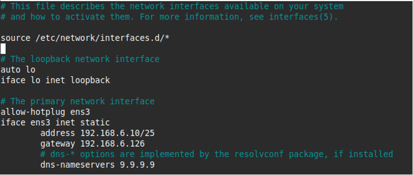
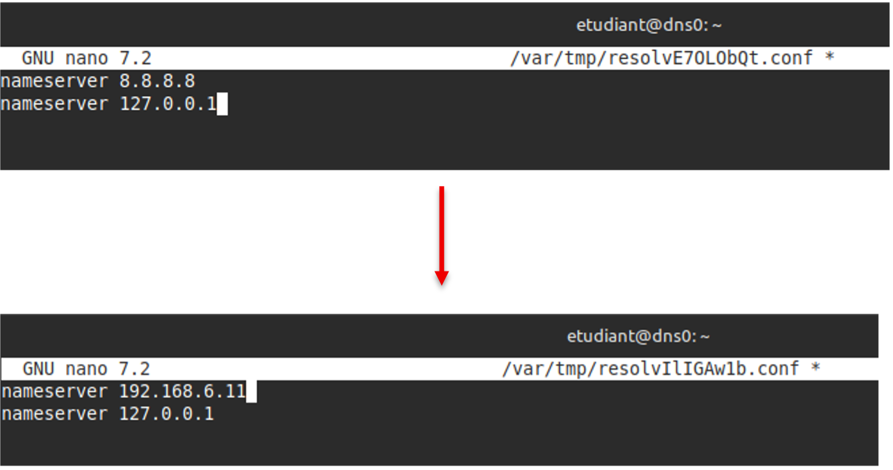
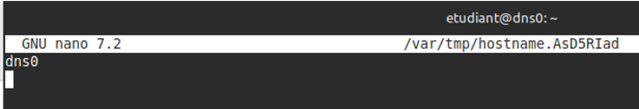
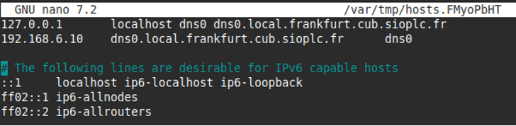
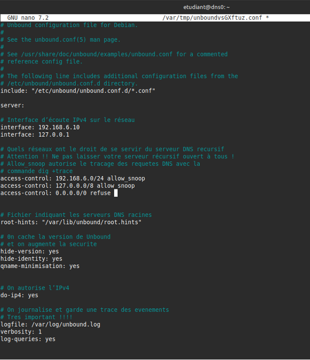
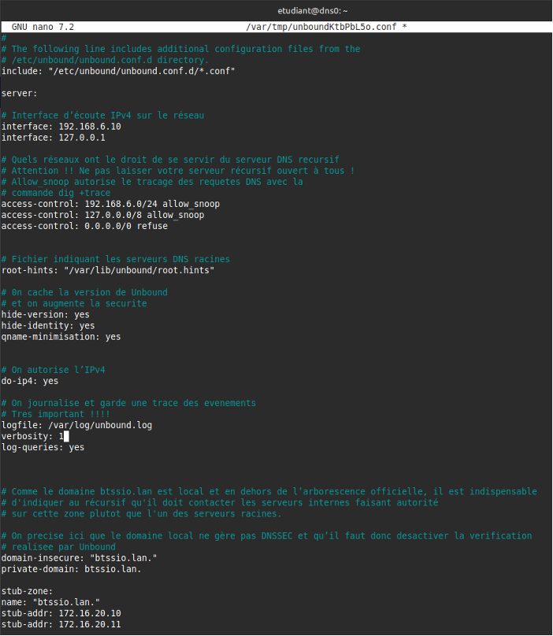
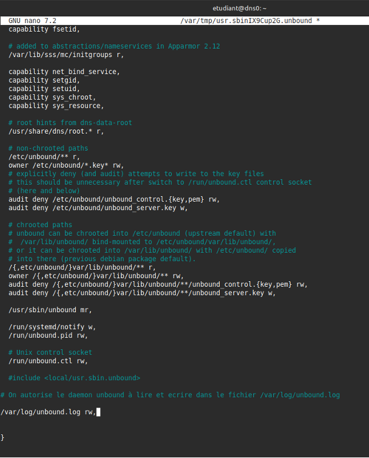
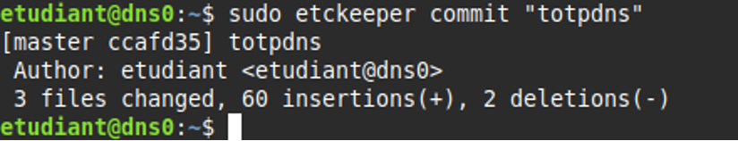

# I - Serveur DNS récursif


## Prérequis


*Ducumentation en ligne : [https://cubdocumentation.sioplc.fr](https://cubdocumentation.sioplc.fr)*
<br>

## Adressage 

| Puissance de 2 | Valeur |
|:---------------:|:------:|
| 2⁰ | 1 |
| 2¹ | 2 |
| 2² | 4 |
| 2³ | 8 |
| 2⁴ | 16 |
| 2⁵ | 32 |
| 2⁶ | 64 |
| <span style="background-color:#aee7ff; padding:2px 4px; border-radius:3px;">**2⁷**</span> | <span style="background-color:#aee7ff; padding:2px 4px; border-radius:3px;">**128**</span> |

**Adresse réseau : 192.168.6.0/24**

<br>

| **Service** | **Nombre d’hôtes** | **Adresse réseau** | **Masque de sous-réseau** | **Adresse de diffusion** | **Description VLAN** |
|--------------|--------------------:|--------------------|----------------------------|---------------------------|----------------------|
| Production | 120 | 192.168.6.0 | <span style="background-color:#b7fbb7;">255.255.255.128</span> | 192.168.6.127 | VLAN 56 |
| Client 1 | 32 | 192.168.6.128 | 255.255.255.192 | 192.168.6.191 | VLAN 10 |
| Administration systèmes et réseaux | 6 | 192.168.6.192 | 255.255.255.240 | 192.168.6.207 | VLAN 20 |

<br>

**N°1 sous-réseau Production = 126 hôtes →** <span style="background-color:#aee7ff; padding:2px 4px; border-radius:3px;">**2⁷**</span> **→ <span style="background-color:#b7fbb7;">/25**</span>

**Production = 192.168.6.0/24 → 255.255.255.128 →** <span style="background-color:#aee7ff; padding:2px 4px; border-radius:3px;">**x.x.x.1000 0000**</span>

**Diffusion :** `1100 0000 . 1010 1000 . 0000 0110 . 0111 1111`  
➡️ 192.168.6.**127**

___

## Schéma logique – Agence Frankfur


___
## Packet tracert - Agence Frankfurt
<br>


<br>

<div style="text-align:center; margin-top:20px;">
  <a href="https://drive.google.com/file/d/1L7Gp52YpPjjRhFdp9gp4L1sGORqAoCEK/view?usp=share_link" 
     style="display:inline-block;
            background:#e7e7e9;
            color:#0096FF;
            padding:11px 25px;
            border-radius:10px;
            text-decoration:none;
            font-weight:50;
            box-shadow:0 0 12px rgba(0,0,0,0.5);
            transition:all 0.3s ease;"
     onmouseover="this.style.background='#dcdce0'; this.style.color='#003d80';"
     onmouseout="this.style.background='#e7e7e9'; this.style.color='#0096FF';">
     🔗 Cliquer pour télécherger le paket tracert
  </a>
</div>
<br>

___

## Plan de câblage 


___


!!! note "Information sur le contexte"
    DNS résolveur (récursif) → VLAN Production 
    @IP de mon DNS → 192.168.6.10
    @IP du DNS de mon camarade → 192.168.6.11 

    Nom de domaine FQDN : dns0.local.frankfurt.cub.sioplc.fr


## 1.  Vérification préalable

Mettez à jour votre serveur

```bash
sudo apt update && sudo apt upgrade
```

Sur votre serveur Debian 12, installez le service de journalisation rsyslog à la place de journalctl. Cela vous permettra de disposer de fichiers de log clairs au format texte situés dans `/var/log`.

```bash
sudo apt install rsyslog
```

## 2. Définir les paramètres réseaux du serveur

```bash
sudoedit /etc/network/interfaces
```




## 3. Définir le serveur DNS récursif à utiliser

```bash
sudoedit /etc/resolv.conf
```

```bash
nameserver 8.8.8.8
```

!!! Warning  "Attention"
    Lorsque le service Unbound sera opérationnel, remplacer 8.8.8.8 par 127.0.0.1 et ajouter ensuite le second serveur récursif produit par votre binôme. 





## 4. Prendre en compte les modifications des paramètres réseaux

```bash
sudo systemctl restart networking
```

## 5. Configurer correctement les fichiers /etc/hostname et /etc/hosts

Le fichier **hostname** sert à donner un nom à votre serveur.

```bash
sudoedit /etc/hostname
```

```bash
dns0
```



!!! Info  "Information"
    Le fichier hosts, ancêtre des stubresolver DNS, permet de faire la correspondance entre un nom et une IP. Il est généralement prioritaire sur la résolution DNS (pour modifier l’ordre de préférence, éditez le fichier `/etc/nsswitch.conf`). Dans ce fichier, il est important de renseigner la correspondance entre votre adresse de boucle locale et un nom. Ainsi, si votre machine sollicite le nom indiqué lors d'un processus particulier, cela la renverra vers l'adresse de loopback.

```bash
sudoedit /etc/hosts
```



Il est nécessaire de redémarrer le serveur pour prendre en compte le changement de nom.

```bash
sudo shutdown -r now
```

## 6. Installer Unbound et les outils d'administration appropriés

```bash
sudo apt install unbound dnsutils tcpdump tmux curl
```

## 7. Configurer Unbound

```bash
sudoedit /etc/unbound/unbound.conf
```




Il est important de vérifier ensuite que la syntaxe des lignes contenues dans le fichier de configuration est correcte. Pour cela, il existe la commande **unbound-checkconf**.

```bash
sudo unbound-checkconf
```

Notre serveur récursif va nativement s’adresser aux serveurs faisant autorité sur Internet en sollicitant en premier l’un des serveurs racines. Dans le cas où le serveur récursif serait amené à devoir traiter des domaines locaux qui se trouvent en dehors de l’arborescence DNS réelle (ex : btssio.lan ou epoka.local), il est important de l’indiquer dans le fichier de configuration `(/etc/unbound/unbound.conf)` de la manière suivante :




On récupère les adresses des serveurs racines et nous les stockons dans le fichier `/var/lib/unbound/root.hints`. Ce fichier est indispensable et permet au service Unbound de savoir comment contacter le serveur racine le plus proche ou rapide.

```bash
sudo curl --output /var/lib/unbound/root.hints https://www.internic.net/domain/named.cache
sudo chown -R unbound:unbound /var/lib/unbound/
```

On crée le fichier de log spécifique à Unbound.

```bash
sudo touch /var/log/unbound.log
chown unbound:unbound /var/log/unbound.log
sudo systemctl restart unbound
sudo systemctl status unbound
```

!!! Warning  "Attention"
    Sur les systèmes Debian récents, un logiciel de sécurité de type MAC (Mandatory Access Control) nommé AppArmor est activé par défaut. Il surveille entre autres les droits d’accès des différents processus lancés sur le système. Par défaut, AppArmor empêche le service unbound de lire et d’écrire dans le répertoire `/var/log/`. Il est donc indispensable de changer ces permissions.

```bash
sudoedit /etc/apparmor.d/usr.sbin.unbound
```




On vérifie que le nouveau fichier de configuration de AppArmor ne contient pas d’erreurs puis on redémarre le service.

```bash
sudo apparmor_parser -r /etc/apparmor.d/usr.sbin.unbound
sudo systemctl restart apparmor
```

Si l’on souhaite observer les évènements journalisés :

```bash
sudo cat /var/log/unbound.log
```

Si l’on souhaite observer les derniers évènements enregistrés dans le fichier de log en temps réel :

```bash
sudo  tail -f /var/log/unbound.log
```

Pour finir : 


