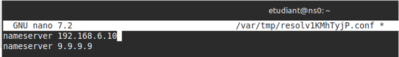
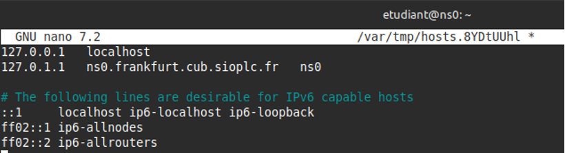
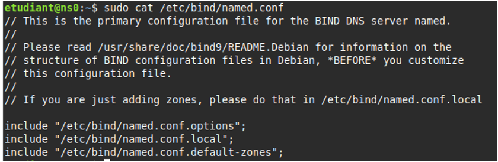
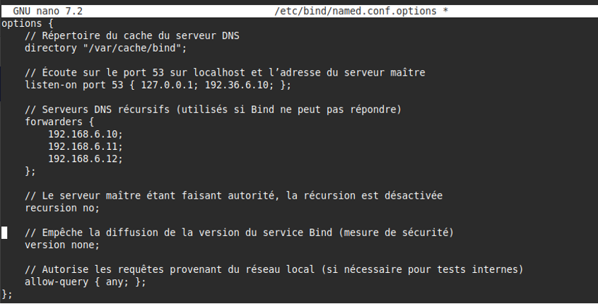
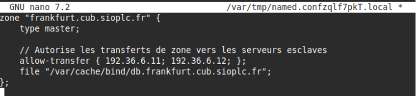
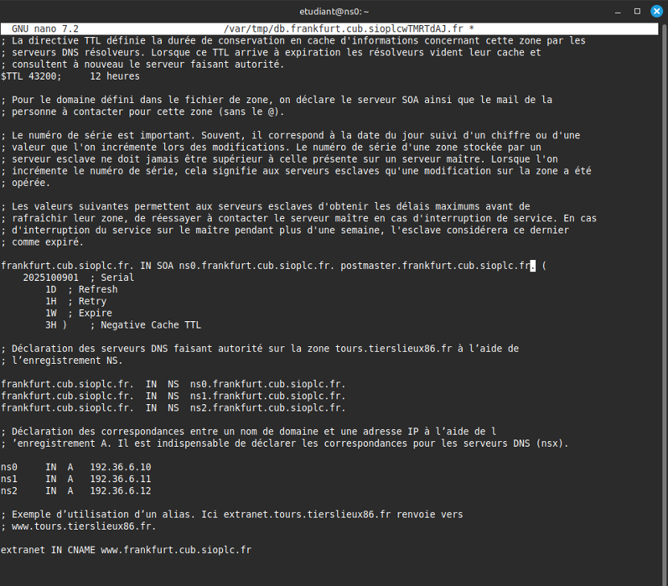
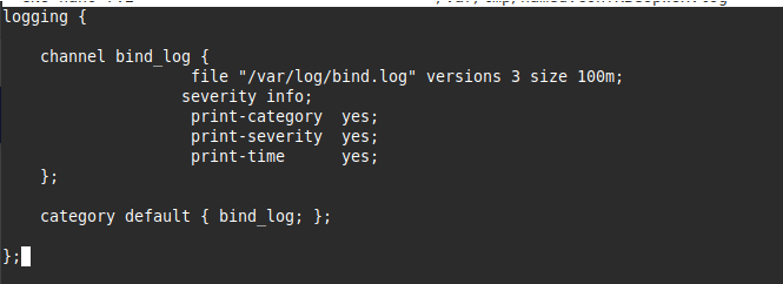
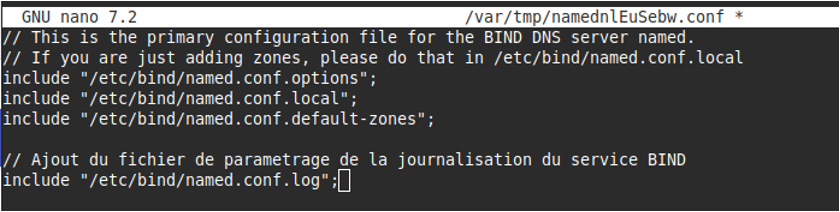
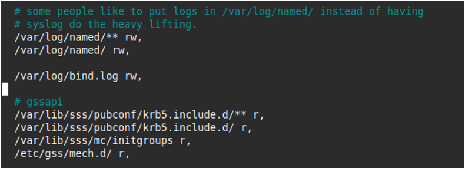

# II - Serveur DNS maître faisant autorité


## Prérequis


*Ducumentation en ligne : [https://cubdocumentation.sioplc.fr](https://cubdocumentation.sioplc.fr)*
<br>

## Adressage 

| Puissance de 2 | Valeur |
|:---------------:|:------:|
| 2⁰ | 1 |
| 2¹ | 2 |
| 2² | 4 |
| 2³ | 8 |
| 2⁴ | 16 |
| 2⁵ | 32 |
| 2⁶ | 64 |
| <span style="background-color:#aee7ff; padding:2px 4px; border-radius:3px;">**2⁷**</span> | <span style="background-color:#aee7ff; padding:2px 4px; border-radius:3px;">**128**</span> |

**Adresse réseau : 192.168.6.0/24**

<br>

| **Service** | **Nombre d’hôtes** | **Adresse réseau** | **Masque de sous-réseau** | **Adresse de diffusion** | **Description VLAN** |
|--------------|--------------------:|--------------------|----------------------------|---------------------------|----------------------|
| Production | 120 | 192.168.6.0 | <span style="background-color:#b7fbb7;">255.255.255.128</span> | 192.168.6.127 | VLAN 56 |
| Client 1 | 32 | 192.168.6.128 | 255.255.255.192 | 192.168.6.191 | VLAN 10 |
| Administration systèmes et réseaux | 6 | 192.168.6.192 | 255.255.255.240 | 192.168.6.207 | VLAN 20 |

<br>

**N°1 sous-réseau Production = 126 hôtes →** <span style="background-color:#aee7ff; padding:2px 4px; border-radius:3px;">**2⁷**</span> **→ <span style="background-color:#b7fbb7;">/25**</span>

**Production = 192.168.6.0/24 → 255.255.255.128 →** <span style="background-color:#aee7ff; padding:2px 4px; border-radius:3px;">**x.x.x.1000 0000**</span>

**Diffusion :** `1100 0000 . 1010 1000 . 0000 0110 . 0111 1111`  
➡️ 192.168.6.**127**

___

## Schéma logique – Agence Frankfur


___
## Packet tracert - Agence Frankfurt
<br>


<br>

<div style="text-align:center; margin-top:20px;">
  <a href="https://drive.google.com/file/d/1L7Gp52YpPjjRhFdp9gp4L1sGORqAoCEK/view?usp=share_link" 
     style="display:inline-block;
            background:#e7e7e9;
            color:#0096FF;
            padding:11px 25px;
            border-radius:10px;
            text-decoration:none;
            font-weight:50;
            box-shadow:0 0 12px rgba(0,0,0,0.5);
            transition:all 0.3s ease;"
     onmouseover="this.style.background='#dcdce0'; this.style.color='#003d80';"
     onmouseout="this.style.background='#e7e7e9'; this.style.color='#0096FF';">
     🔗 Cliquer pour télécherger le paket tracert
  </a>
</div>
<br>

___

## Plan de câblage 


___

!!! note "Information sur le contexte"
    DNS faisant autorité → DMZ 
    @IP de mon DNS → 192.36.6.10
    @IP du DNS de mon camarade → 192.36.6.11
    
    Nom de domaine FQDN : ns0.frankfurt.cub.sioplc.fr

## 1.  Vérification préalable

Mettez à jour votre serveur

```bash
sudo apt update && sudo apt upgrade
```

Sur votre serveur Debian 12, installez le service de journalisation rsyslog à la place de journalctl. Cela vous permettra de disposer de fichiers de log clairs au format texte situés dans `/var/log`.

```bash
sudo apt install rsyslog
```

Installez le service Bind 9 et les outils diagnostics DNS

```bash
sudo apt install bind9 dnsutils
```

## 2. Définir les paramètres réseaux du serveur

```bash
sudoedit /etc/network/interfaces
```

## 3. Définir le serveur DNS récursif à utiliser

```bash
sudoedit /etc/resolv.conf
```



??? info "Pourquoi choisir ces serveurs DNS récursifs ?"
    Pour rappel, les serveurs DNS faisant autorité gèrent, dans la majorité des cas, des zones publiques appartenant à l'arborescence réelle. Ainsi, ils seront la plupart du temps hébergés dans une DMZ contrairement aux serveurs DNS récursifs qui seront installés dans le LAN. Pour des raisons évidentes de sécurité, il est plus pertinent que les serveurs définis dans le fichier `/etc/resolv.conf` soient des résolveurs publics plutôt que les résolveurs internes paramétrés précédemment. 

## 4. Prendre en compte les modifications des paramètres réseaux

```bash
sudo systemctl restart networking
```

## 5. Configurer correctement les fichiers `/etc/hostname et /etc/hosts`

Le fichier **hostname** sert à donner un nom à votre serveur.

```bash
sudoedit /etc/hostname
```

```bash
ns0
```
!!! Info  "Information"
    Le fichier hosts, ancêtre des stubresolver DNS, permet de faire la correspondance entre un nom et une IP. Il est généralement prioritaire sur la résolution DNS (pour modifier l’ordre de préférence, éditez le fichier `/etc/nsswitch.conf`). Dans ce fichier, il est important de renseigner la correspondance entre votre adresse de boucle locale et un nom. Ainsi, si votre machine sollicite le nom indiqué lors d'un processus particulier, cela la renverra vers l'adresse de loopback.

```bash
sudoedit /etc/hosts
```


Il est nécessaire de redémarrer le serveur pour prendre en compte le changement de nom.

```bash
sudo shutdown -r now
```

## 6. Principes généraux concernant Bind9 et le service DNS.

1. Créer dans le répertoire `/var/named/` les zones adéquates à l’aide d’un fichier db.xxxxxx (ou xxxxxx correspond à votre nom de domaine) par exemple, db.tours.btsssio.fr.
2. Initialiser la ou les zones dans `/etc/bind/named.conf.local`
3. Ajouter ou gérer les options globales du daemon Bind 9 dans `/etc/bind/named.conf.options`
4. Faire particulièrement attention à la syntaxe. 
5. Penser aux commandes de test et redémarrer ou recharger le service.

Les commandes à connaître absolument sont les suivantes et vous seront utiles tout au long de votre activité :

* dig
* host
* nslookup (sous Windows)
* named-checkconf
* named-checkzone
* service bind9 stop|start|restart|reload|status (fonctionne avec SysVinit, systemd)
* avec systemd, systemctl stop|start|restart|reload|status bind9

## 7. Exemple de configuration d'un serveur DNS maître faisant autorité

!!! Warning  "Attention"
    Il est recommandé de supprimer le contenu des fichiers de configuration par défaut et d'utiliser le contenu fourni ci-dessous. N'oubliez pas que **etckeeper** doit être mobilisé.

```bash
sudo cat /etc/bind/named.conf
``` 




Le fichier `/etc/bind/named.conf` est le fichier de configuration global du service DNS. Il est possible d'y renseigner tous les paramètres de configuration du service.

Sous Debian, il a été décidé dans un souci de lisibilité, de scinder la configuration en plusieurs fichiers. Ces fichiers sont appelés par le fichier de configuration général à l'aide de la directive include.

* Le fichier named.conf.options est utilisé pour déclarer les options de configuration liées à Bind.
* Le fichier named.conf.local sert à déclarer les zones nouvellement créées.
* Le fichier named.conf.default-zones contient les déclarations de fichier de zone concernant la racine DNS et la boucle locale.
* Le fichier named.conf.log n'existe pas mais vous permettra de gérer la journalisation de votre service dans un fichier texte dédié.

```bash
sudo cat /etc/bind/named.conf.options
```




```bash
sudoedit /etc/bind/named.conf.local
```




Ce fichier sert à déclarer les zones que vous aurez à gérer. Votre serveur peut-être maître sur une zone ou esclave. La directive file sert à déclarer le fichier de zone contenant les enregistrements liés (SOA, NS, A…). La directive allow-transfer permet de déclarer les serveurs esclaves habilités.

!!! Warning  "Attention"
	Le numéro de série ne doit jamais être choisi au hasard et **systématiquement incrémenté à chaque modification du fichier de zone**. Les guides de bonnes pratiques recommande de choisir la date du jour sous **2025090101** (année/mois/jour/id). Dans le cas d'une architecture maître-esclave si le numéro de série présent sur le maître se retrouve **décrémenté** et inférieur à celui du serveur esclave, **le transfert de zone ne se fera plus !**

```bash
sudoedit /var/cache/bind/db.frankfurt.cub.sioplc.fr
sudo chown bind:bind /var/cache/bind/db.frankfurt.cub.sioplc.fr
```



!!! Warning  "Attention"
    Ceci est un exemple de fichier de zone à réadapter sans les commentaires (;). Tous les enregistrements présents dans cet exemple ne servent pas forcément dans le TP. Par contre, il est pertinent de rechercher leurs significations sur Internet pour comprendre à quoi ils peuvent servir dans un contexte professionnel.

Mise en place d’une journalisation des évènements du service DNS

```bash
sudoedit /etc/bind/named.conf.log
```


Ce fichier permet d'activer la journalisation des évènements pour le service DNS. Vous pouvez préciser le niveau de verbosité avec la directive severity mais aussi la taille maximale du fichier de log. Comme pour le fichier de zone esclave, il est nécessaire de créer un fichier vide de log avec les bonnes permissions au préalable :

```bash
sudo touch /var/log/bind.log
sudo chown bind:bind /var/log/bind.log
```

Enfin, on n’oublie pas de déclarer ce nouveau fichier de configuration dans `/etc/bind/named.conf`.

```bash
sudoedit /etc/bind/named.conf
```




!!! Warning  "Attention"
    Sur les systèmes Debian récents, un logiciel de sécurité de type MAC (Mandatory Access Control) nommé AppArmor est activé par défaut. Il surveille entre autres les droits d’accès des différents processus lancés sur le système. Par défaut, AppArmor empêche le service Bind 9 de lire et écrire dans le répertoire `/var/log/`. Il est donc indispensable de changer ces permissions.

```bash
sudoedit /etc/apparmor.d/usr.sbin.named
```

```bash
# On autorise le daemon Bind 9 à lire et ecrire dans le fichier /var/log/bind.log

/var/log/bind.log rw,
```



On vérifie que le nouveau fichier de configuration de AppArmor ne contient pas d’erreurs puis on redémarre le service.

```bash
sudo apparmor_parser -r /etc/apparmor.d/usr.sbin.named
sudo systemctl restart apparmor
```

??? info "named-checkconf"
    La commande named-checkconf permet de vérifier si des erreurs de syntaxe sont présentes et de fournir les éléments ou lignes qui posent problème dans un fichier en particulier.

```bash
sudo named-checkconf -z
sudo systemctl restart bind9
sudo systemctl status bind9
```