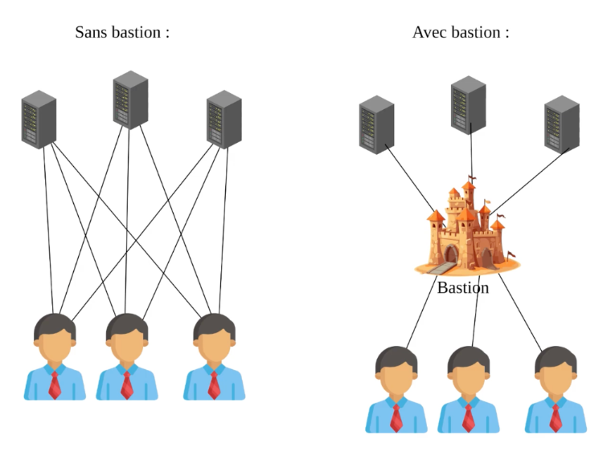
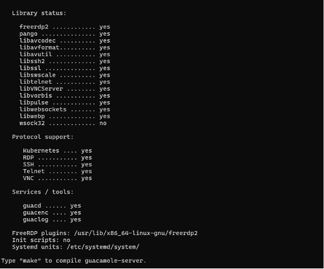

# Présentation du service BASTION


## Prérequis


*Ducumentation en ligne : [https://cubdocumentation.sioplc.fr](https://cubdocumentation.sioplc.fr)*
<br>

| **Service**                           | **Nombre d’hôtes** | **Adresse réseau** | **Masque de sous-réseau** | **Adresse de diffusion** | **Description VLAN** |
|--------------------------------------|--------------------|--------------------|----------------------------|--------------------------|----------------------|
| Production                           | 120                | 192.168.6.0        | 255.255.255.128            | 192.168.6.127            | VLAN 56              |
| Client 1                             | 32                 | 192.168.6.128      | 255.255.255.192            | 192.168.6.191            | VLAN 10              |
| Administration systèmes et réseaux   | 6                  | 192.168.6.192      | 255.255.255.240            | 192.168.6.207            | VLAN 20              |


## Packet tracert - Agence Frankfurt
<br>


<br>

<div style="text-align:center; margin-top:20px;">
  <a href="https://drive.google.com/file/d/1L7Gp52YpPjjRhFdp9gp4L1sGORqAoCEK/view?usp=share_link" 
     style="display:inline-block;
            background:#e7e7e9;
            color:#0096FF;
            padding:11px 25px;
            border-radius:10px;
            text-decoration:none;
            font-weight:50;
            box-shadow:0 0 12px rgba(0,0,0,0.5);
            transition:all 0.3s ease;"
     onmouseover="this.style.background='#dcdce0'; this.style.color='#003d80';"
     onmouseout="this.style.background='#e7e7e9'; this.style.color='#0096FF';">
     🔗 Cliquer pour télécherger le paket tracert
  </a>
</div>
<br>

## Présentation du service  

C’est quoi le **Bastion** : *Un bastion d’administration c’est un serveur qui sert de passerelle sécurisée pour accéder à d’autres machines sur un **réseau privé**. Au lieu de se connecter directement au serveur interne, les utilisateurs vont d’abord se connecter au Bastion ce qui permet de mieux contrôler et de **surveiller les accès***

En claire, le Bastion permet de centraliser les connexions.


!!! danger "Sans Bastion"
    Chaque serveur doit être exposé aux ports **22** et **3389**.

!!! success "Avec Bastion"
    Seul le Bastion est exposé, les autres serveurs restent cachés. 



**Pour résumé** : Un Bestion c’est comme un sas de sécurité numérique. Tu passes par lui pour aller administrer le reste. Apache Guacamole est un exemple pratique qui permet de faire de manière simple, centralisée et sécurisée via un navigateur 

## Installer Apache Guacamole sur Debian

### Installer les prérequis d'Apache Guacamole

Sur la machine Debian, l’installation de ces dépendances se fait à l’aide de la commande suivante :

```bash
apt-get update
```
```bash
apt-get install build-essential libcairo2-dev libjpeg62-turbo-dev libpng-dev libtool-bin uuid-dev libossp-uuid-dev libavcodec-dev libavformat-dev libavutil-dev libswscale-dev freerdp2-dev libpango1.0-dev libssh2-1-dev libtelnet-dev libvncserver-dev libwebsockets-dev libpulse-dev libssl-dev libvorbis-dev libwebp-dev
```
Patienter le temps de l'installation.

### Compiler et installer Apache Guacamole "Server"

La partie « Server » d’Apache Guacamole doit être téléchargée puis compilée localement pour procéder à l’installation. Nous utiliserons la dernière version disponible, en l’occurrence la 1.5.5. Pour vérifier la version la plus récente, il est possible de s’appuyer sur les deux liens suivants :


* *Historique des versions d'Apache Guacamole : [https://guacamole.apache.org/releases/](https://guacamole.apache.org/releases/)*

* *Télécharger les sources d'installation d'Apache Guacamole : [https://dlcdn.apache.org/guacamole/](https://dlcdn.apache.org/guacamole/)*

*(Dans notre cas nous allons utiliser la version 1.5.5 qui est stable)*

On va se positionner dans le répertoire `/tmp` et télécharger l'archive `tar.gz` :

```bash
cd /tmp
```
```bash
wget https://downloads.apache.org/guacamole/1.5.5/source/guacamole-server-1.5.5.tar.gz
```

Une fois le téléchargement terminé, on décompresse l'archive tar.gz et on se positionne dans le répertoire obtenu :

```bash
tar -xzf guacamole-server-1.5.5.tar.gz
```

```bash
cd guacamole-server-1.5.5/
```
On exécute la commande ci-dessous pour se préparer à la compilation, ce qui va permettre de vérifier la présence des dépendances :

```bash
sudo ./configure --with-systemd-dir=/etc/systemd/system/
```

Avant de passer à la suite, on vérifie la sortie de cette commande. Normalement, les librairies principales et dont nous avons besoin sont sur le statut "yes". Comme ceci :



??? En cas d'erreur !"
    Regardez bien la sortie de la commande précédente, afin de vérifier la présence éventuelle d'une erreur. Si vous obtenez une erreur qui spécifie "guacenc_video_alloc", c'est lié au composant "guacenc" qui est utilisé pour créer les enregistrements au format vidéo. Dans ce cas, vous pouvez relancer la commande précédente en désactivant ce composant
    ```bash
    sudo ./configure --with-systemd-dir=/etc/systemd/system/ --disable-guacenc
    ```
 

### Créer le répertoire de configuration
### Installer Guacamole Client (Web App)
### Base de données MariaDB pour l'authentification


## Utilisation d’Apache Guacamole

### Ajouter une connexion SSH


## Récupérations des logs de connexion

### Sur l'interface de la Web App de Apache Guacamole :
### En ligne de commande sur notre serveur Apache Guacamole :


## Annexe
### Annexe 1 : 
### Annexe 2 : Pour plus de sécurité
