# Présentation du service BASTION


## Prérequis


*Ducumentation en ligne : [https://cubdocumentation.sioplc.fr](https://cubdocumentation.sioplc.fr)*
<br>

| **Service**                           | **Nombre d’hôtes** | **Adresse réseau** | **Masque de sous-réseau** | **Adresse de diffusion** | **Description VLAN** |
|--------------------------------------|--------------------|--------------------|----------------------------|--------------------------|----------------------|
| Production                           | 120                | 192.168.6.0        | 255.255.255.128            | 192.168.6.127            | VLAN 56              |
| Client 1                             | 32                 | 192.168.6.128      | 255.255.255.192            | 192.168.6.191            | VLAN 10              |
| Administration systèmes et réseaux   | 6                  | 192.168.6.192      | 255.255.255.240            | 192.168.6.207            | VLAN 20              |


## Packet tracert - Agence Frankfurt
<br>


<br>

<div style="text-align:center; margin-top:20px;">
  <a href="https://drive.google.com/file/d/1L7Gp52YpPjjRhFdp9gp4L1sGORqAoCEK/view?usp=share_link" 
     style="display:inline-block;
            background:#e7e7e9;
            color:#0096FF;
            padding:11px 25px;
            border-radius:10px;
            text-decoration:none;
            font-weight:50;
            box-shadow:0 0 12px rgba(0,0,0,0.5);
            transition:all 0.3s ease;"
     onmouseover="this.style.background='#dcdce0'; this.style.color='#003d80';"
     onmouseout="this.style.background='#e7e7e9'; this.style.color='#0096FF';">
     🔗 Cliquer pour télécherger le paket tracert
  </a>
</div>
<br>

## I - Présentation du service  

C’est quoi le **Bastion** : Un bastion d’administration c’est un serveur qui sert de passerelle sécurisée pour accéder à d’autres machines sur un **réseau privé**. Au lieu de se connecter directement au serveur interne, les utilisateurs vont d’abord se connecter au Bastion ce qui permet de mieux contrôler et de **surveiller les accès**

En claire, le Bastion permet de centraliser les connexions.


!!! danger "Sans Bastion"
    Chaque serveur doit être exposé aux ports **22** et **3389**.

!!! success "Avec Bastion"
    Seul le Bastion est exposé, les autres serveurs restent cachés. 


**Pour résumé** : Un Bestion c’est comme un sas de sécurité numérique. Tu passes par lui pour aller administrer le reste. Apache Guacamole est un exemple pratique qui permet de faire de manière simple, centralisée et sécurisée via un navigateur 

## II - Installer Apache Guacamole sur Debian

### Installer les prérequis d'Apache Guacamole

Sur la machine Debian, l’installation de ces dépendances se fait à l’aide de la commande suivante :

```bash
apt-get update
```
```bash
apt-get install build-essential libcairo2-dev libjpeg62-turbo-dev libpng-dev libtool-bin uuid-dev libossp-uuid-dev libavcodec-dev libavformat-dev libavutil-dev libswscale-dev freerdp2-dev libpango1.0-dev libssh2-1-dev libtelnet-dev libvncserver-dev libwebsockets-dev libpulse-dev libssl-dev libvorbis-dev libwebp-dev
```
Patienter le temps de l'installation.

### Compiler et installer Apache Guacamole "Server"

La partie « Server » d’Apache Guacamole doit être téléchargée puis compilée localement pour procéder à l’installation. Nous utiliserons la dernière version disponible, en l’occurrence la 1.5.5. Pour vérifier la version la plus récente, il est possible de s’appuyer sur les deux liens suivants :


* *Historique des versions d'Apache Guacamole : [https://guacamole.apache.org/releases/](https://guacamole.apache.org/releases/)*

* *Télécharger les sources d'installation d'Apache Guacamole : [https://dlcdn.apache.org/guacamole/](https://dlcdn.apache.org/guacamole/)*

*(Dans notre cas nous allons utiliser la version 1.5.5 qui est stable)*

On va se positionner dans le répertoire `/tmp` et télécharger l'archive `tar.gz` :

```bash
cd /tmp
```
```bash
wget https://downloads.apache.org/guacamole/1.5.5/source/guacamole-server-1.5.5.tar.gz
```

Une fois le téléchargement terminé, on décompresse l'archive tar.gz et on se positionne dans le répertoire obtenu :

```bash
tar -xzf guacamole-server-1.5.5.tar.gz
```

```bash
cd guacamole-server-1.5.5/
```
On exécute la commande ci-dessous pour se préparer à la compilation, ce qui va permettre de vérifier la présence des dépendances :

```bash
sudo ./configure --with-systemd-dir=/etc/systemd/system/
```

Avant de passer à la suite, on vérifie la sortie de cette commande. Normalement, les librairies principales et dont nous avons besoin sont sur le statut "yes". Comme ceci :


Regardez bien la sortie de la commande précédente, afin de vérifier la présence éventuelle d'une erreur. Si vous obtenez une erreur qui spécifie "**guacenc_video_alloc**", c'est lié au composant "**guacenc**" qui est utilisé pour créer les enregistrements au format vidéo. Dans ce cas, vous pouvez relancer la commande précédente en désactivant ce composant

```bash
sudo ./configure --with-systemd-dir=/etc/systemd/system/ --disable-guacenc
```
Ensuite, poursuivez avec la compilation du code source de guacamole-server :

```bash
sudo make
```
Enfin, on termine par installer le composant Guacamole Server :

```bash
sudo make install
```

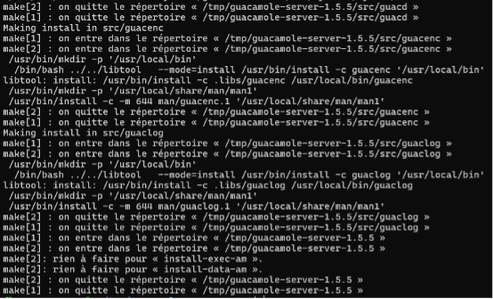

<span style="color: red; font-weight: bold;">La partie serveur d'Apache Guacamole est installée !</span> <br> Mais d'autres étapes sont à réaliser...

La commande ci-dessous sert à mettre à jour les liens entre guacamole-server et les librairies :

```bash
sudo ldconfig
```

Ensuite, on va **démarrer le service** `guacd` correspondant à Guacamole et **activer son démarrage automatique**. La première commande sert à prendre en compte le nouveau service.

```bash
sudo systemctl daemon-reload
```
```bash
sudo systemctl enable --now guacd
```
Enfin, on **vérifie le statut** d'Apache Guacamole Server :

```bash
sudo systemctl status guacd
```

### Créer le répertoire de configuration

Dernière étape avant de passer à la partie client d'Apache Guacamole, **on crée l'arborescence pour la configuration d'Apache Guacamole**. Cela va donner le répertoire `/etc/guacamole` avec les sous-répertoires "**extensions**" et "**lib**". Nous en aurons besoin par la suite pour mettre en place le stockage des données dans une base de données MariaDB / MySQL.

```bash
sudo mkdir -p /etc/guacamole/{extensions,lib}
```

### Installer Guacamole Client (Web App)
Pour la **Web App** correspondante à Apache Guacamole, et donc à la partie cliente, nous avons besoin d'un serveur **Tomcat 9** [^1] . J'insiste sur le fait que **Tomcat 10, distribué par défaut via les dépôts de Debian 12**, n'est **pas pris en charge par Apache Guacamole**. Nous devons **ajouter le dépôt de Debian 11** sur notre machine Debian 12 afin de pouvoir **télécharger les paquets correspondants à Tomcat 9**. ([Explication « Tomcat » en annexe](#annexe-tomcat))

Nous allons ajouter un nouveau fichier source pour Apt. Créez le fichier suivant :
```bash
sudo nano /etc/apt/sources.list.d/bullseye.list 
```

Ajoutez cette ligne, enregistrez et fermez le fichier.
```bash
deb http://deb.debian.org/debian/ bullseye main
```

Mettez à jour le cache des paquets :
```bash
sudo apt-get update
```

Effectuez l'installation des paquets Tomcat 9 sur Debian 12 avec cette commande :
```bash
sudo apt-get install tomcat9 tomcat9-admin tomcat9-common tomcat9-user
```

Puis, nous allons **télécharger la dernière version de la Web App d'Apache Guacamole** depuis le dépôt officiel (même endroit que pour la partie serveur). On se positionne dans `/tmp` et on télécharge la Web App, ce qui revient à télécharger un fichier avec l'extension `.war`. Ici, la **version 1.5.5** est téléchargée.

```bash
cd /tmp
```
```bash
wget https://downloads.apache.org/guacamole/1.5.5/binary/guacamole-1.5.5.war
```
Une fois que le fichier est téléchargé, on le déplace dans la librairie de Web App de Tomcat9 avec cette commande :

```bash
sudo mv guacamole-1.5.5.war /var/lib/tomcat9/webapps/guacamole.war
```

Puis, on relance les services Tomcat9 et Guacamole :
```bash
sudo systemctl restart tomcat9 guacd
```
<span style="color: red; font-weight: bold;">Apache Guacamole Client est installé !</span>

### Base de données MariaDB pour l'authentification

!!! info "Déploiement de MariaDB"
    Cette dernière étape avant de commencer à utiliser Apache Guacamole consiste à **déployer MariaDB Server (ou MySQL Server, au choix) sur Debian pour qu'Apache Guacamole s'appuie sur une base de données**. Cette base de données sera utilisée pour stocker toutes les informations de l'application.


On commence par installer le paquet MariaDB Server :
```bash
sudo apt-get install mariadb-server
```

Puis, on exécute le script ci-dessous pour sécuriser un minimum notre instance (changer le mot de passe root, désactiver les accès anonymes, etc...). Si besoin d'aide pour cette partie, je vous encourage à regarder [ce tutoriel](https://www.it-connect.fr/installer-un-serveur-lamp-linux-apache-mariadb-php-sous-debian-11/).

```bash
sudo mysql_secure_installation
```
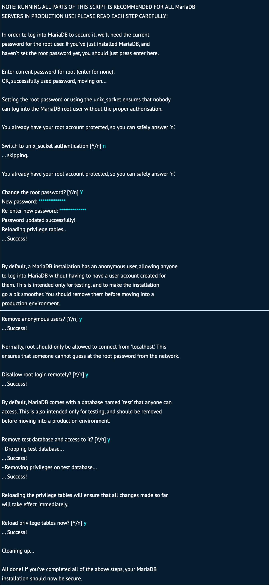

Une fois cette étape effectuée, on va se connecter en tant que root à notre instance MariaDB :
```bash
mysql -u root -p
```

Ceci est utile pour **créer une base de données et un utilisateur dédié pour Apache Guacamole**. Les commandes ci-dessous permettent de créer la base de données `guacadb`, avec l'utilisateur `guaca_user` associé au mot de passe `etudiant_007` (adaptez ces valeurs sibesoin). Cet utilisateur dispose de quelques droits sur la base de données.

```bash
CREATE DATABASE guacadb;
CREATE USER 'guaca_user'@'localhost' IDENTIFIED BY 'etudiant_007';
GRANT SELECT,INSERT,UPDATE,DELETE ON guacadb.* TO 'guaca_user'@'localhost';
FLUSH PRIVILEGES;
EXIT;
```


La suite va consister à **ajouter l'extension MySQL à Apache Guacamole** ainsi que le connecteur correspondant.

Toujours depuis le dépôt officiel, on télécharge cette extension :

```bash
cd /tmp
```
```bash
wget https://downloads.apache.org/guacamole/1.5.5/binary/guacamole-auth-jdbc-1.5.5.tar.gz
```

Puis, on décompresse l'archive `tar.gz` obtenue :
```bash
tar -xzf guacamole-auth-jdbc-1.5.5.tar.gz
```

On déplace le fichier `.jar` de l'extension dans le répertoire `/etc/guacamole/extensions/` créé précédemment :

```bash
sudo mv guacamole-auth-jdbc-1.5.5/mysql/guacamole-auth-jdbc-mysql-1.5.5.jar /etc/guacamole/extensions/
```
Ensuite, le connecteur MySQL doit être téléchargé depuis le site de MySQL (peu importe si vous utilisez MariaDB ou MySQL).

!!! info "Télécherger le connecteur MySQL"
    Utilisez le lien ci-dessous pour repérer le lien de la dernière version en choisissant "**Platform Independent**", puis en cliquant sur le bouton "**Download**" permettant d'obtenir la "**Compressed TAR Archive**".

    [Télécharger le connecteur MySQL](https://dev.mysql.com/downloads/connector/j/)

    Une autre page se charge, copiez le lien sous "**No thanks, just start my download.**". Pour la version actuelle, à savoir 9.1.0, le lien est inclus à la commande ci-dessous. (le lien est déjà renseigner dans la commande ci-dessous)

On lance le téléchargement :
```bash
cd /tmp
```
```bash
wget https://dev.mysql.com/get/Downloads/Connector-J/mysql-connector-j-9.1.0.tar.gz
```

Puis, on décompresse l'archive tar.gz :
```bash
tar -xzf mysql-connector-j-9.1.0.tar.gz
```

On copie (ou déplace) le fichier `.jar` du connecteur vers le répertoire `lib` d'Apache Guacamole :
```bash
sudo cp mysql-connector-j-9.1.0/mysql-connector-j-9.1.0.jar /etc/guacamole/lib/
```
Les dépendances sont déployées, mais nous n'avons pas encore fini cette intégration avec MariaDB.

En effet, il faut **importer la structure de la base de données Apache Guacamole dans notre base de données `guacadb`**. Pour cela, on va importer tous les fichiers SQL situés dans le répertoire `guacamole-auth-jdbc-1.5.5/mysql/schema/`. Le mot de passe root de MariaDB doit être saisit pour effectuer l'import.

```bash
cd guacamole-auth-jdbc-1.5.5/mysql/schema/
```
```bash
cat *.sql | mysql -u root -p guacadb
```

Une fois que c'est fait, on va **créer et éditer le fichier `guacamole.properties`** pour déclarer la connexion à MariaDB. Ce fichier peut être utilisé pour d'autres paramètres, selon vos besoins.

```bash
sudo nano /etc/guacamole/guacamole.properties
```

Dans ce fichier, insérez les lignes ci-dessous en adaptant les trois dernières lignes avec vos valeurs *(si vous avez suivi la documentation ci-dessus, alors rien n’est à changer) :*

```bash
# MySQL
mysql-hostname: 127.0.0.1
mysql-port: 3306
mysql-database: guacadb
mysql-username: guaca_user
mysql-password: etudiant_007
```
*Enregistrez et fermez le fichier.*

Tant que l'on est dans la configuration, **éditez le fichier `guacd.conf` pour déclarer le serveur Guacamole** (ici, on déclare une connexion locale sur le port par défaut, à savoir 4822).

```bash
sudo nano /etc/guacamole/guacd.conf
```

Voici le code à intégrer :
```bash
[server] 
bind_host = 0.0.0.0
bind_port = 4822
```

On enregistre et on termine par redémarrer les trois services liés à Apache Guacamole :
```bash
sudo systemctl restart tomcat9 guacd mariadb
```
<span style="color: red; font-weight: bold;">L'installation de base est enfin terminée !!!</span>


## III - Utilisation d’Apache Guacamole

On va pouvoir se connecter à Apache Guacamole pour effectuer nos premiers pas sur l'interface de la Web App.

`http://<Adresse IP>:8080/guacamole/`

La page de connexion suivante va s'afficher :
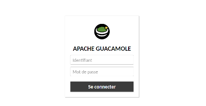


Pour se connecter, on va utiliser les identifiants par défaut :

* Utilisateur : guacadmin
* Mot de passe : guacadmin

**Nous voilà sur Apache Guacamole !** Mais pour l'instant, c'est vide... 


### Ajouter une connexion SSH
Nous allons créer notre première connexion dans Apache Guacamole, de manière à **se connecter à un serveur en SSH !**

Pour créer une nouvelle connexion : `Paramètres > Connexion > Nouvelle connexion`

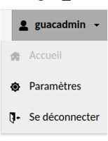

Puis dans l’onglet « **Connexions** » faite « **Nouvelle Connexion** » 

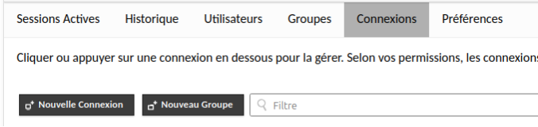

Renseigner maintenant les informations de votre serveur **cible** :

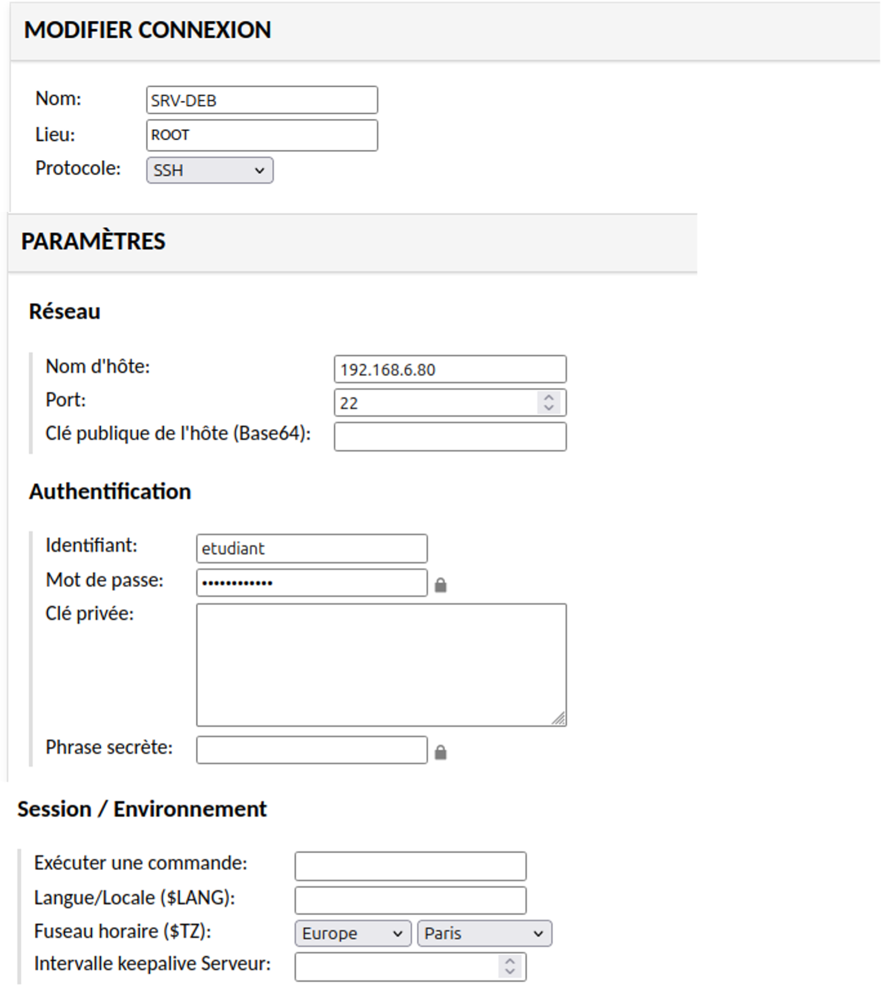

Retourner maintenant dans Accueil

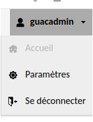

Cliquer simplement sur la configuration de connexion que vous venez de créer afin de vous y connecter 


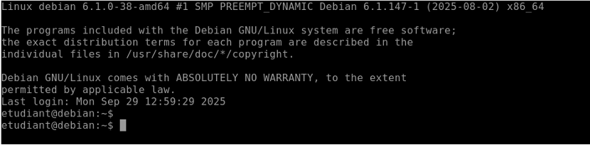


## IV - Récupérations des logs de connexion

Dans le cadre de **l’administration et du suivi des accès**, la récupération des logs de connexion est une étape essentielle. Apache Guacamole enregistre les événements liés aux connexions utilisateurs, ce qui permet d’assurer une meilleure **traçabilité**, de faciliter le diagnostic en cas d’incident et de renforcer la **sécurité de l’infrastructure**. Cette section présente les méthodes permettant d’accéder et d’exploiter ces journaux.

### Sur l'interface de la Web App de Apache Guacamole :

La web App de Apache Guacamole utilise la base de données MariaDB pour récupérer les informations suivantes.

**Paramètres > …**


**Paramètres > Historique**


Voici l’historique de connexion effectuer sur notre serveur **Bastion**. 

!!! note "Télécherger le connecteur MySQL"
    Il est également possible de télécherger les logs en fichier **csv**. Il suffit de cliquer sur le bouton "**Télécharger**" en haut à droite.

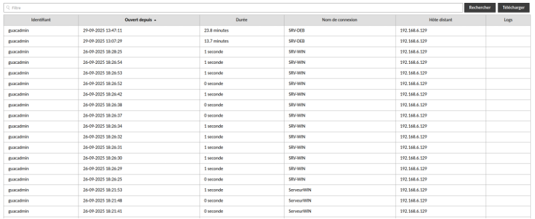


Nous pouvons identifier plusieurs informations importantes concernant la traçabilité comme :

* L’utilisateur 
* L’heure d’ouverture d’une connexion à un serveur 
* La durée de connexion
* Le nom du serveur cible 
* L’adresse IP du client 


### En ligne de commande sur notre serveur Apache Guacamole :

Connection a MariaDB :
```bash
sudo mysgul -u root -p guacadb
```

Puis lancer la commande suivante pour afficher les logs :
```bash
SELECT user_id, connection_id, start_date, end_date
FROM guacamole_connection_history
ORDER BY start_date DESC
LIMIT 10;
```

## V - Annexe
### Annexe 1 : <span id="annexe-tomcat"></span>
Tomcat9, c’est un petit logiciel qui sert à lancer des sites web faits en Java.

Dans Guacamole le fichier `guacamole.war` contient l’interface web (l’écran de connexion, le portail). **Tomcat9** est là pour ouvrir ce fichier et le rendre accessible dans ton navigateur à l’adresse : `http://IP_BASTION:8080/guacamole`

**En résumé :** Tomcat9 c'est le programme qui affiche Guacamole dans le navigateur


### Annexe 2 : Pour plus de sécurité

#### Créer un nouveau compte admin
Tout d'abord, nous allons **créer un nouveau compte d'administration** et supprimer le compte par défaut, pour des raisons de sécurité.
Notre objectif est le suivant :

* Créer un nouveau compte administrateur (avec un nom personnalisé)
* Se déconnecter du compte "**guacadmin**"
* Se reconnecter avec le nouveau compte administrateur
* Supprimer le compte "**guacadmin**" par défaut (ou à minima changer son mot de passe et le désactiver)
* Pour accéder aux paramètres, il faut cliquer sur le nom d'utilisateur en haut à droite puis sur "**Paramètres**".

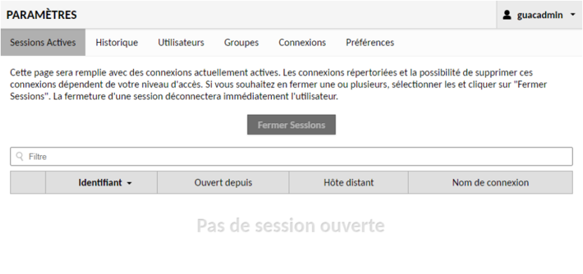

Ensuite, sur l'onglet "**Utilisateurs**" et sur "**Nouvel utilisateur**".

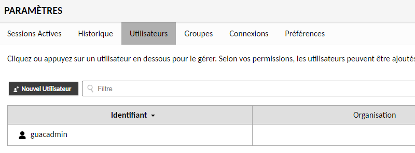

Un formulaire s'affiche. **Indiquez un nom d'utilisateur**, en évitant les traditionnels "Administrateur", "Admin", etc.... Et choisissez un **mot de passe robuste**. Cochez l'ensemble des permissions pour que cet utilisateur soit administrateur de la plateforme Guacamole.

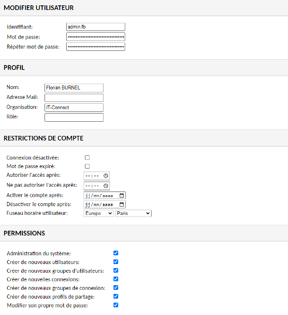

Même si cela ne s'applique pas à notre utilisateur actuel, on remarque des options intéressantes dans la section "**Restrictions de compte**". On peut **limiter l'accès aux sessions uniquement sur certaines plages horaires**, mais aussi **activer et désactiver le compte à une date spécifique**. Très intéressant pour donner un accès à un prestataire tout en gardant le contrôle sur les sessions.

Ce nouveau compte est créé, donc suivez les étapes évoquées ci-dessus pour vous débarrasser du compte guacadmin. Tout se passe dans les paramètres puis dans la section "**Utilisateurs**".

!!! info "Groupe avec Guacamole"
    Apache Guacamole permet aussi de créer des groupes pour faciliter la gestion des autorisations.


[^1]: Tomcat 9 sert d’intermédiaire entre le navigateur du client et les applications web Java hébergées sur le serveur.  
