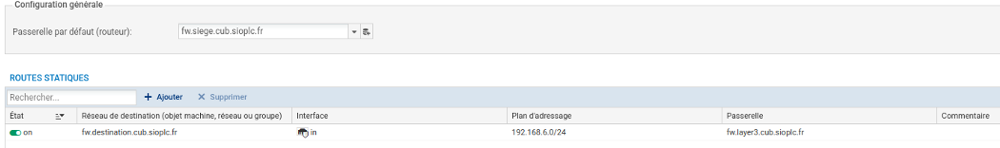
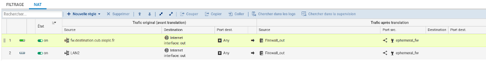

# Situation 3 : Routage et NAT

## Prérequis

*Ducumentation en ligne : [https://cubdocumentation.sioplc.fr](https://cubdocumentation.sioplc.fr)*
 

| **Service**                           | **Nombre d’hôtes** | **Adresse réseau** | **Masque de sous-réseau** | **Adresse de diffusion** | **Description VLAN** |
|--------------------------------------|--------------------|--------------------|----------------------------|--------------------------|----------------------|
| Production                           | 120                | 192.168.6.0        | 255.255.255.128            | 192.168.6.127            | VLAN 56              |
| Client 1                             | 32                 | 192.168.6.128      | 255.255.255.192            | 192.168.6.191            | VLAN 10              |
| Administration systèmes et réseaux   | 6                  | 192.168.6.192      | 255.255.255.240            | 192.168.6.207            | VLAN 20              |

## Packet tracert - Agence Frankfurt
 

 

  <a href="https://drive.google.com/file/d/1L7Gp52YpPjjRhFdp9gp4L1sGORqAoCEK/view?usp=share_link" 
     style="display:inline-block;
            background:#e7e7e9;
            color:#0096FF;
            padding:11px 25px;
            border-radius:10px;
            text-decoration:none;
            font-weight:50;
            box-shadow:0 0 12px rgba(0,0,0,0.5);
            transition:all 0.3s ease;"
     onmouseover="this.style.background='#dcdce0'; this.style.color='#003d80';"
     onmouseout="this.style.background='#e7e7e9'; this.style.color='#0096FF';">
     🔗 Cliquer pour télécherger le paket tracert
  </a>

 

## 1. Rédiger la table de routage du pare-feu Stormshield de l’agence Frankfurt

**FW**

| Destination      | Masque | Passerelle       | Interface       | Type |
|-----------------|--------|-----------------|----------------|------|
| 192.36.253.0    | /24    | 192.36.253.60   | 192.36.253.60  | C    |
| 192.36.6.0      | /24    | 192.36.6.254    | 192.36.6.254   | C    |
| 192.168.66.248  | /28    | 192.168.66.254  | 192.168.66.254 | C    |
| 192.168.6.0     | /24    | 192.168.66.253  | 192.168.66.254 | S    |
| 0.0.0.0         | /0     | 192.36.253.254  | 192.36.253.60  | S    |

**LAYER 3**

| Destination      | Masque | Passerelle       | Interface       | Type |
|-----------------|--------|-----------------|----------------|------|
| 192.168.6.0     | /25    | 192.168.6.126   | 192.168.6.126  | C    |
| 192.168.66.248  | /28    | 192.168.66.253  | 192.168.66.253 | C    |
| 192.168.6.128   | /26    | 192.168.6.190   | 192.168.6.190  | C    |
| 192.168.6.192   | /28    | 192.168.66.206  | 192.168.66.206 | S    |
| 0.0.0.0         | /0     | 192.168.66.254  | 192.168.66.253 | S    |

**Routage NAT**

<table>
  <tr>
    <th colspan="4">Avant translation</th>
    <th colspan="4">Après translation</th>
  </tr>
  <tr>
    <th>Ip source</th>
    <th>Port Src</th>
    <th>IP dst</th>
    <th>Port dst</th>
    <th>Ip source</th>
    <th>Port Src</th>
    <th>IP dst</th>
    <th>Port dst</th>
  </tr>
  <tr>
    <td>192.168.6.0 /24</td>
    <td>*</td>
    <td>*</td>
    <td>*</td>
    <td>192.36.253.60 /24</td>
    <td>*</td>
    <td>*</td>
    <td>*</td>
  </tr>
</table>

## 2. Déterminer quelle adresse IP du WAN doit servir de passerelle pour aller sur Internet ? Puis créer un objet réseau afin que cette adresse IP soit représentée dans l'interface d'administration.

*Configuration > Objets > Réseau*

**Adresse du WAN :** 192.36.253.254

## 3. Utiliser cet objet afin de pouvoir implémenter la table de routage sur votre pare-feu.

*Configuration > Réseau > Routage*

## 4. Proposer et paramétrer une solution technique permettant aux adresses IP privées de votre site de pouvoir communiquer sur le réseau WAN public et Internet.

Afin de permettre aux adresses IP privées de notre site de pouvoir communiquer sur le réseau WAN public et internet il faut faire du routage NAT pour que l’IP du LAN sortent avec l’IP publique du WAN.

*Configuration > Politique de sécurité > Filtrage et NAT*

## 5. Peut-on joindre le pare-feu général CUB puis les serveurs présents dans sa DMZ. Proposer une analyse des résultats obtenus.

!!! Info  "Information"
    !! Impossible de finir la situation car il y a un problème sur nutanix !! 
    
    !! Impossible de positionner les VM dans DMZ !!