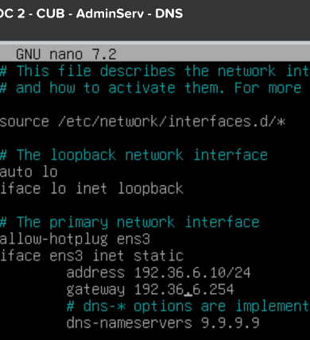
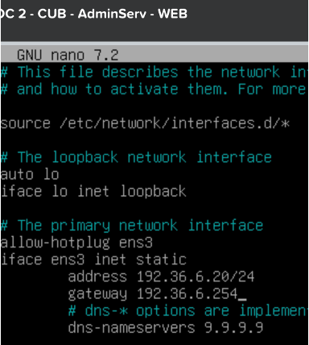
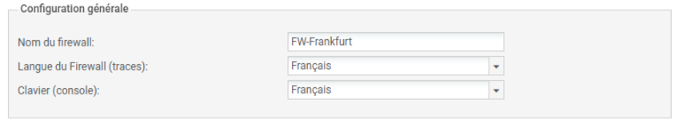
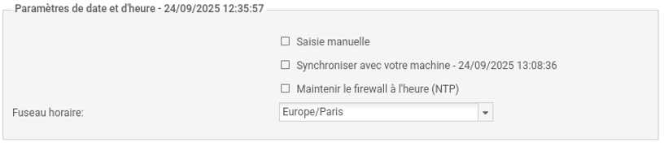
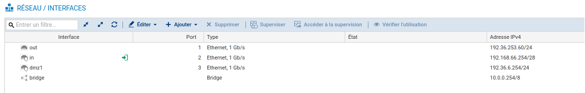
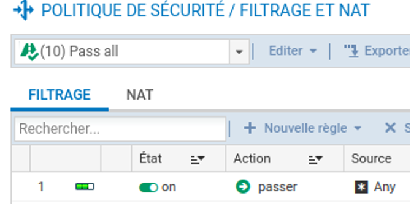

# Situation 2 : Premiers paramétrage d'un pare-feu sur un site de l'entreprise

## Prérequis

*Ducumentation en ligne : [https://cubdocumentation.sioplc.fr](https://cubdocumentation.sioplc.fr)*
 

| **Service**                           | **Nombre d’hôtes** | **Adresse réseau** | **Masque de sous-réseau** | **Adresse de diffusion** | **Description VLAN** |
|--------------------------------------|--------------------|--------------------|----------------------------|--------------------------|----------------------|
| Production                           | 120                | 192.168.6.0        | 255.255.255.128            | 192.168.6.127            | VLAN 56              |
| Client 1                             | 32                 | 192.168.6.128      | 255.255.255.192            | 192.168.6.191            | VLAN 10              |
| Administration systèmes et réseaux   | 6                  | 192.168.6.192      | 255.255.255.240            | 192.168.6.207            | VLAN 20              |

## Packet tracert - Agence Frankfurt
 

 

  <a href="https://drive.google.com/file/d/1L7Gp52YpPjjRhFdp9gp4L1sGORqAoCEK/view?usp=share_link" 
     style="display:inline-block;
            background:#e7e7e9;
            color:#0096FF;
            padding:11px 25px;
            border-radius:10px;
            text-decoration:none;
            font-weight:50;
            box-shadow:0 0 12px rgba(0,0,0,0.5);
            transition:all 0.3s ease;"
     onmouseover="this.style.background='#dcdce0'; this.style.color='#003d80';"
     onmouseout="this.style.background='#e7e7e9'; this.style.color='#0096FF';">
     🔗 Cliquer pour télécherger le paket tracert
  </a>

 

## 1. Installer vos 3 VM (sans les services) et paramétrer correctement leurs cartes réseaux 

  
  

## 2. Renommer le pare-feu : FW-Frankfurt

## 3. Changement du mot de passe conforme aux préconisations de l’ANSSI 

***Configuration > Système > Administrateurs***

1. Cliquez sur l’utilisateur *(souvent `admin`)*.  
2. Cliquez sur Modifier le mot de passe et entrez le nouveau.  
3. Sauvegardez et appliquez.

## 4. Pourquoi est-il primordial que l’ensemble des pare-feu de l’entreprise CUB soit synchronisé sur les serveurs NTP de l’entreprise Stormshield

*Configuration > Système > Configuration*

## 5. Configurer les interfaces réseaux de l’appliance afin que cela correspondent à ce que vous avez défini précédemment dans votre schéma réseau logique

Il est primordial que les pare-feu CUB soient synchronisés avec les serveurs NTP de l’entreprise Stormshield afin de garantir la cohérence des journaux, la fiabilité des analyses de sécurité, la validité des mécanismes cryptographiques et la conformité aux normes de sécurité.

## 6. Dans le menu Filtrage et NAT, appliquer la politique de filtrage (10) Pass All afin d’éviter des blocages ou erreurs liés à cette dernière

*Configuration > Réseau > Interfaces*

## 7. Dans le menu Filtrage et NAT, appliquer la politique de filtrage (10) Pass All afin d’éviter des blocages ou erreurs liés à cette dernière

*Configuration > Politique de sécurité > Filtrage et NAT*

