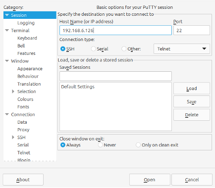
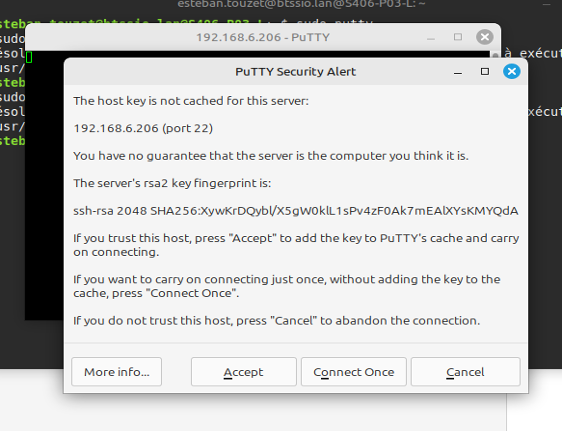
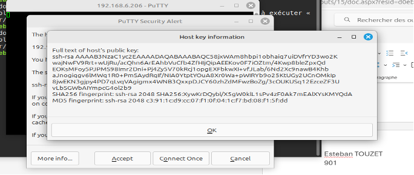
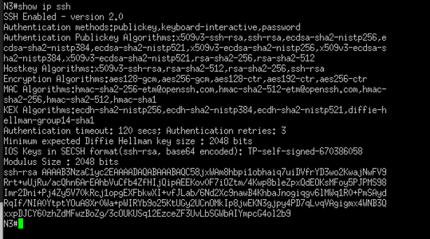
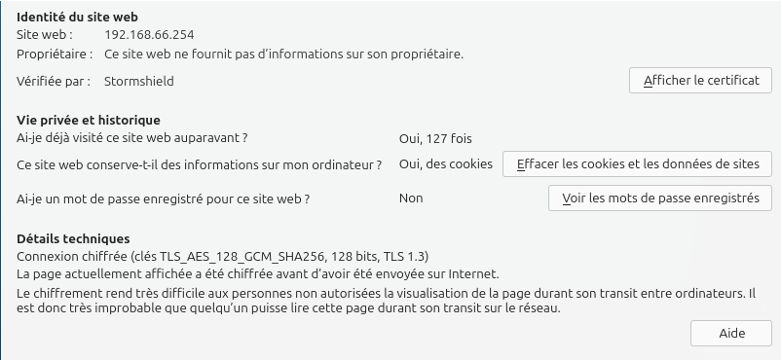
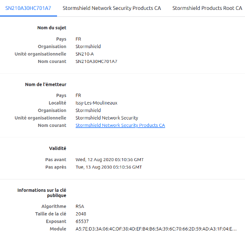
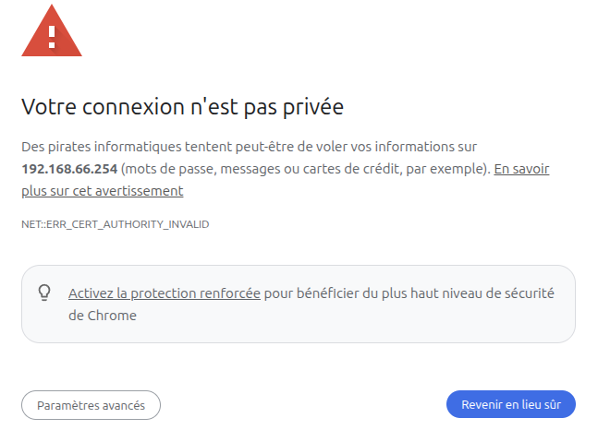

# Situation 4 : Crypthographie


## Prérequis


*Ducumentation en ligne : [https://cubdocumentation.sioplc.fr](https://cubdocumentation.sioplc.fr)*
<br>

| **Service**                           | **Nombre d’hôtes** | **Adresse réseau** | **Masque de sous-réseau** | **Adresse de diffusion** | **Description VLAN** |
|--------------------------------------|--------------------|--------------------|----------------------------|--------------------------|----------------------|
| Production                           | 120                | 192.168.6.0        | 255.255.255.128            | 192.168.6.127            | VLAN 56              |
| Client 1                             | 32                 | 192.168.6.128      | 255.255.255.192            | 192.168.6.191            | VLAN 10              |
| Administration systèmes et réseaux   | 6                  | 192.168.6.192      | 255.255.255.240            | 192.168.6.207            | VLAN 20              |


## Packet tracert - Agence Frankfurt
<br>


<br>

<div style="text-align:center; margin-top:20px;">
  <a href="https://drive.google.com/file/d/1L7Gp52YpPjjRhFdp9gp4L1sGORqAoCEK/view?usp=share_link" 
     style="display:inline-block;
            background:#e7e7e9;
            color:#0096FF;
            padding:11px 25px;
            border-radius:10px;
            text-decoration:none;
            font-weight:50;
            box-shadow:0 0 12px rgba(0,0,0,0.5);
            transition:all 0.3s ease;"
     onmouseover="this.style.background='#dcdce0'; this.style.color='#003d80';"
     onmouseout="this.style.background='#e7e7e9'; this.style.color='#0096FF';">
     🔗 Cliquer pour télécherger le paket tracert
  </a>
</div>
<br>


## 1. Démontrer le respect des critères de sécurité des protocoles d’administration sécurisées à distance RDP et SSH ?

**SSH :**
SSH chiffre les communications avec des algorithmes symétriques (AES) après un échange de clés sécurisé. L’intégrité est assurée par des HMAC ou modes AEAD. L’authentification repose sur des clés publiques ou mots de passe, garantissant l’identité.

**RDP :**
RDP s’appuie sur TLS pour chiffrer les flux (AES) et garantir la confidentialité. L’intégrité est assurée par les MAC/AEAD intégrés à TLS. L’authentification s’effectue par certificats, mots de passe ou Kerberos, assurant la provenance.
Avec certificats ou cartes à puce, les actions sont traçables à une identité → non-répudiation.

**Résumé :**
SSH et RDP sont deux protocoles sécurisés d’administration à distance qui respectent les critères de sécurité de la cryptographie. SSH utilise un échange de clés puis du chiffrement (AES/ChaCha20), des HMAC pour l’intégrité et l’authentification par clé publique ou mot de passe. RDP repose sur TLS pour le chiffrement et l’intégrité, avec authentification par certificats, mot de passe ou Kerberos. Dans les deux cas, la confidentialité, l’intégrité, l’authentification et la non-répudiation sont assurées.


## 2. Vérifier en prouvant l’intégrité de l’identité des matériels (serveurs et élément actifs) lors d’une liaison sécurisée SSH

Se connecter au switch en SSH, puis faire **« open »** et le message suivant s’affiche. 



Cliquer sur **“More info...”**




Votre clé publique s’affiche :




Maintenant il faut comparer la clé que vous avez ci-dessus et la clé que vous avez sur votre switch. Si c’est la même c’est OK ! 

```bash
show ip ssh
```


Les clés sont bien les même alors vous pouvez vous connecter en SSH.

## 3. Préciser l’algorithme de chiffrement utilisé par le serveur SSH

Le serveur SSH utilise « RSA » comme algorithme de chiffrement 

!!! note "Élément récupérer sur le screen au dessus"
    SHA256 fingerprint: **ssh-rsa** 2048 SHA256:XywKrDQyb X5gW0klL1sPv4zF0Ak7mEAIXYsKMYQdA

## 4. Schématiser à l’aide d’un diagramme de séquence les échanges entre le client et le serveur lors d’une connexion SSH.

**Client :** on est dans putty, on se connecte au serveur SSH <br> **Serveur :** le serveur nous communique une clé publique et nous demande si on accepte ou pas la clé  <br> **Client :** utilisation de la clé publique par le client pour accéder au serveur SSH <br> **Serveur :** le serveur nous autorise l’accès au serveur SSH

(La **clé publique** nous permet de chiffrer les informations communiquer avec le switch, et seulement le Serveur peut déchiffrer les information grâce à **sa clé privée**.)

## 5. Connexion en HTTPS sur l’interface d’administration du pare-feu. Relever les éléments présents dans le certificat TLS/SSL

Cliqué sur le cadenas


Faire afficher le certificat



Puis afficher le certificat :


<br>

Il y a de nombreuses informations importantes comme : 

* Information sur la clé publique 
* CA : Le contrat 
* Empreinte numérique 
* etc


## 6. Préciser pourquoi lors de la première connexion à l’interface d’administration du pare-feu Stormshield, un message d’alerte est stipulé 

Le message d’alerte : 



Le message d’alerte apparaît pour sensibiliser la personne qui se rend sur ce site, au fait que la configuration initiale (mot de passe, certificat, règles) n’est pas sécurisée.

***En claire :***
Le message d’alerte lors de la première connexion signale principalement que la communication HTTPS repose sur un **certificat auto-signé** et que les **identifiants par défaut** doivent être changés pour éviter toute faille de sécurité


## 7. Après avoir rappelé le rôle d’une autorité de certification, préciser la différence entre une autorité de certification reconnue et non-reconnue. Quels sont les avantages et les inconvénients de l’une et l’autre ?

**Rôle :** Une **autorité de certification** est un organisme tiers de confiance chargé de délivrer des **certificats numériques**. Cela permet de garantir l’authenticité d’un site, assurer la confidentialité des échanges grâce au chiffrement et vérifier l’intégrité des données transmises.


### Différence 
**Une autorité de certification non-reconnue** c’est un qui est auto-signé, ou délivré par une CA interne à une entreprise.

**Avantage :** flexible <br> **Inconvénient :** génère des alertes de sécurité et demande une configuration manuelle 

**Une autorité de certification reconnue** est un organisme dont les certificats racine sont déjà intégrés dans les navigateurs, les systèmes d’exploitation et les appareils. (exemple : DigiCert, GlobalSign, Let’s Encrypt).

Les certificats qu’elle délivre sont automatiquement considérés comme fiables.

**Avantage :** confiance universelle  <br> **Inconvénient :** coût/dépendance
